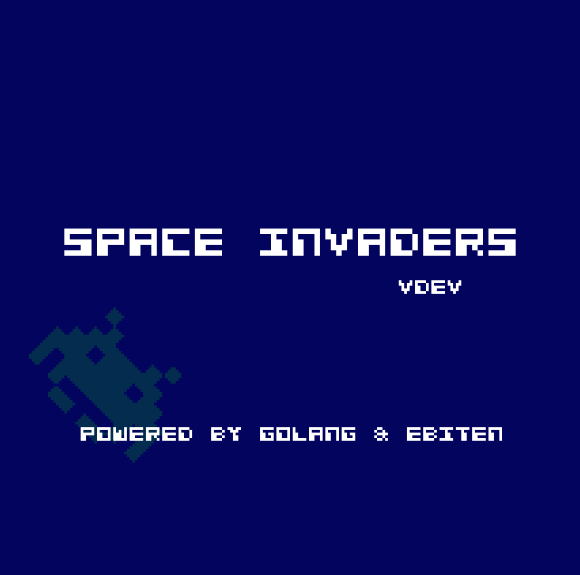
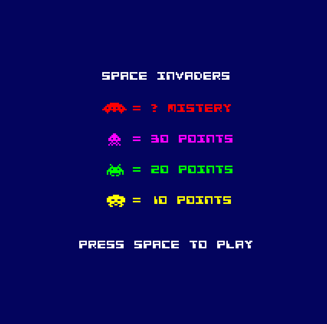
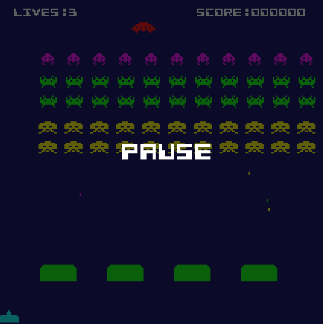

# 👾 Space Invaders en Go (Ebiten).
Un clon más del clásico **Space Invaders** de las máquinas recreativas de los 80, pero con un enfoque técnico moderno y retro a la vez:

- ✅ Escrito 100% en Go
- ✅ Sin imágenes externas: los sprites están generados como arrays
- ✅ Recursos embebidos (fuente y sonidos)
- ✅ Desarrollado en entorno Docker para evitar contaminar tu sistema
- ✅ Binario autocontenible: sin dependencias externas

## 🧱 Tecnologías usadas.
| Herramienta | Versión |
|------------|---------|
| Go         | 1.24.1  |
| Ebiten     | 2.8.7   |
| Docker     | devcontainer  |

## 📷 Capturas.
Se muestran a continuación las pantallas del juego:
### Pantalla de splash.

### Pantalla de presentación.

### Pantalla de juego.

### pantalla de pausa de juego.

## 🚀 ¿Qué encontrarás?
Este proyecto puede ayudarte a aprender:
- Cómo crear un videojuego retro en Go con Ebiten.
- Cómo representar sprites sin imágenes, solo con arrays.
- Cómo embeber recursos (`embed`) en Go para lograr ejecutables autónomos.
- Cómo trabajar con un entorno de desarrollo limpio gracias a Docker.

## 📚 Documentación extendida.
* [Uso de Docker](docs/dockerenvironment.md).
* [Compilación](docs/compilation.md).
* [Recursos de sonido y fuente](docs/resources.md).
* Cómo se hizo el juego paso a paso.

## 🙋 Autor.
Este proyecto ha sido desarrollado como parte de mi proceso de formación continua. Disponible también en [Itch.io](https://programatta.itch.io/space-invaders).

## ☕ ¿Te gustó?

Si este proyecto te resultó interesante, considera:
* ⭐ Dándole una estrella al repositorio
* 💬 Compartiendo ideas o mejoras en los Issues
