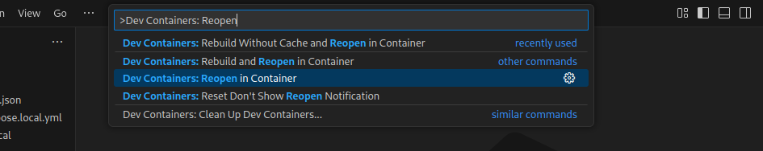

# 🐳 Contenedor de desarrollo.
> ⚠️ **Nota:** El uso de este contenedor se realiza bajo un sistema Linux con servidor X y sonido local configurado (por ejemplo, PulseAudio).
>
> En Mac o Windows es posible que necesite ajustes específicos para la parte gráfica.

El proyecto ha sido creado usando un contenedor de desarrollo utilizado por **Visual Studio Code** para crear un entorno sin tener que instalar librerías adicionales al sistema.

Esto permite:
* usar un entorno de desarrollo replicable y limpio.
* facilitar a colaboradores participar en el proyecto con la misma configuración.
* trabajar con **Ebiten** y **Go** sin preocuparte de compiladores, librerías o rutas.

La configuración utilizada puede encontrarse también en el repositorio [programatta/devcontainers](https://github.com/programatta/devcontainers/tree/master/goebitendevcontainer), donde gestiono entornos para varios proyectos.

## 📦 Requisitos.
Debemos tener instalado en el sistema:
* [Docker](https://www.docker.com/) 
* [Visual Studio Code](https://code.visualstudio.com/)
* Extensión oficial de [Dev Containers](https://marketplace.visualstudio.com/items?itemName=ms-vscode-remote.remote-containers) para Visual Studio Code.

## 📁 Estructura.
El directorio **.devcontainer** tiene los siguientes ficheros:
~~~bash
.
├── devcontainer.json 
├── docker-compose.local.yml
└── Dockerfile.local
~~~

### Fichero devcontainer.json
Archivo principal de configuración para Visual Studio Code. En este fichero indicamos el **docker-compose** que se va a utilizar y el servicio de entrada. Actualmente solo tiene un servicio, pero se puede extender para añadir un servicio de backend.

También indicamos una pequeña configuración para el editor y extensiones a instalar para una mejor experiencia. 

### Fichero docker-compose.local.yml
Archivo que define el contenedor que se usará como entorno de desarrollo:
* Usa Dockerfile.local para construir la imagen.
* Expone el **DISPLAY** y el sonido del host para que el juego pueda ejecutarse con interfaz gráfica.
* Monta el proyecto completo en /code dentro del contenedor.
* Utiliza **sleep infinity** como comando principal, permitiendo que el contenedor esté en espera mientras se trabaja en él desde VSCode.

### Fichero Dockerfile.local
Archivo que define la imagen de desarrollo personalizada para el uso de **Golang** y **Ebiten**:
* Basado en **debian:bookworm-slim** para disponer de una imagen más ligera.
* Instalación de herramientas de desarrollo como **build-essential**, **git**, **gdb**, **make**.
* Instalación de las dependencias propias para usar **Ebiten**.
* Configuración de variables de entorno e instalación de **Golang** desde el sitio oficial.

## 🚀 ¿Cómo usarlo?
Una vez se tenga descargado el directorio **.devcontainer** en una ruta de su preferencia (_p.e /home/usuario/desarrollo/wsgolang/ebiten_), se situa en ese directorio y ejecuta:

~~~shell
code .
~~~

Al abrirse **VSCode** puede mostar la siguiente notificación:

Pulsamos en `Reopen in Container`.

Si no salta, puede presionar `F1` y en la paleta de comandos escribir o buscar la opción: `Dev Containers: Reopen in Container`:

> ⚠️ **Nota:** La primera vez demora un poco para realizar el proceso de construcción de la imagen y levantar el contenedor.

## 🧪 Verificar el funcionamiento.
Una vez haya finalizado el proceso de construcción, si abre una terminal en VSCode, verá que el directorio de trabajo es **/code**.

### Inicializar un modulo de go.
1. Creamos el directorio y nos situamos en él.
~~~bash
mkdir mimodulo && cd mimodulo
~~~

2. Inicializamos el modulo.
~~~bash
go mod init github.com/usuario/mimodulo
~~~

3. Creamos el fichero de entrada que contenga el paquete __main__.
~~~go
package main

import "fmt"

func main() {
	fmt.Println("Hola mundo GO desde devcontainer!")
}
~~~

4. Ejecutar.
~~~bash
go run .
~~~

## 🧹 Para salir del contenedor.
Simplemente cierra la ventana de **VSCode**, y el contenedor se detendrá.

## 🤔 Permitir acceso a X11 desde el contenedor (necesario para mostrar la ventana del juego).
Para que el contenedor pueda abrir ventanas gráficas (como la del juego), el usuario del contenedor necesita permiso para usar el servidor gráfico (**X11**) de tu sistema. Para ello usamos la orden __xhost__.

Para saber que hay, tecleamos xhost en la terminal:
~~~shell
xhost
~~~

Si no hay nada, nos mostrará:
>_access control enabled, only authorized clients can connect_.

Para añadir los permisos a usar **X11**:
~~~shell
xhost +SI:localuser:USUARIO
~~~

Y nos mostrará lo siguiente:
>_localuser:USUARIO being added to access control list_

Para visualizarlo:
~~~shell
xhost
~~~

Y nos mostrará:
>_access control enabled, only authorized clients can connect
SI:localuser:USUARIO_

Para retirar los permisos hacemos:
~~~
xhost -SI:localuser:USUARIO
~~~

Y nos mostrará los siguiente:
>_localuser:USUARIO being removed from access control list_

Y para verificar que todo está como inicalmente lo teníamos:
~~~
xhost
~~~
y nos mostrará:
>_access control enabled, only authorized clients can connect_
