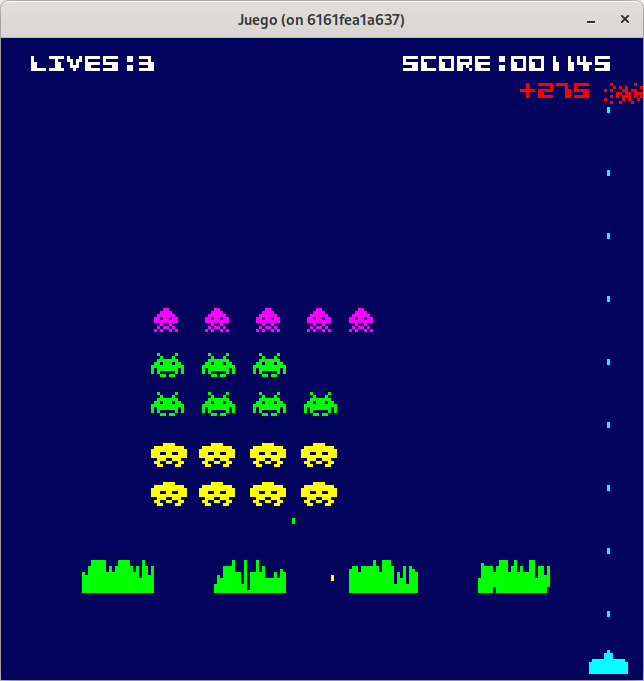
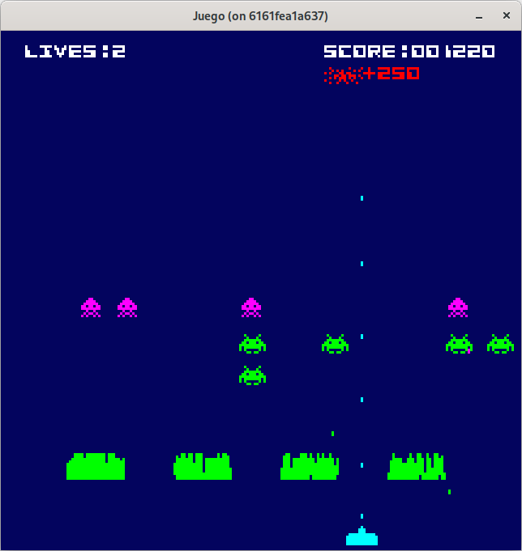

# Paso 8: Mejoras.
En este paso aprenderás:
* Cómo mostrar la puntuación obtenida al destruir la nave UFO directamente sobre el escenario.
* Cómo controlar la visibilidad y la actividad de entidades (como el cañón o la nave) para evitar colisiones no deseadas.
* Cómo hacer que el movimiento de los enemigos se acelere al disminuir su número, replicando el comportamiento clásico.
* Cómo refactorizar funciones repetitivas (como las de creación de formaciones de enemigos) en una única función genérica y parametrizable.
* Cómo limpiar y reorganizar el archivo **game.go** separando responsabilidades en módulos específicos (common, stage, explosion, etc.).

## Ufo.
Una mejora que realizamos sobre la nave, es que cuando colisiona un proyectil con ella, nos pinte la puntuación obtenida en pantalla junto a la explosión. La pintamos en la parte derecha de la explosión, pero si la cadena con la puntuación queda fuera de la pantalla, pintaremos la puntuación en la derecha de la explosión. 

Para ello, pasaremos a la función constructora de la explosión de la nave **NewExplosionUfo()**, la fuente a utilizar y los puntos a pintar.

### explosion_ufo.go
~~~go
type ExplosionUfo struct {
  ...
  face     *text.GoTextFace
  score    uint16
  ...
}

func NewExplosionUfo(posX, posY float32, sprite sprite.Sprite, face *text.GoTextFace, score uint16, notifier common.Notifier) *ExplosionUfo {
  return &ExplosionUfo{sprite: sprite, posX: posX, posY: posY, face: face, score: score, notifier: notifier}
}

func (eu *ExplosionUfo) Draw(screen *ebiten.Image) {
  ...
  uiScoreMisteryText := fmt.Sprintf("+%03d", eu.score)
  widthText, _ := text.Measure(uiScoreMisteryText, eu.face, 0)
  textX := eu.posX + float32(eu.sprite.Image.Bounds().Dx())
  textY := eu.posY + float32(eu.sprite.Image.Bounds().Dy())/2 - 4

  if textX+float32(widthText)+4 > float32(config.DesignWidth) {
    textX = eu.posX - float32(widthText) - 4
  }
  op := &text.DrawOptions{}
  op.GeoM.Translate(float64(textX), float64(textY))
  op.ColorScale.ScaleWithColor(eu.sprite.Color)
  text.Draw(screen, uiScoreMisteryText, eu.face, op)
}
~~~

### game.go
~~~go
func (g *Game) updatePlaying() {
  ...
  //Colisiones.
  for _, bullet := range g.bullets {
    if bullet.dirY < 0 {
      ...
      if g.checkCollision(bullet, g.ufo) {
        bullet.OnCollide()
        g.ufo.OnCollide()

        ufoExplosionSprite, _ := g.spriteCreator.SpriteByName("ufoExplosion")
        ufoX, ufoY := g.ufo.Position()
        ufoScore := g.ufo.Score()
        explosionUfo := explosion.NewExplosionUfo(ufoX, ufoY, ufoExplosionSprite, g.textFace, ufoScore, g)
        g.explosions = append(g.explosions, explosionUfo)
        g.score += uint32(ufoScore)
      }
    } else { 
      ...
    }
  }
  ...
}
~~~

Con estos cambios, tenemos la funcionalidad deseada.

La siguiente mejora es evitar la verificación de colisiones de proyectiles que están en la pantalla cuando la nave no esté activa, es decir, ha habido una colisión y se está pintando la explosión de la nave y la nave está con el flag **remove** a **true** para evitar actualizarla y pintarla, pero puede recibir impactos, ya que el objeto sigue vivo.

Para evitar esto, añadimos en **Ufo** un atributo **active** que indica si está visible o no la nave con el método **IsActive()bool** (no usamos el atributo **remove** para no desvirtuar el sentido del método).

### ufo.go
~~~go
type Ufo struct {
  ...
  active bool
}

func NewUfo(posX, posY float32, sprite sprite.Sprite) *Ufo {
  return &Ufo{sprite: sprite, posX: posX, posY: posY, active: true}
}

func (u *Ufo) IsActive() bool {
  return u.active
}

func (u *Ufo) OnCollide() {
  u.remove = true
  u.active = false
}

func (u *Ufo) Reset() {
  u.posX = -100
  u.remove = false
  u.active = true
}
~~~

Vamos a permitir el futuro incremento de la velocidad de la nave según avance el juego, usaremos un nuevo atributo llamado **speed** y estará en función del delta time **config.Dt**.

Además también vamos a cambiar el modo en el que sale la nave, enviándola cada vez que se reinicie mediante **Reset()** o cuando salga por le lado derecho de la pantalla en un intervalo aleatorio en la parte izquierda, por ejemplo en el intervalo **-500** y **-200** para que tarde en salir por la pantalla.

### ufo.go
~~~go
type Ufo struct {
  ...
  speed  float32
}

func NewUfo(posX, posY float32, sprite sprite.Sprite) *Ufo {
  return &Ufo{sprite: sprite, posX: posX, posY: posY, active: true, speed: 60}
}

func (u *Ufo) Update() {
  if !u.remove {
    u.posX += u.speed * config.Dt
    if u.posX >= float32(config.DesignWidth) {
      u.resetPosition()
    }
  }
}

func (u *Ufo) Reset() {
  u.resetPosition()
  u.remove = false
  u.active = true
}

func (u *Ufo) resetPosition() {
  pos := rand.IntN(500) + 200
  u.posX = -float32(pos)
}
~~~

### game.go
~~~go
func (g *Game) updatePlaying() {
  ...
  //Colisiones.
  for _, bullet := range g.bullets {
    if bullet.dirY < 0 {
      ...
      if g.ufo.IsActive() && g.checkCollision(bullet, g.ufo) {
        bullet.OnCollide()
        g.ufo.OnCollide()

        ufoExplosionSprite, _ := g.spriteCreator.SpriteByName("ufoExplosion")
        ufoX, ufoY := g.ufo.Position()
        ufoScore := g.ufo.Score()
        explosionUfo := explosion.NewExplosionUfo(ufoX, ufoY, ufoExplosionSprite, g.textFace, ufoScore, g)
        g.explosions = append(g.explosions, explosionUfo)
        g.score += uint32(ufoScore)
      }
    } else { 
      ...
    }
  }
  ...
}
~~~

Puede consultar el código de este paso en la rama [step-08-mejoras_1](https://github.com/programatta/space-invaders/tree/step-08-mejoras_1).

## Cañón.
Vamos a hacer una pequeña corrección en el atributo y parametro llamado **notify** para renombrarlo a **notifier**.

Otro cambio a añadir, al igual que hicimos con el **Ufo**, es añadir un metodo **IsActive()bool** para evitar verificar colisiones una vez que ya está en la animación de la explosión y que tenga un comportamiento extraño.

Y finalmente, vamos a dar la posibilidad de incrementar la velocidad al igual que en **Ufo** según avance el juego.

### cannon.go
~~~go
type Cannon struct {
  ...
  speed        float32
  ...
}

func NewCannon(posX, posY float32, sprite sprite.Sprite, notifier common.Notifier) *Cannon {
  return &Cannon{
    sprite:       sprite,
    posX:         posX,
    posY:         posY,
    originalPosX: posX,
    notifier:     notifier,
    speed:        60,
    canFired:     true,
    active:       true,
  }
}

func (c *Cannon) Update() error {
  ...
  if c.active {
    ...
    c.posX += c.speed * config.Dt * c.dirX
    ...
  }
}

func (c *Cannon) IsActive() bool {
  return c.active
}
~~~

### game.go
~~~go
func (g *Game) updatePlaying() {
  ...
  //Colisiones.
  for _, bullet := range g.bullets {
    if bullet.dirY < 0 {
      ...
    } else {
      //Bala de alien.
      ...
      if g.cannon.IsActive() && g.checkCollision(bullet, g.cannon) {
        cannonExplosion1Sprite, _ := g.spriteCreator.SpriteByName("cannonExplosion1")
        cannonExplosion2Sprite, _ := g.spriteCreator.SpriteByName("cannonExplosion2")
        posX, posY := g.cannon.Position()
        explosionCannon := explosion.NewExplosionCannon(posX, posY, cannonExplosion1Sprite, cannonExplosion2Sprite, g)
        g.explosions = append(g.explosions, explosionCannon)
        if g.cannonCount > 0 {
          g.cannonCount--
          g.cannon.OnCollide()
        }
        bullet.OnCollide()
        g.soundEffects.PlayCannonExplosion()
      }
    }
  }
  ...
}
~~~

Puede consultar el código de este paso en la rama [step-08-mejoras_2](https://github.com/programatta/space-invaders/tree/step-08-mejoras_2).

## Enemigos.
Para los enemigos vamos a añadir una pequeña funcionalidad que replica el comportamiento clásico del juego original: cuando quedan pocos aliens, estos se mueven más deprisa.
La velocidad de movimiento de los aliens se incrementa progresivamente a medida que su número disminuye:
* si tenemos entre 10 y 6 enemigos: se desplacen 3 veces más rápido que originalmente
* si tenemos entre 5 y 2 enemigos: se desplacen 5 veces más rápido que originalmente
* si solo tenemos 1 enemigo: se desplacen 7 veces más rápido que originalmente

Para llevar a cabo esto, deberíamos gestionar el tiempo de retraso con el que se hacen las animaciones y movimiento de los enemigos. Ahora lo tenemos en un valor constante (y número mágico) de **0.35**. Para quitar este número mágico y poder gestionarlo, vamos a pasar a la entidad **Alien** el tiempo de retraso para luego ser manipulado y también implementaremos una función que en base a las condiciones que tengamos pasamos el valor indicado para reducir el tiempo de retraso y así dar el efecto deseado de rapidez en los aliens.

### alien.go
~~~go
type Alien struct {
  sprites        []sprite.Sprite
  currentSprite  uint
  posX           float32
  posY           float32
  score          uint8
  alienMoveDelay float32
  currentDirX    float32
  lastDirX       float32
  time           float32
  notifier       common.Notifier
  remove         bool
  currentDelay   float32
}

func NewAlien(posX, posY float32, sprite1, sprite2 sprite.Sprite, score uint8, alienMoveDelay float32, notifier common.Notifier) *Alien {
  sprites := []sprite.Sprite{sprite1, sprite2}
  return &Alien{sprites: sprites, posX: posX, posY: posY, score: score, alienMoveDelay: alienMoveDelay, currentSprite: 0, time: 0, currentDelay: alienMoveDelay, notifier: notifier}
}

func (a *Alien) Update() {
  ...
  a.time += config.Dt
  if a.time >= a.currentDelay {
    a.posX += config.AlienSpeed * config.Dt * a.currentDirX
    a.currentSprite = (a.currentSprite + 1) % 2
    a.time = 0
  }
  ...
}

func (a *Alien) IncrementSpeed(incrementSpeed float32) {
  if incrementSpeed > 0 {
    a.currentDelay = a.alienMoveDelay / incrementSpeed
  }
}
~~~

El tiempo de retraso inicial va a estar definido en **config.alienMoveDelay**, y el valor que se va modificando es **currentDelay** en el método **IncrementSpeed()**. Al hacer esta operativa, reducimos el tiempo de espera en hacer el desplazamiento y la animación, manteniedo siempre el mismo desplazamiento en pantalla del alien. Es decir, se desplaza siempre la misma cantidad de pixeles, pero la acción se hace más rápido al reducir el tiempo.

### config.go
~~~go
const AlienMoveDelay float32 = 0.35
const AlienSpeed float32 = 200
~~~

### game.go
~~~go
func (g *Game) updatePlaying() {
  ...
  var enemyIncrementSpeed float32 = 0
  if len(g.enemies) == 1 {
    enemyIncrementSpeed = 7
  } else if 2 <= len(g.enemies) && len(g.enemies) <= 5 {
    enemyIncrementSpeed = 5
  } else if 6 <= len(g.enemies) && len(g.enemies) <= 10 {
    enemyIncrementSpeed = 3
  }

  for _, enemy := range g.enemies {
    enemy.IncrementSpeed(enemyIncrementSpeed)
    enemy.ChangeDirection(g.enemiesCurrentDir)
    enemy.Update()
  }
  ...
}

func createCrabs(count, rows uint8, initX, initY float32, spriteCreator *sprite.SpriteCreator, notifier common.Notifier) []*enemy.Alien {
  sprite1, _ := spriteCreator.SpriteByName("crab1")
  sprite2, _ := spriteCreator.SpriteByName("crab2")
  crabs := []*enemy.Alien{}

  posX := initX
  posY := initY
  for i := range count * rows {
    crab := enemy.NewAlien(posX, posY, sprite1, sprite2, 20, config.AlienMoveDelay, notifier)
    ...
  }
  return crabs
}

func createOctopuses(count, rows uint8, initX, initY float32, spriteCreator *sprite.SpriteCreator, notifier common.Notifier) []*enemy.Alien {
  sprite1, _ := spriteCreator.SpriteByName("octopus1")
  sprite2, _ := spriteCreator.SpriteByName("octopus2")
  octopuses := []*enemy.Alien{}

  posX := initX
  posY := initY
  for i := range count * rows {
    octopus := enemy.NewAlien(posX, posY, sprite1, sprite2, 10, config.AlienMoveDelay, notifier)
    ...
  }
  return octopuses
}

func createSquids(count, rows uint8, initX, initY float32, spriteCreator *sprite.SpriteCreator, notifier common.Notifier) []*enemy.Alien {
  sprite1, _ := spriteCreator.SpriteByName("squid1")
  sprite2, _ := spriteCreator.SpriteByName("squid2")
  squids := []*enemy.Alien{}

  posX := initX
  posY := initY
  for i := range count * rows {
    squid := enemy.NewAlien(posX, posY, sprite1, sprite2, 30, config.AlienMoveDelay, notifier)
    ...
  }
  return squids
}
~~~

Con este cambio, conseguimos que los aliens incrementen su rapidez de movimiento cuando se reducen en número, de forma similar a como lo hace el juego original.

Puede consultar el código de este paso en la rama [step-08-mejoras_3](https://github.com/programatta/space-invaders/tree/step-08-mejoras_3).

## Mejoras en Game.
Otra mejora que podemos hacer, es reducir las funciones de ayuda **createCrabs**, **createOctopuses** y **createSquids** a una sóla función, ya que el código es muy similar entre ellas, salvando ciertos valores que bien se pueden parametrizar. Vamos a crear la función **createAlien** para reemplazar a estas tres funciones.

Esta función puede:
* recoger el nombre del sprite que usamos para cargar las imágenes de cada uno de los aliens.
* los desplazamientos en **X** y en **Y** usados para ver la formación.
* los puntos por alien
* el resto de parámetros se mantienen.

Esto nos lleva a una pequeña refectorizaciñon en la función **createEnemies()** que reemplaza las funciones **createCrabs**, **createOctopuses** y **createSquids** por la función **createAlien** y sus correspondientes parámetros.

### game.go
~~~go
func createEnemies(spriteCreator *sprite.SpriteCreator, notifier common.Notifier) []*enemy.Alien {
  enemies := []*enemy.Alien{}

  squids := createAlienFormation("squid", 11, 1, 9, 5, 30, 11, 35, spriteCreator, notifier)
  enemies = append(enemies, squids...)

  crabs := createAlienFormation("crab", 11, 2, 6, 5, 20, 10, 50, spriteCreator, notifier)
  enemies = append(enemies, crabs...)

  octopuses := createAlienFormation("octopus", 11, 2, 5, 5, 10, 9, 80, spriteCreator, notifier)
  enemies = append(enemies, octopuses...)
  return enemies
}

func createAlienFormation(alienName string, count, rows, offsetX, offsetY, points uint8, initX, initY float32, spriteCreator *sprite.SpriteCreator, notifier common.Notifier) []*enemy.Alien {
  sprite1, _ := spriteCreator.SpriteByName(fmt.Sprintf("%s1", alienName))
  sprite2, _ := spriteCreator.SpriteByName(fmt.Sprintf("%s2", alienName))
  aliens := []*enemy.Alien{}

  posX := initX
  posY := initY
  for i := range count * rows {
    alien := enemy.NewAlien(posX, posY, sprite1, sprite2, points, config.AlienMoveDelay, notifier)
    aliens = append(aliens, alien)
    posX += float32(sprite1.Image.Bounds().Dx() + int(offsetX))
    if i > 0 && (i+1)%count == 0 {
      posX = initX
      posY += float32(sprite1.Image.Bounds().Dy() + int(offsetY))
    }
  }
  return aliens
}
~~~

Con esta refactorización mejoramos la escalabilidad del código y facilitamos el mantenimiento ante futuros cambios o ampliaciones en el tipo de enemigos.

Puede consultar el código de este paso en la rama [step-08-mejoras_4](https://github.com/programatta/space-invaders/tree/step-08-mejoras_4).

Para finalizar este paso, vamos a sacar del fichero **game.go** las interfaces y las funciones auxiliares, agrupandolas para tener más sentido:
* movemos a **common/common.go** las interfaces **Mamageer** y **Eraser**
* creamos un nuevo fichero en **common** llamado **collision.go** donde se alojará la interfaz **Collider** y una función extraida como método de **Game**, **CheckCollision()**, ya que no accedía a ningún atributo de **Game** ni realizaba modificación alguna sobre estos
* creamos un nueov fichero en **explosion** llamado **explosion.go** que alojará la interfaz **Explosioner**
* creamos un fichero en **internal** llamado **stage.go** que va a alojar las funciones de creación de elementos de juego: **createBunkers()**, **createEnemies()** y **createAlienFormation()**.

### common/collison.go
~~~go
package common

type Collider interface {
  Rect() (float32, float32, float32, float32)
  OnCollide()
}

func CheckCollision(sourceObj, targetObj Collider) bool {
  sx0, sy0, sw, sh := sourceObj.Rect()
  tx0, ty0, tw, th := targetObj.Rect()

  hasCollision := sx0 < tx0+tw && sx0+sw > tx0 && sy0 < ty0+th && sh+sy0 > ty0

  return hasCollision
}
~~~

### common/common.go
~~~go
...
type Manageer interface {
  Update()
  Draw(screen *ebiten.Image)
}

type Eraser interface {
  CanRemove() bool
}
~~~

### explosion/explosion.go
~~~go
package explosion

import "github.com/programatta/spaceinvaders/internal/common"

type Explosioner interface {
  common.Manageer
  common.Eraser
}
~~~

### stage.go
~~~go
package internal

import (
  "fmt"

  "github.com/programatta/spaceinvaders/internal/common"
  "github.com/programatta/spaceinvaders/internal/config"
  "github.com/programatta/spaceinvaders/internal/enemy"
  "github.com/programatta/spaceinvaders/internal/player"
  "github.com/programatta/spaceinvaders/internal/sprite"
)

func createBunkers(spriteCreator *sprite.SpriteCreator) []*player.Bunker {
  bunkerSprite, _ := spriteCreator.SpriteByName("bunker")

  var posX float32 = 27
  bunkers := []*player.Bunker{}
  for range 4 {
    bunker := player.NewBunker(posX, float32(config.DesignHeight-40), bunkerSprite)
    bunkers = append(bunkers, bunker)
    posX += float32(bunkerSprite.Image.Bounds().Dx()) + 20
  }
  return bunkers
}

func createEnemies(spriteCreator *sprite.SpriteCreator, notifier common.Notifier) []*enemy.Alien {
  enemies := []*enemy.Alien{}

  squids := createAlienFormation("squid", 11, 1, 9, 5, 30, 11, 35, spriteCreator, notifier)
  enemies = append(enemies, squids...)

  crabs := createAlienFormation("crab", 11, 2, 6, 5, 20, 10, 50, spriteCreator, notifier)
  enemies = append(enemies, crabs...)

  octopuses := createAlienFormation("octopus", 11, 2, 5, 5, 10, 9, 80, spriteCreator, notifier)
  enemies = append(enemies, octopuses...)
  return enemies
}

func createAlienFormation(alienName string, count, rows, offsetX, offsetY, points uint8, initX, initY float32, spriteCreator *sprite.SpriteCreator, notifier common.Notifier) []*enemy.Alien {
  sprite1, _ := spriteCreator.SpriteByName(fmt.Sprintf("%s1", alienName))
  sprite2, _ := spriteCreator.SpriteByName(fmt.Sprintf("%s2", alienName))
  aliens := []*enemy.Alien{}

  posX := initX
  posY := initY
  for i := range count * rows {
    alien := enemy.NewAlien(posX, posY, sprite1, sprite2, points, config.AlienMoveDelay, notifier)
    aliens = append(aliens, alien)
    posX += float32(sprite1.Image.Bounds().Dx() + int(offsetX))
    if i > 0 && (i+1)%count == 0 {
      posX = initX
      posY += float32(sprite1.Image.Bounds().Dy() + int(offsetY))
    }
  }
  return aliens
}
~~~

Con esta última refactorización hemos dejado limpio el fichero **game.go** para reducir su tamaño, eliminar responsabilidades cruzadas y mejorar la claridad del diseño del sistema. 

Por favor, consulta el código de este paso en la rama [step-08-mejoras_5](https://github.com/programatta/space-invaders/tree/step-08-mejoras_5).
