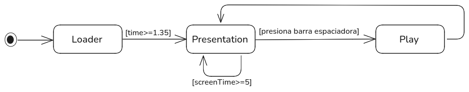
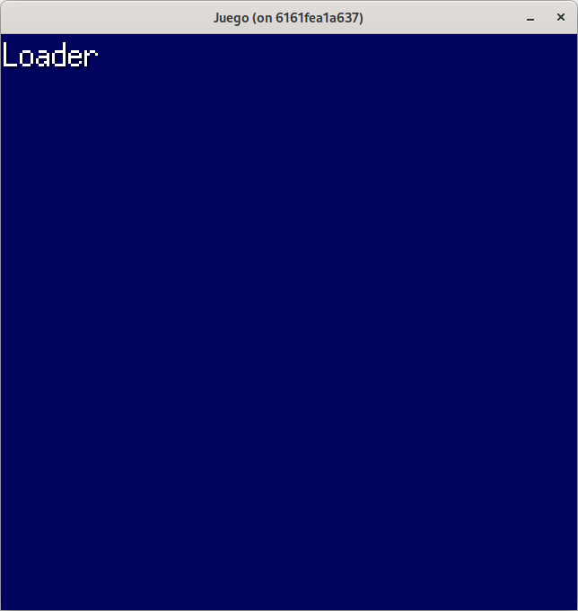
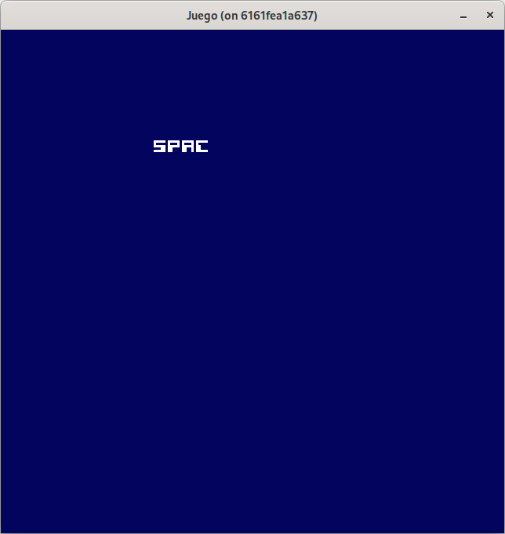
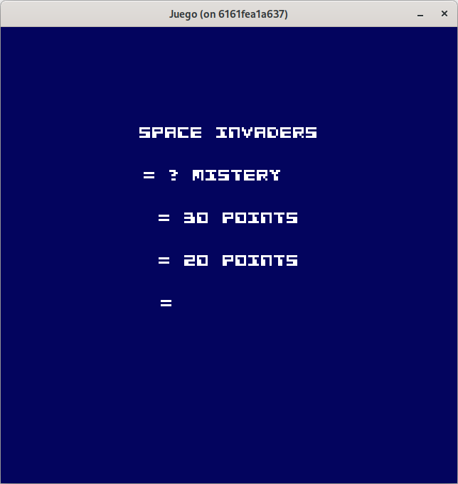
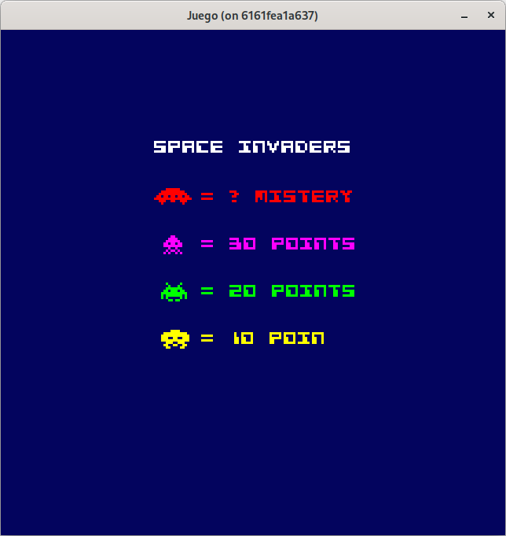

# Paso 9: Estados de la aplicación.
En este paso aprenderás:
* Cómo estructurar tu juego en múltiples estados visuales y lógicos.
* Cómo diseñar una interfaz común para estados que permite transiciones limpias.
* Cómo aplicar animaciones básicas con Ebiten (escalado, rotación, canal alfa, parpadeo, máquina de escribir).
* Cómo reorganizar paquetes para reflejar responsabilidades más precisas (separación por estados).

Hasta este momento, cuando ejecutamos el juego, directamente nos aparece la vista de juego, que nos muestra el "play game" y el "game over", para volver de nuevo al "play game".

Vamos a crear la funcionalidad para presentar una vista de bienvenida (**loader**), la vista previa al juego donde podemos mostrar los puntos de cada enemigo (**presentation**) y la vista que ya disponemos de juego (**play**).

Para realizar esto, refactorizaremos la entidad **Game**, que conocerá los estados que puede manejar, y en su bucle de juego (en los métodos implementados de la interfaz **ebiten.Game**) se encargará de determinar el estado actual e invocar a métodos para procesar eventos, actualizar su lógica y dibujar su estado.

Vamos a tener en cuenta, que casi toda la funcionalidad que tenemos en **Game** se llevará al nuevo estado de juego **play**.

## Descripción de los estados.
Como hemos indicado, vamos a manejar tres estados:
* **Loader**: Este estado es con el que arranca la aplicación (nuestro juego), y presentará una pantalla sin recoger ningún evento, simplemente la tendremos presente durante unos segundos. En este estado se puede añadir funcionalidad para cargar recursos externos y una vez finalizada la carga pasar al siguiente estado. Esta última funcionalidad no se ha realizado en este tutorial.
* **Presentación**: Este estado se va a encargar de presentar la puntuación de la nave y de los aliens de forma similar a como lo hace el original. Se queda unos segundos esperando y si no hay interacción, se vuelve a repintar. Si hay un evento del usuario (presionar la tecla barra espaciadora) ya pasa al siguiente estado.
* **Play**: Este estado es el contenido ya visto en el tutorial y que actualmente se recoge en **Game**. Nos va a permitir jugar al juego y en caso de pasar a su estado interno de **gameOver** en vez de volver a iniciar el juego, vamos  a llevar al usuario al estado de **Presentación**.

Un estado como hemos indicado antes, tendrá una serie de métodos y estos métodos van a ser:
* **ProcessEvents**: recogerá eventos del usuario, como hasta ahora, entrada de teclado
* **Update**: actualizará la lógica del estado
* **Draw**: dibujará el estado actual según su lógica interna.
* **NextState**: en función del estado interno, devolverá el estado actual o el siguiente estado al que tiene que pasar la aplicación.

Todos estos métodos los podemos agrupar en una interface llamada **State** y que cada estado debe de implementar. Cada estado lo vamos a determinar por un identificador, y para ello usaremos un enumerado.

Vamos a ubicar todo esto nuevo, siguiendo el pauta como hasta ahora, en **internal/states**, y en un fichero llamado **state.go**:

~~~go
package states

import "github.com/hajimehoshi/ebiten/v2"

type StateId int

const (
  Loader StateId = iota
  Presentation
  Play
)

// State define el comportamiento de un estado de juego
type State interface {
  ProcessEvents()
  Update()
  Draw(screen *ebiten.Image)
  NextState() StateId
}
~~~

Teniendo esto en mente, nos va llevar a una nueva reestructuración del paquete **internal**, donde por cada estado podemos definir un paquete, quedándonos una estructura similar a esta:

~~~shell
internal/
├── assets/
│   ├── fonts/
│   │   └── ...
│   └── sounds/
│       └── ...
├── common/
│   └── xxxxxxx
├── config/
│   └── ...
├── sounds/
│   └── ...
├── sprite/
│   └── ...
├── states/
│   ├── loader/
│   │	└── ...
│   ├── play/
│   │	└── ...
│   └── presentation/
│   	└── ...
├── utils/
│   └── ...
└── game.go
~~~

## Implementación de los estados.
Para empezar, vamos a realizar una copia del fichero **game.go** a **game.old**, y el nuevo **game.go** va a gestionar los estados creados por medio de un mapa.

### loader/loader.go
~~~go
package loader

import (
  "image/color"

  "github.com/hajimehoshi/ebiten/v2"
  "github.com/programatta/spaceinvaders/internal/states"
)

type LoaderState struct {
  nextState states.StateId
}

func NewLoaderState() *LoaderState {
  return &LoaderState{}
}

func (ls *LoaderState) ProcessEvents() {}

func (ls *LoaderState) Update() {}

func (ls *LoaderState) Draw(screen *ebiten.Image) {
  screen.Fill(color.RGBA{0x03, 0x04, 0x5e, 0xFF})
  ebitenutil.DebugPrint(screen, "Loader")
}

func (ls *LoaderState) NextState() states.StateId {
  return ls.nextState
}
~~~

### presentation/presentation.go
~~~go
package presentation

import (
  "image/color"

  "github.com/hajimehoshi/ebiten/v2"
  "github.com/programatta/spaceinvaders/internal/states"
)

type PresentationState struct {
  nextState states.StateId
}

func NewPresentationState() *PresentationState {
  return &PresentationState{}
}

func (ps *PresentationState) ProcessEvents() {}

func (ps *PresentationState) Update() {}

func (ps *PresentationState) Draw(screen *ebiten.Image) {
  screen.Fill(color.RGBA{0x03, 0x04, 0x5e, 0xFF})
}

func (ps *PresentationState) NextState() states.StateId {
  return ps.nextState
}
~~~

### play/play.go
~~~go
package play

import (
  "image/color"

  "github.com/hajimehoshi/ebiten/v2"
  "github.com/programatta/spaceinvaders/internal/states"
)

type PlayState struct {
  nextState states.StateId
}

func NewPlayState() *PlayState {
  return &PlayState{}
}

func (ps *PlayState) ProcessEvents() {}

func (ps *PlayState) Update() {}

func (ps *PlayState) Draw(screen *ebiten.Image) {
  screen.Fill(color.RGBA{0x03, 0x04, 0x5e, 0xFF})
}

func (ps *PlayState) NextState() states.StateId {
  return ps.nextState
}
~~~

### game.go
~~~go
package internal

import (
  "github.com/hajimehoshi/ebiten/v2"
  "github.com/programatta/spaceinvaders/internal/config"
  "github.com/programatta/spaceinvaders/internal/sounds"
  "github.com/programatta/spaceinvaders/internal/sprite"
  "github.com/programatta/spaceinvaders/internal/states"
  "github.com/programatta/spaceinvaders/internal/states/loader"
  "github.com/programatta/spaceinvaders/internal/states/play"
  "github.com/programatta/spaceinvaders/internal/states/presentation"
  "github.com/programatta/spaceinvaders/internal/utils"
)

type Game struct {
  currentState   states.State
  currentStateId states.StateId
  states         map[states.StateId]states.State
}

func NewGame() *Game {
  _ = sprite.NewSpriteCreator()
  _ = utils.LoadEmbeddedFont(8)
  _ = sounds.NewSoundEffects()

  game := &Game{}

  game.states = make(map[states.StateId]states.State)
  game.states[states.Presentation] = presentation.NewPresentationState()
  game.states[states.Play] = play.NewPlayState()

  game.currentState = loader.NewLoaderState()
  game.currentStateId = states.Loader

  return game
}

// Implementación de la interface esperada por ebiten.
func (g *Game) Update() error {
  next := g.currentState.NextState()
  if next != g.currentStateId {
    g.currentState = g.states[next]
    g.currentStateId = next
  }
  g.currentState.ProcessEvents()
  g.currentState.Update()

  return nil
}

func (g *Game) Draw(screen *ebiten.Image) {
  g.currentState.Draw(screen)
}

func (g *Game) Layout(outsideWidth, outsideHeight int) (screenWidth, screenHeight int) {
  return config.DesignWidth, config.DesignHeight
}
~~~

Con esta primera aproximación, tenemos ya preparados los estados para abordar las nuevas funcionalidades.

Puede consultar el código de este paso en la rama [step-09-estados_1](https://github.com/programatta/space-invaders/tree/step-09-estados_1).

## El estado Loader.
Este estado nos va a servir de presentación, y lo mantendremos durante unos segundos. Este estado inicialmente va a necesitar las fuentes y **SpriteCreator** ya que podemos poner una ilustración de alguno de los aliens, por lo que pasaremos esto a la función constructora del estado.

### loader.go
~~~go
type LoaderState struct {
  spriteCreator *sprite.SpriteCreator
  textFace      *text.GoTextFace
  nextState     states.StateId
}

func NewLoaderState(spriteCreator *sprite.SpriteCreator, textFace *text.GoTextFace) *LoaderState {
  return &LoaderState{
    spriteCreator: spriteCreator,
    textFace:      textFace,
    nextState:     states.Loader,
  }
}

func (ls *LoaderState) Draw(screen *ebiten.Image) {
  screen.Fill(color.RGBA{0x03, 0x04, 0x5e, 0xFF})

  crabSprite, _ := ls.spriteCreator.SpriteByName("crab1")
  drawOp := &ebiten.DrawImageOptions{}
  drawOp.GeoM.Translate(20, 10)
  drawOp.GeoM.Scale(5.0, 5.0)
  drawOp.GeoM.Rotate(rotationInRads)
  drawOp.ColorScale.ScaleAlpha(0.16)
  screen.DrawImage(crabSprite.Image, drawOp)

  uiTitleText := "SPACE INVADERS"
  widthText, _ := text.Measure(uiTitleText, ls.textFace, 0)
  titleX := float64(config.DesignWidth/2) - widthText
  titleY := float64(config.DesignHeight/2 - 24)

  titleOp := &text.DrawOptions{}
  titleOp.GeoM.Scale(2.0, 2.0)
  titleOp.GeoM.Translate(titleX, titleY)
  titleOp.ColorScale.ScaleWithColor(color.White)
  text.Draw(screen, uiTitleText, ls.textFace, titleOp)

  uiTechText := "Powered by Golang & Ebiten"
  widthText, _ = text.Measure(uiTechText, ls.textFace, 0)
  techX := float64(config.DesignWidth/2) - widthText/2
  techY := float64(config.DesignHeight/2 + 50)

  techOp := &text.DrawOptions{}
  techOp.GeoM.Translate(techX, techY)
  techOp.ColorScale.ScaleWithColor(color.White)
  text.Draw(screen, uiTechText, ls.textFace, techOp)
}

const rotationInRads float64 = 45 * math.Pi / 180
~~~

### game.go
~~~go
func NewGame() *Game {
  textFace := utils.LoadEmbeddedFont(8)
  spriteCreator := sprite.NewSpriteCreator()
  _ = sounds.NewSoundEffects()

  game := &Game{}

  game.states = make(map[states.StateId]states.State)
  game.states[states.Presentation] = presentation.NewPresentationState()
  game.states[states.Play] = play.NewPlayState()

  game.currentState = loader.NewLoaderState(spriteCreator, textFace)
  game.currentStateId = states.Loader

  return game
}
~~~

Con esta funcionalidad, tenemos que este estado nos muestra el texto del juego como en pasos anteriores. Vemos que usamos dos nuevas funcionalidades:
* escalado
* rotación
* aplicación de alfa

El escalado es ofrecida por `GeoM.Scale(x,y float64)` que nos permite redimensionar, tanto la fuente como las imágenes.

La rotación es ofrecida por `GeoM.Rotate(theta float64)` que nos permite rotar una imagen desde el punto superior izquierdo y girarla un ángulo indicado en radianes. 

El canal alfa es ofrecido por `ColorScale.ScaleAlpha(a float32)` con valores de 0 a 1, donde 0 será un valor transparente y 1 opaco.

Hay que tener en cuenta que no es conmutativa la operación `GeoM.Translate()` con `GeoM.Scale()`. Si se hace primero el escalado, los valores de translación serán diferentes.

<Imagen con texto e imagen de alien>

Finalizamos añadiendo la funcionalidad de retardo para realizar el cambio de estado. Dejamos un segundo y medio aproximadamente para pasar al estado de presentación (**Presentation**).

~~~go
type LoaderState struct {
  spriteCreator *sprite.SpriteCreator
  textFace      *text.GoTextFace
  time          float32
  nextState     states.StateId
}

func (ls *LoaderState) Update() {
  ls.time += config.Dt
  if ls.time >= viewChangeDelay {
    ls.time = 0
    ls.nextState = states.Presentation
  }
}

const viewChangeDelay float32 = 1.35 //en segundos.
~~~

Con está funcionalidad, ya se permite el cambio de estado a presentación al cumplir el tiempo de retraso. En este momento, el cambio va a producir un error, ya que solo tenemos definidos los estados, pero no están devolviendo el identificador del estado en curso. Esto lo resolvemos en el siguiente apartado.

Puede consultar el código de este paso en la rama [step-09-estados_2](https://github.com/programatta/space-invaders/tree/step-09-estados_2).

## El estado Presentation.
Este estado se va a encargar de mostrar la información de las puntuaciones de los enemigos, y esperar a que se presione la barra espaciadora para pasar al estado de juego (**Play**). En caso de no ser así, se vuelve a mostrar.
Usaremos la misma forma de presentación de los puntos de los enemigos que en el juego original.

Antes de nada, vamos a corregir el fallo que tenemos y mostrar un mensaje de estado de presentación.

~~~go
func NewPresentationState() *PresentationState {
  return &PresentationState{
    nextState: states.Presentation,
  }
}

func (ps *PresentationState) Draw(screen *ebiten.Image) {
  screen.Fill(color.RGBA{0x03, 0x04, 0x5e, 0xFF})
  ebitenutil.DebugPrint(screen, "Presentation")
}
~~~

Con este pequeño cambio, ya tenemos el flujo de la aplicación funcionando.

Como en el estado anterior, en este vamos a hacer uso de la fuente y de la entidad **SpriteCreator**, así que los pasamos a su función constructora **NewPresentationState()**.

### presentation.go
~~~go
type PresentationState struct {
  spriteCreator *sprite.SpriteCreator
  textFace      *text.GoTextFace
  nextState     states.StateId
}

func NewPresentationState(spriteCreator *sprite.SpriteCreator, textFace *text.GoTextFace) *PresentationState {
  return &PresentationState{
    spriteCreator: spriteCreator,
    textFace:      textFace,
    nextState:     states.Presentation,
  }
}

func (ps *PresentationState) Draw(screen *ebiten.Image) {
  screen.Fill(color.RGBA{0x03, 0x04, 0x5e, 0xFF})

  title := "SPACE INVADERS"
  widthText, _ := text.Measure(title, ps.textFace, 0)
  titleX := float64(config.DesignWidth/2) - widthText/2
  titleY := float64(config.DesignHeight/2 - 60)

  textOp := &text.DrawOptions{}
  textOp.GeoM.Translate(titleX, titleY)
  textOp.ColorScale.ScaleWithColor(color.White)
  text.Draw(screen, title, ps.textFace, textOp)
}
~~~

Con esta funcionalidad ya vemos la pantalla de presentación con la fuente pasada.

Vamos a añadir una funcionalidad para escribir textos carácter a carácter con un tiempo de retardo:
~~~go
type PresentationState struct {
  ...
  time          float32
  uiTitleText   string
  textIndex     int
}

func (ps *PresentationState) Update() {
  ps.time += config.Dt
  if ps.time >= 1.12 {
    if ps.textIndex <= len(title) {
      ps.uiTitleText = title[0:ps.textIndex]
      ps.textIndex++
    } else {
      ps.textIndex = 0
    }
    ps.time = 0
  }
}

func (ps *PresentationState) Draw(screen *ebiten.Image) {
  screen.Fill(color.RGBA{0x03, 0x04, 0x5e, 0xFF})

  widthText, _ := text.Measure(title, ps.textFace, 0)
  titleX := float64(config.DesignWidth/2) - widthText/2
  titleY := float64(config.DesignHeight/2 - 60)

  textOp := &text.DrawOptions{}
  textOp.GeoM.Translate(titleX, titleY)
  textOp.ColorScale.ScaleWithColor(color.White)
  text.Draw(screen, ps.uiTitleText, ps.textFace, textOp)
}

const title string = "SPACE INVADERS"
~~~

Puede consultar el código de este paso en la rama [step-09-estados_3](https://github.com/programatta/space-invaders/tree/step-09-estados_3).

Vamos a reutilizar esta funcionalidad para añadir mas textos, e ir mostrando cada uno línea a línea:

~~~go
type PresentationState struct {
  ...
  uiTitleText   string
  uiMisteryText string
  uiSquidText   string
  uiCrabText    string
  uiOctopusText string
  textIndex     int
  currentStep   int
}
func (ps *PresentationState) Update() {
  ps.time += config.Dt
  if ps.time >= 0.12 {
    if ps.currentStep == 0 {
      ps.uiTitleText = ps.typeWriteText(title)
    }
    if ps.currentStep == 1 {
      ps.uiMisteryText = ps.typeWriteText(mistery)
    }
    if ps.currentStep == 2 {
      ps.uiSquidText = ps.typeWriteText(squid)
    }
    if ps.currentStep == 3 {
      ps.uiCrabText = ps.typeWriteText(crab)
    }
    if ps.currentStep == 4 {
      ps.uiOctopusText = ps.typeWriteText(octopus)
    }
    if ps.currentStep == 5 {
      ps.currentStep = 0
    }
    ps.time = 0
  }
}

func (ps *PresentationState) Draw(screen *ebiten.Image) {
  screen.Fill(color.RGBA{0x03, 0x04, 0x5e, 0xFF})

  if ps.currentStep >= 0 {
    widthText, _ := text.Measure(title, ps.textFace, 0)
    titleX := float64(config.DesignWidth/2) - widthText/2
    titleY := float64(config.DesignHeight/2 - 60)

    ps.drawText(screen, ps.uiTitleText, titleX, titleY, color.White)
  }
  if ps.currentStep >= 1 {
    misteryTextX := float64(config.DesignWidth/2 - 40)
    misteryTextY := float64(config.DesignHeight/2 - 40)

    ps.drawText(screen, ps.uiMisteryText, misteryTextX, misteryTextY, color.White)
  }

  if ps.currentStep >= 2 {
    widthText, _ := text.Measure(squid, ps.textFace, 0)
    squidTextX := float64(config.DesignWidth/2) - widthText/2
    squidTextY := float64(config.DesignHeight/2 - 20)

    ps.drawText(screen, ps.uiSquidText, squidTextX, squidTextY, color.White)
  }
  if ps.currentStep >= 3 {
    widthText, _ := text.Measure(crab, ps.textFace, 0)
    crabTextX := float64(config.DesignWidth/2) - widthText/2
    crabTextY := float64(config.DesignHeight / 2)

    ps.drawText(screen, ps.uiCrabText, crabTextX, crabTextY, color.White)
  }
  if ps.currentStep >= 4 {
    widthText, _ := text.Measure(octopus, ps.textFace, 0)
    octopusTextX := float64(config.DesignWidth/2) - widthText/2
    octopusTextY := float64(config.DesignHeight/2 + 20)

    ps.drawText(screen, ps.uiOctopusText, octopusTextX, octopusTextY, color.White)
  }
}

func (ps *PresentationState) typeWriteText(text string) string {
  tmpText := text
  if ps.textIndex <= len(text) {
    tmpText = text[0:ps.textIndex]
    ps.textIndex++
  } else {
    ps.currentStep++
    ps.textIndex = 0
  }
  return tmpText
}

func (ps *PresentationState) drawText(screen *ebiten.Image, textstr string, posX, posY float64, color color.Color) {
  textOp := &text.DrawOptions{}
  textOp.GeoM.Translate(posX, posY)
  textOp.ColorScale.ScaleWithColor(color)
  text.Draw(screen, textstr, ps.textFace, textOp)
}

const title string = "SPACE INVADERS"
const mistery string = "= ? MISTERY"
const squid string = "= 30 POINTS"
const crab string = "= 20 POINTS"
const octopus string = "= 10 POINTS"
~~~

Con esta funcionalidad, obtenemos el efecto deseado, se va mostrando el texto carácter a carácter, y cuando finaliza una cadena, se pasa al siguiente paso incrementando **currentStep** y el indice de la cadena **textIndex** se pone a 0 para ir mostrando carácter a carácter la siguiente cadena y así hasta mostrar todas.

Puede consultar el código de este paso en la rama [step-09-estados_4](https://github.com/programatta/space-invaders/tree/step-09-estados_4).

Vamos a añadir los sprites de cada enemmigo junto con su puntuación, y además vamos a tintar la fuente del color de cada sprite:

~~~go
func (ps *PresentationState) Draw(screen *ebiten.Image) {
  screen.Fill(color.RGBA{0x03, 0x04, 0x5e, 0xFF})

  var lineX float64 = 0
  var lineY float64 = 0
  if ps.currentStep >= 0 {
    widthText, _ := text.Measure(title, ps.textFace, 0)
    lineX = float64(config.DesignWidth/2) - widthText/2
    lineY = float64(config.DesignHeight/2 - 60)

    ps.drawText(screen, ps.uiTitleText, lineX, lineY, color.White)
    lineY += 20
  }
  if ps.currentStep >= 1 {
    ufoSprite, _ := ps.spriteCreator.SpriteByName("ufo")
    ps.drawIcon(screen, ufoSprite, lineX, lineY)
    ps.drawText(screen, ps.uiMisteryText, lineX+20, lineY+1, ufoSprite.Color)
    lineY += 20
  }
  if ps.currentStep >= 2 {
    squidSprite, _ := ps.spriteCreator.SpriteByName("squid1")
    ps.drawIcon(screen, squidSprite, lineX+4, lineY)
    ps.drawText(screen, ps.uiSquidText, lineX+20, lineY+1, squidSprite.Color)
    lineY += 20
  }
  if ps.currentStep >= 3 {
    crabSprite, _ := ps.spriteCreator.SpriteByName("crab1")
    ps.drawIcon(screen, crabSprite, lineX+3, lineY)
    ps.drawText(screen, ps.uiCrabText, lineX+20, lineY+1, crabSprite.Color)
    lineY += 20
  }
  if ps.currentStep >= 4 {
    octopusSprite, _ := ps.spriteCreator.SpriteByName("octopus1")
    ps.drawIcon(screen, octopusSprite, lineX+3, lineY)
    ps.drawText(screen, ps.uiOctopusText, lineX+20, lineY+1, octopusSprite.Color)
  }
}
~~~

Con esta funcionalidad, mostramos los enemigos junto con sus puntuaciones, y mostrando carácter a carácter y con el mismo color en el texto. Cada línea la separamos en **20** pixeles y los enemigos se van desplazando **4**, **3** y **3** en **X** con base al primer enemigo. Los textos se desplazan en **X** en **20** pixeles para que queden en columna.

Puede consultar el código de este paso en la rama [step-09-estados_5](https://github.com/programatta/space-invaders/tree/step-09-estados_5).

Para finalizar este estado, vamos a poner un mensaje indicando que presione la barra espaciadora para jugar, y este mensaje va a estar parpadeando.

Para ello vamos a definir dos estados internos, uno para mostrar los textos como hasta ahora (**showScores**), y otro para mostrar el mensaje parpadeando (**showToPlay**).

### inner_state.go
~~~go
package presentation

type presentationInnerStateId int

const (
  showScores presentationInnerStateId = iota
  showToPlay
)
~~~

### presentation.go
~~~go
type PresentationState struct {
  ...
  pressSpaceTime       float32
  reloadScreenTime     float32
  showPressSpaceToPlay bool
  innerState           presentationInnerStateId
}

func NewPresentationState(spriteCreator *sprite.SpriteCreator, textFace *text.GoTextFace) *PresentationState {
  return &PresentationState{
    spriteCreator: spriteCreator,
    textFace:      textFace,
    nextState:     states.Presentation,
    innerState:    showScores,
  }
}

func (ps *PresentationState) ProcessEvents() {
  if inpututil.IsKeyJustReleased(ebiten.KeySpace) {
    ps.nextState = states.Play
  }

  if ebiten.IsKeyPressed(ebiten.KeyEscape) {
    os.Exit(0)
  }
}

func (ps *PresentationState) Update() {
  switch ps.innerState {
    case showScores:
      ps.time += config.Dt
      if ps.time >= stepDelay {
        if ps.currentStep == 0 {
          ps.uiTitleText = ps.typeWriteText(title)
        }
        if ps.currentStep == 1 {
          ps.uiMisteryText = ps.typeWriteText(mistery)
        }
        if ps.currentStep == 2 {
          ps.uiSquidText = ps.typeWriteText(squid)
        }
        if ps.currentStep == 3 {
          ps.uiCrabText = ps.typeWriteText(crab)
        }
        if ps.currentStep == 4 {
          ps.uiOctopusText = ps.typeWriteText(octopus)
        }
        if ps.currentStep == 5 {
          ps.innerState = showToPlay
        }
        ps.time = 0
      }
    case showToPlay:
      ps.pressSpaceTime += config.Dt
      if ps.pressSpaceTime >= blinkDelay {
        ps.pressSpaceTime = 0
        ps.showPressSpaceToPlay = !ps.showPressSpaceToPlay
      }

      ps.reloadScreenTime += config.Dt
      if ps.reloadScreenTime > reloadDelay {
        ps.uiTitleText = ""
        ps.reloadScreenTime = 0
        ps.currentStep = 0
        ps.innerState = showScores
      }
  }
}

func (ps *PresentationState) Draw(screen *ebiten.Image) {
  ...
  if ps.currentStep >= 5 {
    if ps.showPressSpaceToPlay {
      widthText, _ := text.Measure(pressToPlay, ps.textFace, 0)
      playX := float64(config.DesignWidth/2) - widthText/2
      playY := float64(config.DesignHeight/2 + 50)
      ps.drawText(screen, pressToPlay, playX, playY, color.White)
    }
  }
}
...
const pressToPlay string = "PRESS SPACE TO PLAY"

const stepDelay float32 = 0.12  //en segundos.
const reloadDelay float32 = 5.0 //en segundos.
const blinkDelay float32 = 0.5  //en segundos.
~~~

En la funcionalidad añadida, al pasar del estado **showScores** a **showToPlay**, controlamos un tiempo de retardo para modificar la variable booleana **showPressSpaceToPlay** que hace el efecto de parpadeo.

También en este estado interno, se controla en mostrar la pantalla hasta que se cumple, en ese momento pasa del estado **showToPlay** a **showScores**, y establece **currentStep** a **0** y borra **uiTitleText** para evitar un parpadeo.

También se ha añadido en **ProcessEvents()** la acción de presionar la barra espaciadora para cambiar de estado, y si se pulsa la tecla escape, salir de la aplicación.

Puede consultar el código de este paso en la rama [step-09-estados_6](https://github.com/programatta/space-invaders/tree/step-09-estados_6).

Como en el estado anterior, si pulsamos la barra espaciadora, tendremos un error, pero esto lo solucionamos con la definición del siguiente estado.

## El estado Play.
Como hemos visto, al presionar la barra espaciadora, se nos vuelve a romper el juego, ya que no estamos retornando ningún estado al pasar a Play. Primero arreglamos esto.

### play.go
~~~go
func NewPlayState() *PlayState {
  return &PlayState{
    nextState: states.Play,
  }
}

func (ps *PlayState) Draw(screen *ebiten.Image) {
  screen.Fill(color.RGBA{0x03, 0x04, 0x5e, 0xFF})
  ebitenutil.DebugPrint(screen, "Play")
}
~~~

Con este pequeño cambio, ya tenemos el flujo completo desde el estado de **Presentation** a **Play**.

Este estado, realmente va a contener la funcionalidad que ya teníamos realizada antes de aplicar estados y como mostramos al principio de este paso 9, vamos a reestructurar internal, moviendo los siguientes paquetes y ficheros a states/play:
* common
* enemy
* explosion
* player
* bullet.go
* play_innerstate.go
* stage.go

Esto nos va a llevar a cambiar el nombre del paquete al que pertenece los ficheros, y reajustar las importaciones. En los ficheros, bullet.go, play_innerstate.go y stage.go cambiamos **package internal** por **package play**. Y las modificaciones en los imports es ajustar las referencias a los paquetes movidos indicando **"states/play/"**.

Por favor, antes de continuar, revisa el código de este paso en la rama [step-09-estados_7](https://github.com/programatta/space-invaders/tree/step-09-estados_7).

Procedemos a adaptar **play.go** con el contenido de **game.old** que es la copia que mantuvimos y que una vez finalicemos lo eliminaremos.

Como en los estados anteriores, vamos a necesitar la entidad **SpriteCreator**, la fuente y los sonidos.

### play.go
~~~go
type PlayState struct {
  spriteCreator *sprite.SpriteCreator
  textFace      *text.GoTextFace
  soundEffects  *sounds.SoundEffects
  nextState     states.StateId
}
func NewPlayState(spriteCreator *sprite.SpriteCreator, textFace *text.GoTextFace, soundEffects *sounds.SoundEffects) *PlayState {
  return &PlayState{
    spriteCreator: spriteCreator,
    textFace:      textFace,
    soundEffects:  soundEffects,
    nextState:     states.Play,
  }
}
~~~

### game.go
~~~go
func NewGame() *Game {
  textFace := utils.LoadEmbeddedFont(8)
  spriteCreator := sprite.NewSpriteCreator()
  soundEffects := sounds.NewSoundEffects()

  game := &Game{}

  game.states = make(map[states.StateId]states.State)
  game.states[states.Presentation] = presentation.NewPresentationState(spriteCreator, textFace)
  game.states[states.Play] = play.NewPlayState(spriteCreator, textFace, soundEffects)

  game.currentState = loader.NewLoaderState(spriteCreator, textFace)
  game.currentStateId = states.Loader

  return game
}
~~~

Con este cambio, ya tenemos ligado el estado **Play** con **Game**.

Puede consultar el código de este paso en la rama [step-09-estados_8](https://github.com/programatta/space-invaders/tree/step-09-estados_8).

Comenzamos a mover funcionalidad de **GameOld** a **PlayState**, comenzamos con los campos de la entidad **PlayState** y la función constructora **NewPlayState()**

~~~go
type PlayState struct {
  spriteCreator     *sprite.SpriteCreator
  textFace          *text.GoTextFace
  soundEffects      *sounds.SoundEffects
  cannon            *player.Cannon
  cannonCount       uint8
  score             uint32
  bullets           []*Bullet
  bunkers           []*player.Bunker
  ufo               *enemy.Ufo
  enemies           []*enemy.Alien
  enemiesCurrentDir float32
  newDirection      float32
  explosions        []explosion.Explosioner
  alienFireTime     float32
  innerStateId      playInnerStateId
  nextState         states.StateId
}

func NewPlayState(spriteCreator *sprite.SpriteCreator, textFace *text.GoTextFace, soundEffects *sounds.SoundEffects) *PlayState {

  playState := &PlayState{}

  playState.spriteCreator = spriteCreator
  playState.textFace = textFace
  playState.soundEffects = soundEffects

  spriteCannon, _ := spriteCreator.SpriteByName("cannon")
  playState.cannon = player.NewCannon(float32(0), float32(config.DesignHeight-10), spriteCannon, playState)

  bunkers := createBunkers(spriteCreator)
  playState.bunkers = bunkers

  ufoSprite, _ := spriteCreator.SpriteByName("ufo")
  ufo := enemy.NewUfo(-20, 15, ufoSprite)
  playState.ufo = ufo

  enemies := createEnemies(spriteCreator, playState)
  playState.enemies = enemies
  playState.enemiesCurrentDir = 1
  playState.newDirection = 1
  playState.cannonCount = 3
  playState.score = 0
  playState.innerStateId = playing

  playState.nextState = states.Play

  return playState
}
~~~

Vamos a necesitar implementar la interfaz **common.Notifier** para **PlayState** de la misma forma que lo teníamos en **GameOld.go**, copiando los métodos y renombrando **g** por **ps**:

~~~go
// -----------------------------------------------------------------------------
// Implementación de la interface Notifier
// -----------------------------------------------------------------------------
func (ps *PlayState) OnCreateCannonBullet(posX, posY float32, color color.Color) {
  spriteBullet, _ := ps.spriteCreator.SpriteByName("bullet")
  bullet := NewBullet(posX, posY, spriteBullet, color, -1)
  ps.bullets = append(ps.bullets, bullet)
  ps.soundEffects.PlayShoot()
}

func (ps *PlayState) OnCreateAlienBullet(posX, posY float32, color color.Color) {
  spriteBullet, _ := ps.spriteCreator.SpriteByName("bullet")
  bullet := NewBullet(posX, posY, spriteBullet, color, 1)
  ps.bullets = append(ps.bullets, bullet)
}

func (ps *PlayState) OnChangeDirection(newDirection float32) {
  ps.newDirection = newDirection
}

func (ps *PlayState) OnResetUfo() {
  ps.ufo.Reset()
}

func (ps *PlayState) OnResetCannon() {
  if ps.cannonCount == 0 {
    ps.innerStateId = gameOver
  }
  ps.cannon.Reset()
}
~~~

La adaptación al método **ProcessEvents()** es de la siguiente forma:

~~~go
func (ps *PlayState) ProcessEvents() {
  switch ps.innerStateId {
  case playing:
    ps.processKeyEventPlaying()
  case gameOver:
    ps.processKeyEventGameOver()
  }
}
~~~
En la anterior funcionalidad, el método **Update** se encargaba de recoger los eventos y hacer la actualización de la lógica en función de estos. Ahora, con la interfaz de **State** tenemos separada esta funcionalidad, aunque realmente se llame a **ProcessEvents()** y **Update()** en la función **Update()** de la entidad **Game**.

Movemos las funciones requeridas de GameOld a PlayState y reajustando como antes:
~~~go
// -----------------------------------------------------------------------------
// Sección de procesamiento de eventos por estado.
// -----------------------------------------------------------------------------

func (ps *PlayState) processKeyEventPlaying() {
  ps.cannon.ProcessKeyEvents()
}

func (ps *PlayState) processKeyEventGameOver() {
  if inpututil.IsKeyJustReleased(ebiten.KeySpace) {
    // resetear el juego.
    ps.reset()
    ps.cannon.Reset()
    ps.cannonCount = 3
    ps.score = 0
    ps.innerStateId = playing
  }
}

func (ps *PlayState) reset() {
  bunkers := createBunkers(ps.spriteCreator)
  enemies := createEnemies(ps.spriteCreator, ps)

  ps.enemies = enemies
  ps.bullets = []*Bullet{}
  ps.bunkers = bunkers
  ps.explosions = []explosion.Explosioner{}
  ps.enemiesCurrentDir = 1
  ps.newDirection = 1
  ps.alienFireTime = 0
}
~~~

La adaptación al método **Update()** es de la siguiente forma:

~~~go
func (ps *PlayState) Update() {
  if ps.innerStateId == playing {
    ps.updatePlaying()
  }
}
~~~

Movemos las funciones requeridas de GameOld a PlayState y reajustando como antes.
~~~go
// -----------------------------------------------------------------------------
// Sección de actualización por estado.
// -----------------------------------------------------------------------------

func (ps *PlayState) updatePlaying() {
  ps.cannon.Update()

  ps.alienFireTime += config.Dt
  if ps.alienFireTime > 0.400 {
    if len(ps.enemies) > 0 {
      pos := rand.Intn(len(ps.enemies))
      ps.enemies[pos].Fire()
    }
    ps.alienFireTime = 0
  }

  for _, bullet := range ps.bullets {
    bullet.Update()
  }

  ps.ufo.Update()
  ufoX, _ := ps.ufo.Position()
  if ufoX >= 5 {
    ps.soundEffects.PlayUfo()
  }

  var enemyIncrementSpeed float32 = 0
  if len(ps.enemies) == 1 {
    enemyIncrementSpeed = 7
  } else if 2 <= len(ps.enemies) && len(ps.enemies) <= 5 {
    enemyIncrementSpeed = 5
  } else if 6 <= len(ps.enemies) && len(ps.enemies) <= 10 {
    enemyIncrementSpeed = 3
  }

  for _, enemy := range ps.enemies {
    enemy.IncrementSpeed(enemyIncrementSpeed)
    enemy.ChangeDirection(ps.enemiesCurrentDir)
    enemy.Update()
  }

  for _, explosion := range ps.explosions {
    explosion.Update()
  }

  //Colisiones.
  for _, bullet := range ps.bullets {
    if bullet.dirY < 0 {
      //Bala de cañon
      for _, bunker := range ps.bunkers {
        if common.CheckCollision(bullet, bunker) {
          if bunker.DoDamage(bullet.posX, bullet.posY, -1) {
            bullet.OnCollide()
          }
        }
      }
      for _, enemy := range ps.enemies {
        if common.CheckCollision(bullet, enemy) {
          bullet.OnCollide()
          enemy.OnCollide()

          alienExplosionSprite, _ := ps.spriteCreator.SpriteByName("alienExplosion")
          enemyX, enemyY := enemy.Position()
          explosion := explosion.NewExplosion(enemyX, enemyY, alienExplosionSprite, enemy.Color())
          ps.explosions = append(ps.explosions, explosion)
          ps.score += uint32(enemy.Score())
          ps.soundEffects.PlayAlienKilled()
        }
      }
      if ps.ufo.IsActive() && common.CheckCollision(bullet, ps.ufo) {
        bullet.OnCollide()
        ps.ufo.OnCollide()

        ufoExplosionSprite, _ := ps.spriteCreator.SpriteByName("ufoExplosion")
        ufoX, ufoY := ps.ufo.Position()
        ufoScore := ps.ufo.Score()
        explosionUfo := explosion.NewExplosionUfo(ufoX, ufoY, ufoExplosionSprite, ps.textFace, ufoScore, ps)
        ps.explosions = append(ps.explosions, explosionUfo)
        ps.score += uint32(ufoScore)
      }
    } else {
      //Bala de alien.
      for _, bunker := range ps.bunkers {
        if common.CheckCollision(bullet, bunker) {
          if bunker.DoDamage(bullet.posX, bullet.posY, 1) {
            bullet.OnCollide()
          }
        }
      }
      if ps.cannon.IsActive() && common.CheckCollision(bullet, ps.cannon) {
        cannonExplosion1Sprite, _ := ps.spriteCreator.SpriteByName("cannonExplosion1")
        cannonExplosion2Sprite, _ := ps.spriteCreator.SpriteByName("cannonExplosion2")
        posX, posY := ps.cannon.Position()
        explosionCannon := explosion.NewExplosionCannon(posX, posY, cannonExplosion1Sprite, cannonExplosion2Sprite, ps)
        ps.explosions = append(ps.explosions, explosionCannon)
        if ps.cannonCount > 0 {
          ps.cannonCount--
          ps.cannon.OnCollide()
        }
        bullet.OnCollide()
        ps.soundEffects.PlayCannonExplosion()
      }
    }
  }

  //Colisines alien con bunker
  for _, enemy := range ps.enemies {
    for _, bunker := range ps.bunkers {
      if common.CheckCollision(enemy, bunker) {
        bunker.OnCollide()
        break
      }
    }
  }

  if len(ps.bullets) > 0 {
    ps.bullets = slices.DeleteFunc(ps.bullets, func(bullet *Bullet) bool {
      return bullet.CanRemove()
    })
  }

  if len(ps.enemies) > 0 {
    ps.enemies = slices.DeleteFunc(ps.enemies, func(alien *enemy.Alien) bool {
      return alien.CanRemove()
    })
  } else {
    ps.reset()
    ps.cannon.Reset()
  }

  if len(ps.explosions) > 0 {
    ps.explosions = slices.DeleteFunc(ps.explosions, func(explosion explosion.Explosioner) bool {
      return explosion.CanRemove()
    })
  }

  if len(ps.bunkers) > 0 {
    ps.bunkers = slices.DeleteFunc(ps.bunkers, func(bunker *player.Bunker) bool {
      return bunker.CanRemove()
    })
  }

  if ps.newDirection != ps.enemiesCurrentDir {
    ps.enemiesCurrentDir = ps.newDirection
  }
}
~~~

Y finalmente la adaptación al método **Draw()** es de la siguiente forma:

~~~go
func (ps *PlayState) Draw(screen *ebiten.Image) {
  screen.Fill(color.RGBA{0x03, 0x04, 0x5e, 0xFF})
  switch ps.innerStateId {
  case playing:
    ps.drawPlaying(screen)
  case gameOver:
    ps.drawGameOver(screen)
  }
}
~~~

Movemos las funciones requeridas de GameOld a PlayState y reajustando como antes.

~~~go
// -----------------------------------------------------------------------------
// Sección de dibujo de pantalla por estado.
// -----------------------------------------------------------------------------

func (ps *PlayState) drawPlaying(screen *ebiten.Image) {
  uiCannonCountText := fmt.Sprintf("LIVES:%1d", ps.cannonCount)
  op := &text.DrawOptions{}
  op.GeoM.Translate(10, 6)
  op.ColorScale.ScaleWithColor(color.White)
  text.Draw(screen, uiCannonCountText, ps.textFace, op)

  uiScoreText := fmt.Sprintf("SCORE:%06d", ps.score)
  widthText, _ := text.Measure(uiScoreText, ps.textFace, 0)
  op = &text.DrawOptions{}
  op.GeoM.Translate(float64(config.DesignWidth)-widthText-10, 6)
  op.ColorScale.ScaleWithColor(color.White)
  text.Draw(screen, uiScoreText, ps.textFace, op)

  ps.ufo.Draw(screen)

  for _, enemy := range ps.enemies {
    enemy.Draw(screen)
  }

  for _, explosion := range ps.explosions {
    explosion.Draw(screen)
  }

  ps.cannon.Draw(screen)
  for _, bullet := range ps.bullets {
    bullet.Draw(screen)
  }

  for _, bunker := range ps.bunkers {
    bunker.Draw(screen)
  }
}

func (ps *PlayState) drawGameOver(screen *ebiten.Image) {
  uiGameOverText := "GAME OVER"
  widthText, _ := text.Measure(uiGameOverText, ps.textFace, 0)
  gameOverX := float64(config.DesignWidth/2) - widthText/2
  gameOverY := float64(config.DesignHeight/2 - 30)

  op := &text.DrawOptions{}
  op.GeoM.Translate(gameOverX, gameOverY)
  op.ColorScale.ScaleWithColor(color.White)
  text.Draw(screen, uiGameOverText, ps.textFace, op)

  uiYourScoreText := fmt.Sprintf("YOUR SCORE:%06d", ps.score)
  widthText, _ = text.Measure(uiYourScoreText, ps.textFace, 0)
  yourScoreX := float64(config.DesignWidth/2) - widthText/2
  yourScoreY := float64(config.DesignHeight/2 - 15)

  op = &text.DrawOptions{}
  op.GeoM.Translate(yourScoreX, yourScoreY)
  op.ColorScale.ScaleWithColor(color.White)
  text.Draw(screen, uiYourScoreText, ps.textFace, op)
}
~~~

Con estas adaptaciones realizadas, ya disponemos de los estados y el juego funcionando.

Puede consultar el código de este paso en la rama [step-09-estados_9](https://github.com/programatta/space-invaders/tree/step-09-estados_9).

