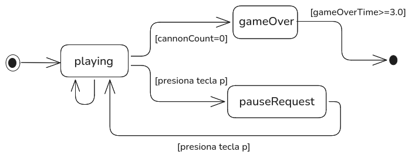
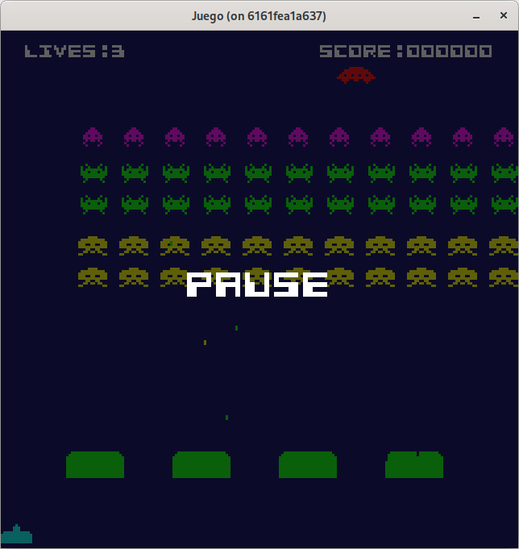

# Paso 10: Mejoras II.
En este paso aprenderás:
* Cómo implementar una transición automática entre estados lógicos de juego.
* Cuándo usar estados precargados frente a una fábrica de estados (State Factory).
* Cómo reiniciar correctamente un estado ya creado usando el método `Start()`.
* Cómo gestionar salidas controladas del juego con teclas especiales como Escape.
* Cómo implementar una funcionalidad de pausa en el juego de forma no disruptiva, capturando la pantalla actual y mostrando un overlay pausado.

Ya tenemos casi todo el flujo de la aplicación. Nos queda por abordar unas mejoras:
* Desde el estado interno **gameOver** de **Play** tras mostrar la puntuación durante  unos segundos, nos lleve al estado de **Presentation**.
* Crear un nuevo estado interno que nos permita parar el juego.
* También una mínima mejora, sobre los eventos en el estado de **Play** al pulsar la tecla escape, nos permita salir del juego.

## Salir del juego.
De igual forma que en el estado **Presentation**, al pulsar la tecla Escape salimos del juego, añadimos esta pequeña funcionalidad en **ProcessEvents()** de **Play**:

### play.go
~~~go
func (ps *PlayState) ProcessEvents() {
  if ebiten.IsKeyPressed(ebiten.KeyEscape) {
    os.Exit(0)
  }
  ...
}	
~~~

Con esto en cualquier monento del juego podemos salir de la aplicación.

Puede consultar el código de este paso en la rama [step-10-mejoras2_1](https://github.com/programatta/space-invaders/tree/step-10-mejoras2_1).

## En gameOver volver al estado Presentation.
Al entrar en este estado interno, vamos a estar en el un determinado tiempo, por ejemplo 3 segundos, y al superar este tiempo, saldremos del estado **Play** y pasaremos al estado **Presentation**.

### play.go
~~~go
type PlayState struct {
  ...
  gameOverTime      float32
}

func (ps *PlayState) ProcessEvents() {
  if ebiten.IsKeyPressed(ebiten.KeyEscape) {
    os.Exit(0)
  }

  switch ps.innerStateId {
  case playing:
    ps.processKeyEventPlaying()
  }
}

func (ps *PlayState) Update() {
  switch ps.innerStateId {
  case playing:
    ps.updatePlaying()
  case gameOver:
    ps.updateGameOver()
  }
}

// -----------------------------------------------------------------------------
// Sección de actualización por estado.
// -----------------------------------------------------------------------------

func (ps *PlayState) updateGameOver() {
  ps.gameOverTime += config.Dt
  if ps.gameOverTime >= gameOverDelay {
    ps.gameOverTime = 0
    ps.nextState = states.Presentation
  }
}

const gameOverDelay float32 = 3.0 //en segs.
~~~

Con esta funcionalidad, ya salimos del estado de **Play** y pasamos al estado de **Presentation**. Pero tenemos un problema, y es que en la entidad **Game**, al realizar el cambio de estado, accedemos al estado almacenado en el mapa, con lo que al procesar **currentState** trabajamos con el estado interno que se quedó.

Para solucionar esto bien se podría usar un patrón **State Factory** o bien podemos añadir un método más en la interface **State** que inicia el estado.
El uso de **State Factory** es adecuado para:
* Hay muchos estados y no todos se usan siempre.
* Los estados son pesados (ej. cargan grandes imágenes, sonidos, mapas).
* Se desea reiniciar completamente el estado cada vez que se entra.
* Se busca reducir el uso de memoria viva al mínimo.

Sin embargo, este patrón crea una nueva instancia del estado cada vez que se entra, lo cual implica:
* Posible presión sobre el **garbage collector**, especialmente si hay ciclos rápidos o estados que se destruyen y se vuelven a crear a menudo.
* Mayor complejidad en la gestión de datos compartidos si algunos estados necesitan conservar datos entre sesiones.

Vamos a seguir por la línea de crear el nuevo método y lo llamaremos **Start()**, con lo que nos lleva a hacer los siguientes cambios:

### state.go
~~~go
type State interface {
  Start()
  ProcessEvents()
  Update()
  Draw(screen *ebiten.Image)
  NextState() StateId
}
~~~

### game.go
~~~go
func (g *Game) Update() error {
  next := g.currentState.NextState()
  if next != g.currentStateId {
    g.currentState = g.states[next]
    g.currentStateId = next
    g.currentState.Start()
  }
}
~~~

### loader.go
~~~go
func (ls *LoaderState) Start() {}
~~~

### presentation.go
~~~go
func NewPresentationState(spriteCreator *sprite.SpriteCreator, textFace *text.GoTextFace) *PresentationState {
  return &PresentationState{
    spriteCreator: spriteCreator,
    textFace:      textFace,
  }
}

func (ps *PresentationState) Start() {
  ps.nextState = states.Presentation
  ps.innerState = showScores
  ps.time = 0
  ps.pressSpaceTime = 0
  ps.uiTitleText = ""
  ps.reloadScreenTime = 0
  ps.currentStep = 0
  ps.textIndex = 0
}
~~~

### play.go
~~~go
func NewPlayState(spriteCreator *sprite.SpriteCreator, textFace *text.GoTextFace, soundEffects *sounds.SoundEffects) *PlayState {

  playState := &PlayState{}

  playState.spriteCreator = spriteCreator
  playState.textFace = textFace
  playState.soundEffects = soundEffects

  spriteCannon, _ := spriteCreator.SpriteByName("cannon")
  playState.cannon = player.NewCannon(float32(0), float32(config.DesignHeight-10), spriteCannon, playState)

  ufoSprite, _ := spriteCreator.SpriteByName("ufo")
  ufo := enemy.NewUfo(-20, 15, ufoSprite)
  playState.ufo = ufo

  return playState
}

func (ps *PlayState) Start() {
  ps.innerStateId = playing
  ps.nextState = states.Play
  ps.cannon.Reset()
  ps.cannonCount = 3
  ps.score = 0
  ps.gameOverTime = 0
  ps.reset()
}
~~~

Con esta pequeña refactorización, ya tenemos la funcionalidad deseada y resolviendo el problema detectado.

Puede consultar el código de este paso en la rama [step-10-mejoras2_2](https://github.com/programatta/space-invaders/tree/step-10-mejoras2_2).

## Pausa del juego.
Para realizar esta funcionalidad, la idea es que al presionar, por ejemplo, la tecla **P** detengamos el juego, dejando la imagen congelada y con un texto, y volviendo a presionar la tecla **P** continua el juego en el mismo estado.

Para llevar a cabo esto, tendremos nuevos estados internos para **Play**, que serán los siguientes **pauseRequest** y **pause**:
* **pauseRequest**: este estado interno va a realizar una captura de la pantalla actual del juego, y se mantiene el estado del juego ya que no estamos en **playing** por lo que no hay actualización de la lógica. Una vez tengamos la pantalla, pasamos al estado de **pause**.
* **pause**: este estado interno va a pintar la pantalla capturada un tanto sombreada y con el texto de pausa. Estará pendiente del evento de tecla **P** presionada para eliminar la imagen capturara, y restaurar el estado de juego volviendo al estado interno **playing**.

Se muestra a continuación los estados internos de **Play** y sus relaciones:

### play_innerstate.go
~~~go
...
const (
  playing playInnerStateId = iota
  pauseRequest
  pause
  gameOver
)
~~~

### play_innerstate.go
~~~go
type PlayState struct {
  ...
  pauseGameScreen   *ebiten.Image
  pauseOverlay      *ebiten.Image
}

func (ps *PlayState) ProcessEvents() {
  if ebiten.IsKeyPressed(ebiten.KeyEscape) {
    os.Exit(0)
  }

  switch ps.innerStateId {
  case playing:
    ps.processKeyEventPlaying()
  case pause:
    ps.processKeyEventPause()
  }
}

func (ps *PlayState) Update() {
  switch ps.innerStateId {
  case playing:
    ps.updatePlaying()
  case pauseRequest:
    ps.updatePauseRequest()
  case gameOver:
    ps.updateGameOver()
  }
}

func (ps *PlayState) Draw(screen *ebiten.Image) {
  screen.Fill(color.RGBA{0x03, 0x04, 0x5e, 0xFF})
  switch ps.innerStateId {
  case playing:
    ps.drawPlaying(screen)
  case pauseRequest:
    ps.drawPauseRequest(screen)
  case pause:
    ps.drawPause(screen)
  case gameOver:
    ps.drawGameOver(screen)
  }
}

// -----------------------------------------------------------------------------
// Sección de procesamiento de eventos por estado.
// -----------------------------------------------------------------------------

func (ps *PlayState) processKeyEventPlaying() {
  if inpututil.IsKeyJustPressed(ebiten.KeyP) {
    ps.innerStateId = pauseRequest
  }
  ps.cannon.ProcessKeyEvents()
}

func (ps *PlayState) processKeyEventPause() {
  if inpututil.IsKeyJustPressed(ebiten.KeyP) {
    ps.innerStateId = playing
    ps.pauseGameScreen.Deallocate()
    ps.pauseGameScreen = nil
    ps.pauseOverlay.Deallocate()
    ps.pauseOverlay = nil
  }
}

// -----------------------------------------------------------------------------
// Sección de actualización por estado.
// -----------------------------------------------------------------------------
...
func (ps *PlayState) updatePauseRequest() {
  if ps.pauseGameScreen != nil {
    ps.innerStateId = pause
  }
}

// -----------------------------------------------------------------------------
// Sección de dibujo de pantalla por estado.
// -----------------------------------------------------------------------------
...
func (ps *PlayState) drawPauseRequest(screen *ebiten.Image) {
  ps.drawPlaying(screen)
  ps.pauseGameScreen = ebiten.NewImageFromImage(screen)
  rect := ps.pauseGameScreen.Bounds()
  ps.pauseOverlay = ebiten.NewImage(rect.Dx(), rect.Dy())
  ps.pauseOverlay.Fill(color.RGBA{0x0A, 0x0A, 0x0A, 0xAA})
}

func (ps *PlayState) drawPause(screen *ebiten.Image) {
  opPauseGameScreen := &ebiten.DrawImageOptions{}
  opPauseGameScreen.GeoM.Translate(0, 0)

  opPauseOverlay := &ebiten.DrawImageOptions{}
  opPauseOverlay.GeoM.Translate(0, 0)

  uiPauseText := "PAUSE"
  widthText, heightText := text.Measure(uiPauseText, ps.textFace, 0)
  pauseX := float64(config.DesignWidth/2) - widthText
  pauseY := float64(config.DesignWidth/2) - heightText

  opPause := &text.DrawOptions{}
  opPause.GeoM.Scale(2.0, 2.0)
  opPause.GeoM.Translate(pauseX, pauseY)
  opPause.ColorScale.ScaleWithColor(color.White)
  text.Draw(ps.pauseOverlay, uiPauseText, ps.textFace, opPause)

  screen.DrawImage(ps.pauseGameScreen, opPauseGameScreen)
  screen.DrawImage(ps.pauseOverlay, opPauseOverlay)
}
...
~~~
Con la funcionalidad añadida, podemos ver, que al entrar en el estado interno **pauseRequest**, en el método **Update()** no realizamos nada, ya que todavía no tenemos la captura de la pantalla, sin embargo, en el método **Draw()** realizamos las siguientes acciones:
* pintamos el estado del juego
* realizamos una copia de la imagen de la pantalla con la función `ebiten.NewImageFromImage(source image.Image) *Image`, y la guardamos en **pauseGameScreen**
* creamos una imagen de las mismas dimensiones que la pantalla, para poner el texto de pausa usando la función `ebiten.NewImage(width, height int) *Image`, y la guardamos en **pauseOverlay** y establecemos una transparencia al rellenar la imagen de color.

Estas nuevas imágenes son las que vamos a presentar en el estado interno de **pause**.

Ya en el estado de **pause**, escribimos el texto sobre la imagen **pauseOverlay** y sobre el objeto *screen** vamos a dibujar estas imagenes por capas, la primera, la captura de la imagen de juego **pauseGameScreen** y la segunda **pauseOverlay** con el texto de pausa. Al realizar esto estamos apilando las imágenes, dando el siguiente resultado:

Puede consultar el código de este paso en la rama [step-10-mejoras2_3](https://github.com/programatta/space-invaders/tree/step-10-mejoras2_3).

Con estos cambios, ya disponemos de un clon funcional del clásico **Space Invaders** de 1978, desarrollado por **Taito**, con pantallas de inicio, presentación, juego y pausa, al estilo de los arcades originales para microordenadores de la época.
