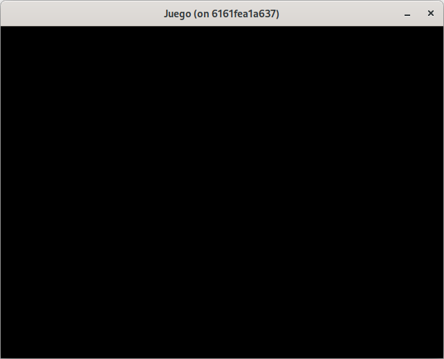

# Paso 1: Introducción a Ebiten y primer ejemplo de ventana.
En este paso aprenderás qué es Ebiten, cómo se instala, y cómo crear una ventana básica de juego.

## ¿Qué es Ebiten?
**Ebiten** o **Ebitengine** es una librería de juegos 2D simple y de código abierto realizada para el lenguaje de programación **Golang**.
Presenta un API bastante sencilla y permite generar binarios para diferentes plataformas.

## Instalación de la librería.
>🔔 **Contenedor**
>
>Los ejemplos realizados a partir de  este momento están dentro del contenedor de desarrollo.

Para hacer uso de la librería, es tan sencillo como crear un modulo de go de la forma tradicional e instalarla:

~~~shell
mkdir <proyecto> && cd <proyecto>
go mod init github.com/<usuario>/proyecto
go get github.com/hajimehoshi/ebiten/v2
~~~

## Características básicas.
**Ebiten** implementa una **interface** con tres métodos:
~~~go
type Game interface {
	Update() error
	Draw(screen *ebiten.Image)
	Layout(outsideWidth, outsideHeight int) (screenWidth, screenHeight int)
}
~~~

El punto de entrada se realiza a través de la llamada a la función **RunGame()** de **Ebiten**.

~~~go
...
func main(){
	g:=&Game{}
	err:=ebiten.RunGame(g)
	if err != nil {
		panic(err)
	}
}
~~~

>🔔 **Nota: FPS**
>
>**Ebiten** nos asegura que la ejecución del bucle de juego se realiza a **60 FPS**.

## Los métodos de la interface.
### Update.
Este método se va a encargar de actualizar la lógica de nuestro juego. Aquí podemos recoger el procesamiento de eventos y lógica.
Es invocado en cada frame.
### Draw.
Este método se encarga de renderizar la pantalla a través del parámetro screen (que es de tipo imagen).
Es invocado en cada frame.
### Layout.
Este método se usa para dimensionar la pantalla lógica del juego. Esto quiere decir que podemos tener una ventana física de 640x480 y el juego mostrarse a 160x120 (tipo pixel art de 8x8).

## Ejemplo básico.
~~~go
package main

import "github.com/hajimehoshi/ebiten/v2"

type Game struct {}

//Implementación de la interface esperada por ebiten.
func (g *Game) Update() error {
	return nil
}

func (g *Game) Draw(screen *ebiten.Image) {
}

func (g *Game) Layout(outsideWidth, outsideHeight int) (screenWidth, screenHeight int) {
	return outsideWidth, outsideHeight
}

func main(){
	ebiten.SetWindowSize(640, 480)
	ebiten.SetWindowTitle("Juego")
	
	game:=&Game{}
	err:=ebiten.RunGame(game)
	if err != nil {
		panic(err)
	}
}
~~~

Antes de la ejecución del programa, hacemos:
~~~shell
go mod tidy
~~~
para actualizar los módulos y para ejecutar el programa:
~~~shell
go run .
~~~

Deberá mostrarnos una pantalla como la siguiente:

Con este ejemplo obtenemos:
* una ventana física de 640x480 y el layout va a ser del mismo tamaño
* un ciclo de juego funcionando a 60 FPS.
* una estructura básica lista para empezar a dibujar y/o procesar entrada.

### Código fuente.
Puede consultar el código de este paso en la rama [step-01-inicial](https://github.com/programatta/space-invaders/tree/step-01-inicial).
