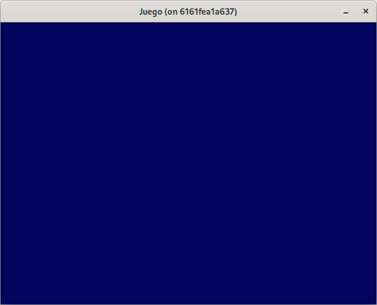
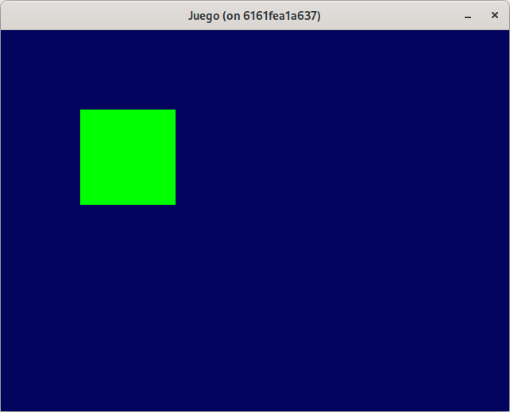
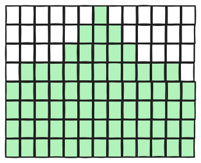
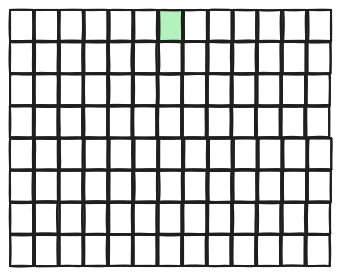
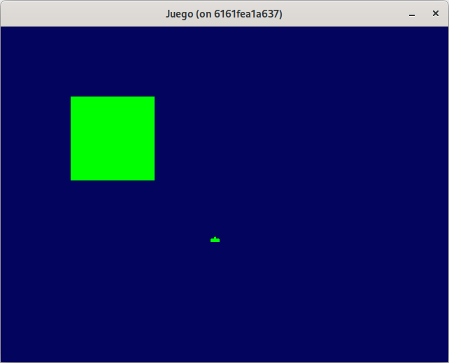

# Paso 2: Cañon y movimiento.
En este paso aprenderás:
- Pintar un color de fondo.
- Dibujar formas básicas (primitivas) en la pantalla.
- Representar sprites mediante arrays de datos y `ebiten.Image`.

## ¿Cómo pintar un elemento en la pantalla?
**Ebiten** nos va a permitir renderizar elementos en la pantalla a través del método `Draw(screen *ebiten.Image)`. En este método nos va a permitir establecer un color de fondo, además de renderizar tanto imágenes como primitivas (circulo, rectángulo).

### Color.
En este tutorial vamos a utilizar la **interface Color** que hace uso de la estructura **RGBA** (Rojo, Verde, Azul y Alfa) que nos va a  permitir establecer colores en ese orden. Cada campo de la estructura admite valores entre 0 y 0xFF (0 y 255).

~~~go
color:=color.RGBA{0x03, 0x04, 0x5e, 0xFF}
~~~

Y podemos aplicar el color a la imagen con la función `image.Fill(c color.Color)`:
~~~go
image.Fill(color)
~~~

Esto nos permite rellenar una imagen de un color sólido, como puede ser un color de fondo.

Aplicando esto al método `Draw(screen *ebiten.Image)`, que nos proporciona la pantalla (que es una imagen) como lienzo, lo usamos para limpiar la pantalla en cada renderizado.

~~~go
func (g *Game) Draw(screen *ebiten.Image) {
	screen.Fill(color.RGBA{0x03, 0x04, 0x5e, 0xFF})
}
~~~

## Dibujando en la pantalla.
Como se ha indicado antes, **Ebiten** nos permite dibujar tanto primitivas como imágenes. Esto lo podemos realizar a través del paquete **vector**.

### Dibujando una primitiva.
Comencemos dibujando un simple cuadrado usando el método `vector.DrawFilledRect(dst *ebiten.Image, x, y, width, height float32, clr color.Color, antialias bool)` que nos permite pasar el lienzo sobre donde se va a pintar el rectangulo.
~~~go
vector.DrawFilledRect(screen, 100, 100, 120, 120, color.RGBA{0,255,0, 255}, true)
~~~
con esto, pintamos un cuadrado en la  posición 100, 100 de la pantalla de dimensiones 120 por cada lado, con un color rojo sólido y se aplica "antialias" o suavizado, para evitar efectos de escalera.

Añadiendo esto en el método **Draw**:
~~~go
func (g *Game) Draw(screen *ebiten.Image) {
	screen.Fill(color.RGBA{0x03, 0x04, 0x5e, 0xFF})
	vector.DrawFilledRect(screen, 100, 100, 120, 120, color.RGBA{0,255,0, 255}, true)
}
~~~

#### Ejemplo completo.
~~~go
package main

import (
	"image/color"

	"github.com/hajimehoshi/ebiten/v2"
	"github.com/hajimehoshi/ebiten/v2/vector"
)

type Game struct{}

// Implementación de la interface esperada por ebiten.
func (g *Game) Update() error {
	return nil
}

func (g *Game) Draw(screen *ebiten.Image) {
	screen.Fill(color.RGBA{0x03, 0x04, 0x5e, 0xFF})
	vector.DrawFilledRect(screen, 100, 100, 120, 120, color.RGBA{0, 255, 0, 255}, true)
}

func (g *Game) Layout(outsideWidth, outsideHeight int) (screenWidth, screenHeight int) {
	return outsideWidth, outsideHeight
}

func main() {
	ebiten.SetWindowSize(640, 480)
	ebiten.SetWindowTitle("Juego")

	game := &Game{}
	err := ebiten.RunGame(game)
	if err != nil {
		panic(err)
	}
}
~~~

Puede consultar el código de este paso en la rama [step-02-cannon_y_movimiento_1](https://github.com/programatta/space-invaders/tree/step-02-cannon_y_movimiento_1).

### Dibujando una imagen.
**Ebiten** permite leer texturas extermas al binario, leer texturas embebidas en el binario (son texturas externas que se añaden al binario durante la compilación a través de embed) o crear las imágenes en base a un array de dos dimensiones en tiempo de ejecución, que es lo que se aplica eneste tutorial.

Para crear una imagen, usamos el método `ebiten.NewImage(width int, height int) *ebiten.Image` que nos devolverá una imagen para trabajarla como un lienzo.

Queremos crear un sprite de 13x8 pixeles. como se muestra en la imagen:

~~~go
spriteImg := ebiten.NewImage(13, 8)
~~~

podemos representarla de la siguiente forma:
~~~go
var spriteDataCannon = [][]int{
	{0, 0, 0, 0, 0, 0, 1, 0, 0, 0, 0, 0, 0},
	{0, 0, 0, 0, 0, 1, 1, 1, 0, 0, 0, 0, 0},
	{0, 0, 0, 0, 0, 1, 1, 1, 0, 0, 0, 0, 0},
	{0, 1, 1, 1, 1, 1, 1, 1, 1, 1, 1, 1, 0},
	{1, 1, 1, 1, 1, 1, 1, 1, 1, 1, 1, 1, 1},
	{1, 1, 1, 1, 1, 1, 1, 1, 1, 1, 1, 1, 1},
	{1, 1, 1, 1, 1, 1, 1, 1, 1, 1, 1, 1, 1},
	{1, 1, 1, 1, 1, 1, 1, 1, 1, 1, 1, 1, 1},
}

colorOn := color.RGBA(0, 255, 0, 255)
~~~

Cada valor **1** del array representa un píxel visible que será dibujado como un pequeño cuadrado de color (una imagen de 1x1) en la posición correspondiente del sprite.

~~~go
rect := ebiten.NewImage(1, 1)
rect.Fill(colorOn)
~~~

Esta nueva imagen **rect** de tamaño 1x1 y rellenada de color verde, la debemos incluir en nuestro lienzo **spriteImg**. 

Para realizar eso, debemos usar la estructura **ebiten.DrawImageOptions** que representa las opciones a aplicar en la imagen, como por ejemplo donde colocar la imagen. Esto se realiza con el campo **GeoM** de tipo **GeoM** que contiene la matriz de transformación. 

En este momento vamos a aplicar una  traslación, es decir, indicar la posición donde se va a ubicar la imagen con el método de `GeoM.Translate(tx,ty float64)`

~~~go
op := &ebiten.DrawImageOptions{}
op.GeoM.Translate(float64(6), float64(0))
~~~

Y  para pintar en el lienzo nuestra imagen **rect** con esas opciones sobre **spriteImg** hacemos uso del método `Image.DrawImage(img *ebiten.Image, options *ebiten.DrawImageOptions)`

~~~go
spriteImg.DrawImage(rect, op)
~~~

>🔔 Nota
>
>Esta última función la iremos usando junto con las opciones de imagen cada vez que dibujemos algo en la pantalla.

Para realizar el volcado de la matriz de datos para crear la imagen, construimos una función que recoja dicha matriz de datos, el tamaño del pixel y el color que queramos asignar y que nos devuelva una imagen:
~~~go
func SpriteFromArray(data [][]int, pixelSize int, colorOn color.Color) *ebiten.Image {
	h := len(data)
	w := len(data[0])
	img := ebiten.NewImage(w*pixelSize, h*pixelSize)
	
	for y := 0; y < h; y++ {
		for x := 0; x < w; x++ {
			if data[y][x] == 1 {
				rect := ebiten.NewImage(pixelSize, pixelSize)
				rect.Fill(colorOn)
				
				op := &ebiten.DrawImageOptions{}
				op.GeoM.Translate(float64(x*pixelSize), float64(y*pixelSize))
				img.DrawImage(rect, op)
			}
		}
	}
	return img
}
~~~

Para crear la imagen lo hacemos de esta forma:
~~~go
var spriteCannon *ebiten.Image
...
spriteCannon = SpriteFromArray(spriteDataCannon, 1, color.RGBA{0, 255, 0, 255})
~~~

Y para pintarlo en pantalla usamos el método **Draw**:
~~~go
func (g *Game) Draw(screen *ebiten.Image) {
	screen.Fill(color.RGBA{0x03, 0x04, 0x5e, 0xFF})
	vector.DrawFilledRect(screen, 100, 100, 120, 120, color.RGBA{0,255,0, 255}, true)

	//sprite cañón.
	opCannon := &ebiten.DrawImageOptions{}
	opCannon.GeoM.Translate(300, 300)
	screen.DrawImage(spriteCannon, opCannon)
}
~~~

Nos aparecerá el cañón dibujado en la posición 300, 300 junto con el cuadrado verde.

#### Ejemplo completo.
~~~go
package main

import (
	"image/color"
	
	"github.com/hajimehoshi/ebiten/v2"
	"github.com/hajimehoshi/ebiten/v2/vector"
)

type Game struct{}

// Implementación de la interface esperada por ebiten.
func (g *Game) Update() error {
	return nil
}

func (g *Game) Draw(screen *ebiten.Image) {
	screen.Fill(color.RGBA{0x03, 0x04, 0x5e, 0xFF})
	vector.DrawFilledRect(screen, 100, 100, 120, 120, color.RGBA{0, 255, 0, 255}, true)

	//sprite cañón.
	opCannon := &ebiten.DrawImageOptions{}
	opCannon.GeoM.Translate(300, 300)
	screen.DrawImage(spriteCannon, opCannon)
}

func (g *Game) Layout(outsideWidth, outsideHeight int) (screenWidth, screenHeight int) {
	return outsideWidth, outsideHeight
}

var spriteCannon *ebiten.Image  

func main() {
	ebiten.SetWindowSize(640, 480)
	ebiten.SetWindowTitle("Juego")

	spriteCannon = SpriteFromArray(spriteDataCannon, 1, color.RGBA{0, 255, 0, 255})

	game := &Game{}
	err := ebiten.RunGame(game)
	if err != nil {
		panic(err)
	}
}

func SpriteFromArray(data [][]int, pixelSize int, colorOn color.Color) *ebiten.Image {
	h := len(data)
	w := len(data[0])
	img := ebiten.NewImage(w*pixelSize, h*pixelSize)

	for y := 0; y < h; y++ {
		for x := 0; x < w; x++ {
			if data[y][x] == 1 {
				rect := ebiten.NewImage(pixelSize, pixelSize)
				rect.Fill(colorOn)

				op := &ebiten.DrawImageOptions{}
				op.GeoM.Translate(float64(x*pixelSize), float64(y*pixelSize))
				img.DrawImage(rect, op)
			}
		}
	}
	return img
}

var spriteDataCannon = [][]int{
	{0, 0, 0, 0, 0, 0, 1, 0, 0, 0, 0, 0, 0},
	{0, 0, 0, 0, 0, 1, 1, 1, 0, 0, 0, 0, 0},
	{0, 0, 0, 0, 0, 1, 1, 1, 0, 0, 0, 0, 0},
	{0, 1, 1, 1, 1, 1, 1, 1, 1, 1, 1, 1, 0},
	{1, 1, 1, 1, 1, 1, 1, 1, 1, 1, 1, 1, 1},
	{1, 1, 1, 1, 1, 1, 1, 1, 1, 1, 1, 1, 1},
	{1, 1, 1, 1, 1, 1, 1, 1, 1, 1, 1, 1, 1},
	{1, 1, 1, 1, 1, 1, 1, 1, 1, 1, 1, 1, 1},
}
~~~

El tamaño del sprite del cañón se ve pequeño, pero lo vamos a ajustar mas adelante al establecer el **layout**.

Puede consultar el código de este paso en la rama [step-02-cannon_y_movimiento_2](https://github.com/programatta/space-invaders/tree/step-02-cannon_y_movimiento_2).

## Moviendo el cañon. Eventos de teclado.
Una vez tenemos el cañón en la pantalla, podemos moverlo usando el teclado. Para realizar esta funcionalidad **Ebiten** nos ofrece dos modos de verificar si tenemos una tecla pulsada:
* recoger la pulsación continua de una tecla
* recoger la pulsación o liberación de una tecla.

### Recoger pulsación continua de una tecla.
**Ebiten** nos suministra el método `ebiten.IsKeyPressed(key Key)bool` que devuelve **true** si la tecla está siendo presionada.

### Recoger pulsación o liberación de una tecla.
Si se necesita gestionar una única pulsación de una tecla (aunque se mantenga presionada) se debe usar el método `inpututil.IsKeyJustPressed(key Key)bool` que devuelve true si la tecla ha sido presionada en un determinado tick de ejecución. 

También se puede usar el método `inpututil.IsKeyJustReleased(key Key)bool` que devuelve true si la tecla ha dejado de ser presionada en un determinado tick de ejecución.

Estas funciones deberían ser invocadas en el método `Update() error`.

En este paso, vamos a usar este método `ebiten.IsKeyPressed(key Key)bool` y vamos a controlar el cañon con las teclas de los cursores izquierda y derecha. Estas teclas las determinamos con el enumerado **Key** que tiene mapeadas las teclas del sistema:
* ebiten.KeyArrowLeft
* ebiten.KeyArrowRight

El cañón lo teniamos situado en la posición fija 300, 300 de la pantalla. Establecemos la posición inicial:

~~~go
var cannonPosX float32 = 300
...

func (g *Game) Draw(screen *ebiten.Image) {
  ...
	//sprite cañón.
	opCannon := &ebiten.DrawImageOptions{}
	opCannon.GeoM.Translate(float64(cannonPosX), 300)
	screen.DrawImage(spriteCannon, opCannon)
}
~~~

Y para mover el cañon, recogemos los eventos en el método **Update() error**:
~~~go
func (g *Game) Update() error {
	if ebiten.IsKeyPressed(ebiten.KeyArrowRight) {
		cannonPosX++
	} else if ebiten.IsKeyPressed(ebiten.KeyArrowLeft) {
		cannonPosX--
	}

	if cannonPosX <= 0 {
		cannonPosX = 0
	} else if cannonPosX >= float32(640-spriteCannon.Bounds().Dx()) {
		cannonPosX = float32(640 - spriteCannon.Bounds().Dx())
	}
	return nil
}
~~~

Al presionar el cursor derecho o izquierdo, se incrementa o decrementa la posición en X respectivamente. Para evitar que el cañón abandone la pantalla, establecemos el límite inferior en 0 y el superior en el ancho de la imagen del cañon menos el ancho de la pantalla.

Se hace de esta manera, ya que el origen de coordenadas de las imagenes están en la esquina superior izquierda, entonces al ir hacia la izquierda, simplemente verificamos con 0, pero al ir hacia la derecha, verificamos la posición del sprite junto con su ancho para evitar que supere el ancho de la pantalla.

Puede consultar el código de este paso en la rama [step-02-cannon_y_movimiento_3](https://github.com/programatta/space-invaders/tree/step-02-cannon_y_movimiento_3).

## Reorganización del código con todo lo realizado.
Ya que nuestro juego empieza a crecer, es un buen momento para aplicar una separación de responsabilidades y organizar el código en módulos internos.

Para organizar todo esto, vamos a crear un paquete **internal** que va a contener:
* un fichero **util.go** con la funcionalidad de creación de sprites.
* un fichero **cannon.go** encargado de recoger eventos de teclado para moverse, actualizarse y pintarse.

Dejar el fichero **main.go** más limpio.

>🔔 **Paquete internal**
>
>Este paquete limita la visibilidad al propio paquete y subpaquetes, permite organizar el código interno sin exponer detalles de la implementación. 
>
>Evita dependencias no deseadas y mantiene la separación dentre interfaces publicas y privadas. El código que se coloque aquí es código que no se reutiliza, es decir, es propio  de este modulo y no se va a compartir para otros proyectos.

### El tipo Cannon.
Creamos una entidad para gestionar el canón y este va a estar en el fichero **internal/cannon.go**, donde tendrá una función constructora que devuelva el tipo **Cannon** y métodos para:
* manejar los eventos de teclado
* actualizar el estado (su posición) y comprobar límites
* dibujarlo.

~~~go
package internal

import (
	"github.com/hajimehoshi/ebiten/v2"
)

type Cannon struct {
	sprite *ebiten.Image
	posX   float32
	posY   float32
	dirX   float32
}

func NewCannon(posX, posY float32, sprite *ebiten.Image) *Cannon {
	return &Cannon{
		sprite: sprite,
		posX:   posX,
		posY:   posY,
	}
}

func (c *Cannon) ProcessKeyEvents() {
	c.dirX = 0
	if ebiten.IsKeyPressed(ebiten.KeyArrowRight) {
		c.dirX = 1
	} else if ebiten.IsKeyPressed(ebiten.KeyArrowLeft) {
		c.dirX = -1
	}
}

func (c *Cannon) Update() error {
	c.posX += c.dirX
	if c.posX <= 0 {
		c.posX = 0
	} else if c.posX+float32(c.sprite.Bounds().Dx()) >= float32(640) {
		c.posX = float32(640) - float32(c.sprite.Bounds().Dx())
	}
	return nil
}

func (c *Cannon) Draw(screen *ebiten.Image) {
	opCannon := &ebiten.DrawImageOptions{}
	opCannon.GeoM.Translate(float64(c.posX), float64(c.posY))
	screen.DrawImage(c.sprite, opCannon)
}
~~~

### Cambios en main.go
En el objeto **Game** añadimos una referencia al cañón para luego ser utilizado en los métodos **Update** y **Draw**:

~~~go
type Game struct {
	cannon *internal.Cannon
}
~~~

Reescribimos **Update** y **Draw**, donde en **Update** se a encargar de llamar tanto a los eventos de teclado del como a la actualización del cañón respectivamente:
~~~go
func (g *Game) Update() error {
	g.cannon.ProcessKeyEvents()

	g.cannon.Update()

	return nil
}
~~~

En **Draw** se llama al métdo de dibujo del cañón:
~~~go
func (g *Game) Draw(screen *ebiten.Image) {
	screen.Fill(color.RGBA{0x03, 0x04, 0x5e, 0xFF})

	g.cannon.Draw(screen)
}
~~~

Y finalmente dejamos la función **main()** de la siguiente forma:
~~~go
func main() {
	ebiten.SetWindowSize(640, 480)
	ebiten.SetWindowTitle("Juego")

	spriteCannon := internal.SpriteFromArray(spriteDataCannon, 1, color.RGBA{0, 255, 0, 255})

	game := &Game{}
	game.cannon = internal.NewCannon(300, 300, spriteCannon)

	err := ebiten.RunGame(game)
	if err != nil {
		panic(err)
	}
}
~~~

Con esto, hemos logrado mover el cañón, encapsular su lógica, y dejar preparada la estructura para continuar desarrollando el juego de forma limpia y escalable.

Puede consultar el código de este paso en la rama [step-02-cannon_y_movimiento_4](https://github.com/programatta/space-invaders/tree/step-02-cannon_y_movimiento_4).
