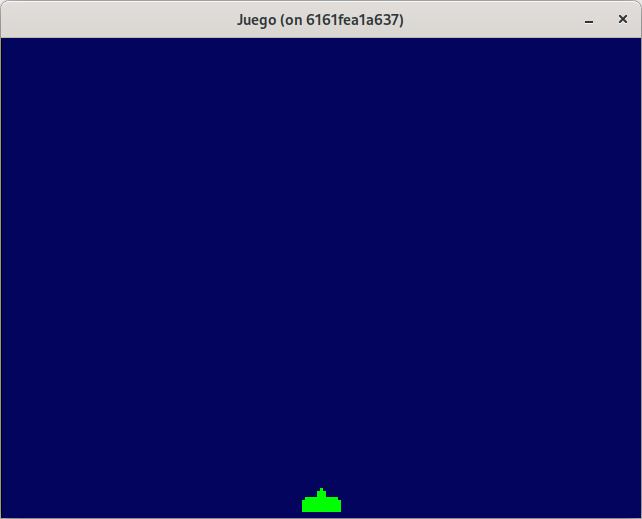
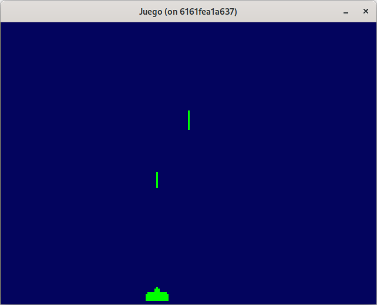
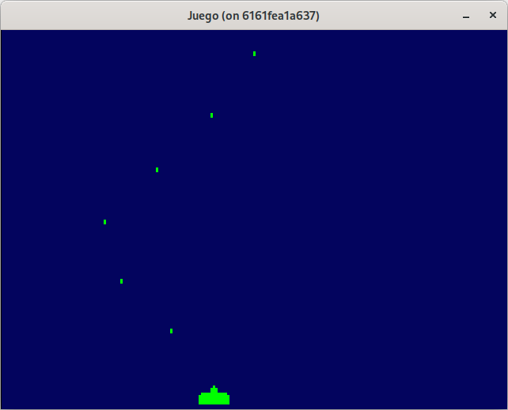

# Paso 3: Disparos.
En este paso aprenderás:
* Cómo ajustar la resolución lógica del juego para obtener un estilo retro (aproximación).
* Cómo crear y representar un sprite de disparo (bullet) mediante arrays de datos.
* Cómo organizar nuevas entidades (como Bullet) siguiendo el patrón usado con Cannon.
* Cómo comunicar entidades usando interfaces (desacoplamiento).
* Cómo generar múltiples disparos gestionados en un slice.
* Cómo controlar la frecuencia de disparo con control de tiempo (delta time).
* Cómo eliminar proyectiles que ya no están en pantalla de forma segura y eficiente.

## Ajuste en el layout.
Vemos que el cañón se ve muy pequeño, ya que estamos renderizando un sprite de 13x8 en una superficie de 640x480. Si pintamos un disparo, que pueda tener un sprite de 1x2 no se va a ver.

Como primera aproximación, vamos a dividir 640 y 480 por 3, para tener una resolución lógica de 213, 160 que nos permitirá ver nuestro disparo y dar un aspecto retro al juego.

~~~go
func (g *Game) Layout(outsideWidth, outsideHeight int) (screenWidth, screenHeight int) {
	return outsideWidth / 3, outsideHeight / 3
}
~~~

Y ajustamos la posición del cañón:
~~~go
game.cannon = internal.NewCannon(100, 150, spriteCannon)
~~~

## El tipo Bullet.
Siguiendo el mismo modelo de desarrollo que el cañón, creamos la entidad **Bullet** para gestionar el disparo.

~~~go
package internal

import "github.com/hajimehoshi/ebiten/v2"

type Bullet struct {
	sprite *ebiten.Image
	posX   float32
	posY   float32
}

func NewBullet(posX, posY float32, sprite *ebiten.Image) *Bullet {
	return &Bullet{
		sprite: sprite,
		posX:   posX,
		posY:   posY,
	}
}

func (b *Bullet) Update() {}

func (b *Bullet) Draw(screen *ebiten.Image) {
	opBullet := &ebiten.DrawImageOptions{}
	opBullet.GeoM.Translate(float64(b.posX), float64(b.posY))
	screen.DrawImage(b.sprite, opBullet)
}
~~~

### Cambios en main.go
Inicialmente vamos a ubicar el disparo y procedemos de la misma forma que con el tipo **Cannon**:

~~~go
type Game struct {
	cannon *internal.Cannon
	bullet *internal.Bullet
}
~~~

Añadimos el objeto bullet en el método **Draw**:

~~~go
g.bullet.Draw(screen)
~~~

Y finalmente en la función **main()** inicializamos el **Bullet** y lo asignamos a game:

~~~go
spriteBullet := internal.SpriteFromArray(spriteDataBullet, 1, color.RGBA{0, 255, 0, 255})
...
game.bullet = internal.NewBullet(106, 146, spriteBullet)
...
~~~

Y el array 2D para el bullet es el siguiente:
~~~go
var spriteDataBullet = [][]int{
	{1},
	{1},
}
~~~

Puede consultar el código de este paso en la rama [step-03-disparos_1](https://github.com/programatta/space-invaders/tree/step-03-disparos_1)

## Comunicación entre el cañón y el juego con interfaces.
Hasta este momento, la entidad **Game** se encarga de crear el cañón y el disparo, además de pintarlos y actualizarlos.

Ahora queremos que el cañón pueda generar un disparo cuando se presione la barra espaciadora.

Una opción sencilla sería pasar directamente una referencia del objeto **Game** al cañón. Sin embargo, esto generaría un **acoplamiento fuerte**, ya que el cañón tendría acceso completo a los métodos del juego principal, violando **el principio de responsabilidad única** y dificultando la reutilización o testeo del código.

En lugar de eso, vamos a aplicar un enfoque más flexible: usar una **interfaz**.

  >💡 En programación orientada a objetos y diseño modular, es habitual que un componente (como el cañón) necesite notificar a otro (como el juego principal) de que ha ocurrido un evento.
  >
  >Para no acoplar directamente ambos objetos, se define una interfaz que actúa como contrato: el objeto externo (en este caso **Game**) implementa la interfaz, y el cañón solo necesita conocer esa interfaz, no al objeto completo.

De este modo:
* **Cannon** solo conoce la interfaz y usará los métodos definidos en esta.
* **Game** implementa la interfaz y gestiona la creación del proyectil.
* La relación entre ambos es débil, explícita y bien definida.

Para realizar esto, debemos hacer una nueva refactorización en **main.go**, vamos a crear una entidad **Game** en **internal/game.go** y dejar **main.go** mucho mas pequeño.

### La nueva entidad game.go
Sacamos parte de la funcionalidad de **main.go** a **internal/game.go**:

~~~go
type Game struct {
  cannon *Cannon
  bullet *Bullet
}

func NewGame() *Game {
  spriteCannon := SpriteFromArray(spriteDataCannon, 1, color.RGBA{0, 255, 0, 255})
  game := &Game{}
  game.cannon = NewCannon(100, 150, spriteCannon, game)
  return game
}

// Implementación de la interface esperada por ebiten.
func (g *Game) Update() error {
  g.cannon.ProcessKeyEvents()
  g.cannon.Update()
  
  return nil
}

func (g *Game) Draw(screen *ebiten.Image) {
  screen.Fill(color.RGBA{0x03, 0x04, 0x5e, 0xFF})

  g.cannon.Draw(screen)
}

func (g *Game) Layout(outsideWidth, outsideHeight int) (screenWidth, screenHeight int) {
  return outsideWidth / 3, outsideHeight / 3
}

var spriteDataCannon = [][]int{
  {0, 0, 0, 0, 0, 0, 1, 0, 0, 0, 0, 0, 0},
  {0, 0, 0, 0, 0, 1, 1, 1, 0, 0, 0, 0, 0},
  {0, 0, 0, 0, 0, 1, 1, 1, 0, 0, 0, 0, 0},
  {0, 1, 1, 1, 1, 1, 1, 1, 1, 1, 1, 1, 0},
  {1, 1, 1, 1, 1, 1, 1, 1, 1, 1, 1, 1, 1},
  {1, 1, 1, 1, 1, 1, 1, 1, 1, 1, 1, 1, 1},
  {1, 1, 1, 1, 1, 1, 1, 1, 1, 1, 1, 1, 1},
  {1, 1, 1, 1, 1, 1, 1, 1, 1, 1, 1, 1, 1},
}

var spriteDataBullet = [][]int{
  {1},
  {1},
}
~~~

El fichero **main.go** nos queda realmente simple, siguiendo la filosofía de golang:

~~~go
package main

import (
  "github.com/hajimehoshi/ebiten/v2"

  "github.com/programatta/spaceinvaders/internal"
)

func main() {
  ebiten.SetWindowSize(640, 480)
  ebiten.SetWindowTitle("Juego")

  game := internal.NewGame()
  err := ebiten.RunGame(game)
  if err != nil {
    panic(err)
  }
}
~~~

### Definicion de la nueva interface Notifier.
La interfaz va a implementar un método encargado de crear el disparo, lo podemos llamar **OnCreateCannonBullet**:

~~~go
type Notifier interface {
  OnCreateCannonBullet(posX, posY float32)
}
~~~

La entidad **game** implementa la interfaz:

~~~go
func (g *Game) OnCreateCannonBullet(posX, posY float32) {
  spriteBullet := internal.SpriteFromArray(spriteDataBullet, 1, color.RGBA{0, 255, 0, 255})
  g.bullet = internal.NewBullet(posX, posY, spriteBullet)
}
~~~

Y en el método **Update** el disparo debe actualizarse para ir desplazandose hacia la parte superior de la pantalla si este existe.

~~~go
if g.bullet != nil {
  g.bullet.Update()
}
~~~

Y de la misma forma en **Draw**:

~~~go
if g.bullet != nil {
  g.bullet.Draw(screen)
}
~~~

La función constructora NewCannon() va a aceptar un nuevo pámetro, que es la interfaz y asi **ca
nnon** puede invocar a los métodos implementados por la interfaz:

~~~go
type Cannon struct {
  ...
  notify Notifier
}

func NewCannon(posX, posY float32, sprite *ebiten.Image, notify Notifier) *Cannon {
  return &Cannon{
    sprite: sprite,
    posX:   posX,
    posY:   posY,
    notify: notify
  }
}
~~~

Y en el momento de presionar la barra espaciadora, llamamos a **OnCreateCannonBullet()** pasando la posición inicial del disparo, que  la ubicamos en el centro del cañon:

~~~go
if ebiten.IsKeyPressed(ebiten.KeySpace) {
  c.OnCreateCannonBullet(c.posX+6, c.posY)
}
~~~

Para la actualización del proyectil vamos restando hasta que salga de la pantalla:

~~~go
func (b *Bullet) Update(){
  if b.posY + float32(b.sprite.Image.Bounds().Dy()) > 0 {
    b.posY -= 1
  }
}
~~~

Puede consultar el código de este paso en la rama [step-03-disparos_2](https://github.com/programatta/space-invaders/tree/step-03-disparos_2)

## Múltiples proyectiles.
Hasta el momento, solo disponemos de un proyectil, y si presionamos varias veces la barra espaciadora, mientras el proyectil aún está en pantalla, se puede crear otro nuevo, solapando los anteriores.

Para manejar esto, añadiremos un slice de **Bullet**. Usamos slices, ya que estos son mutables, al contrario que los arrays que son inmutables una vez creados.

~~~go
type Game struct {
  cannon  *Cannon
  bullets []*Bullet
}
~~~

Cambiamos tambíén los métodos **Update** y **Draw**:

~~~go
func (g *Game) Update() error {
  ...
  for _, bullet := range g.bullets {
    bullet.Update()
  }
  return nil
}

func (g *Game) Draw(screen *ebiten.Image) {
  ...
  for _, bullet := range g.bullets {
    bullet.Draw(screen)
  }
}
~~~

Y el método **OnCreateCannonBullet** se encargará de añadir bullets al slice:

~~~go
func (g *Game) OnCreateCannonBullet(posX, posY float32) {
  spriteBullet := SpriteFromArray(spriteDataBullet, 1, color.RGBA{0, 255, 0, 255})
  bullet := NewBullet(posX, posY, spriteBullet)
  g.bullets = append(g.bullets, bullet)
}
~~~

Con esta funcionalidad ya podemos disparar varios proyectiles, pero tenemos algunos inconvenientes:
* Disparamos muchos proyectiles seguidos.
* Los proyectiles una vez salen de la pantalla, no deberían de existir, es decir, deberíamos eliminarlos del slice de **bullets**.

Puede consultar el código de este paso en la rama [step-03-disparos_3](https://github.com/programatta/space-invaders/tree/step-03-disparos_3)

### El cañón hace disparos espaciados en el tiempo.
Para evitar que los proyectiles se acumulen en una sola pulsación de la barra espaciadora vamos a definir el siguiente proceso:
1. Al pulsar la tecla de disparo no va a poder realizar otro disparo hasta que pase cierto tiempo, y esto lo vamos a controlar con una variable lógica **canFired**.
2. Para controlar el tiempo, usaremos una variable para acumular el tiempo **time** entre frames y cuando llegue o supere el valor establecido, se pone a cero y cambia el valor de **canFired** a **true**.

Actualizamos la entidad **Cannon** con los campos **canFired** y **time**:

~~~go
type Cannon struct {
  ...
  canFired bool
  time     float32
}
~~~

En la función de inicialización del cañón, **canFired** se establece a **true**:

~~~go
func NewCannon(posX, posY float32, sprite *ebiten.Image, notify Notifier) *Cannon {
  return &Cannon{
    sprite:   sprite,
    posX:     posX,
    posY:     posY,
    notify:   notify,
    canFired: true,
  }
}
~~~

Realizamos el control de poder disparar al pulsar la barra espaciadora el método **ProcessKeyEvents**:

~~~go
func (c *Cannon) ProcessKeyEvents() {
...
  if c.canFired && ebiten.IsKeyPressed(ebiten.KeySpace) {
    c.canFired = false
    c.notify.OnCreateCannonBullet(c.posX+6, c.posY)
  }
}
~~~

Y en el método **Update** la gestión del tiempo, acumulando el delta time fijo, hasta llegar a un valor p.e **0.35** segundos:

~~~go
func (c *Cannon) Update() error {
  if !c.canFired {
    c.time += dt
    if c.time >= 0.35 {
      c.canFired = true
      c.time = 0
    }
  }
  ...
  return nil
}
~~~

El valor de **dt** lo definimos constante en el fichero **game.go** como **1/60**, ya que no vamos a aplicar físicas y es cada cuanto tiempo nos asegura **Ebiten** que nos llama al método **Update**.

~~~go
const dt float32 = float32(1.0 / 60)
~~~

### Eliminación de proyectiles.
Para evitar acumular objetos de tipo **Bullet** que ya no  necesitamos, vamos a marcar la entidad **bullet** como borrable, mediante una variable lógica **remove**, y que puede ser consultada mediante un método **CanRemove()** por el juego. Si el bullet puede ser borrado, se elimina del slice.

~~~go
type Bullet struct {
  ...
  remove bool
}
~~~

Modificamos el método **Update** para indicar que una vez el **bullet** salga de la parte visible, se marque como borrable:

~~~go
func (b *Bullet) Update() {
  b.posY -= 1
  if b.posY-float32(b.sprite.Bounds().Dy()) < 0 {
    b.remove = true
  }
}
~~~

Y añadimos el método que nos devuelve si el **bullet** se tiene que eliminar o no:

~~~go
func (b *Bullet) CanRemove() bool {
  return b.remove
}
~~~

En el componente **Game** se va a encargar de eliminar todos los **bullets** que puedan ser eliminados consultando al método **CanRemove** de **Bullet**.
La eliminación del bullet del slice de bullets, la realizamos con la función `slices.DeleteFunc()`, que nos permite eliminar elementos de un slice basándose en una condición definida por el usuario. En nuestro caso, esa condición nos la indica el método **CanRemove** de **Bullet**.

~~~go
func (g *Game) Update() error {
  ...
  for _, bullet := range g.bullets {
    bullet.Update()
  }
  if len(g.bullets) > 0 {
    g.bullets = slices.DeleteFunc(g.bullets, func(bullet *Bullet) bool {
      return bullet.CanRemove()
    })
  }

  return nil
}
~~~

Puede consultar el código de este paso en la rama [step-03-disparos_4](https://github.com/programatta/space-invaders/tree/step-03-disparos_4)
