# Paso 4. Bunkers.
En este paso aprenderás:
* A crear estructuras defensivas en el juego (bunkers).
* A reutilizar código y patrones ya establecidos.
* A representar el estado de un sprite con datos 2D que se pueden modificar dinámicamente.
* A implementar colisiones básicas (AABB) usando interfaces.
* A aplicar daño visual modificando el sprite tras una colisión.
* A mantener una arquitectura limpia que favorece la evolución del juego.

## El tipo Bunker.
De la misma forma que se ha desarrollado las entidades **Cannon** y **Bullet**, vamos a desarrollar el tipo **Bunker**:

~~~go
package internal

import "github.com/hajimehoshi/ebiten/v2"

type Bunker struct {
  sprite *ebiten.Image
  posX   float32
  posY   float32
}

func NewBunker(posX, posY float32, sprite *ebiten.Image) *Bunker {
  return &Bunker{
    sprite: sprite,
    posX:   posX,
    posY:   posY,
  }
}

func (b *Bunker) Update() {
}

func (b *Bunker) Draw(screen *ebiten.Image) {
  opBunker := &ebiten.DrawImageOptions{}
  opBunker.GeoM.Translate(float64(b.posX), float64(b.posY))
  screen.DrawImage(b.sprite, opBunker)
}
~~~

## Cambios en game.go
En el fichero **game.go** vamos a añadir el array 2D de datos para dibujar el bunker, y un slice de **Bunker** para tener 4 bunkers que defiendan al cañon.

También vamos a añadir unas constantes que ya hemos usado, pero para evitar tener números mágicos que van a ser para determinar el tamaño de la ventana (**WindowWidtht** y **WindowHeight**), y el tamaño lógico (**DesignWidth** y **DesignHeight**).

~~~go
type Game struct {
  cannon  *Cannon
  bullets []*Bullet
  bunkers []*Bunker
}
~~~

En la función constructora de **NewGame** creamos el sprite del bunker a partir de su array 2D y creamos cada bunker situandolos, el primero en la posición horizontal (x) en 27 y para la posicion vertical hacemos uso de la constante **DesignHeight** situandolo a 40 pixels de la parte baja de la pantalla. Y para el desplazamiento horizontal nos desplazamos 20 pixeles mas el ancho del bunker y lo añadimos al slice de **Bunker**:

~~~go
func NewGame() *Game {
  spriteCannon := SpriteFromArray(spriteDataCannon, 1, color.RGBA{0, 255, 0, 255})
  spriteBunker := SpriteFromArray(spriteDataBunker, 1, color.RGBA{0, 255, 0, 255})

  game := &Game{}
  game.cannon = NewCannon(float32(0), float32(DesignHeight-10), spriteCannon, game)

  bunker1 := NewBunker(float32(27), float32(DesignHeight-40), spriteBunker)

  space := float32(bunker1.sprite.Bounds().Dx())
  bunker2 := NewBunker(27+space+20, float32(DesignHeight-40), spriteBunker)
  bunker3 := NewBunker(27+2*(space+20), float32(DesignHeight-40), spriteBunker)
  bunker4 := NewBunker(27+3*(space+20), float32(DesignHeight-40), spriteBunker)
  game.bunkers = []*Bunker{bunker1, bunker2, bunker3, bunker4}

  return game
}
~~~

Modificamos el método **Draw** para pintar los bunkers:

~~~go
func (g *Game) Draw(screen *ebiten.Image) {
  screen.Fill(color.RGBA{0x03, 0x04, 0x5e, 0xFF})

  g.cannon.Draw(screen)
  for _, bullet := range g.bullets {
    bullet.Draw(screen)
  }

  for _, bunker := range g.bunkers {
    bunker.Draw(screen)
  }
}
~~~

En el método **Layout** hacemos uso de las constantes mencionadas:

~~~go
func (g *Game) Layout(outsideWidth, outsideHeight int) (screenWidth, screenHeight int) {
  return DesignWidth, DesignHeight
}
~~~

El array de datos 2D para el sprite del bunker:

~~~go
var spriteDataBunker = [][]int{
  {0, 0, 1, 1, 1, 1, 1, 1, 1, 1, 1, 1, 1, 1, 1, 1, 1, 1, 1, 1, 1, 1, 0, 0},
  {0, 1, 1, 1, 1, 1, 1, 1, 1, 1, 1, 1, 1, 1, 1, 1, 1, 1, 1, 1, 1, 1, 1, 0},
  {1, 1, 1, 1, 1, 1, 1, 1, 1, 1, 1, 1, 1, 1, 1, 1, 1, 1, 1, 1, 1, 1, 1, 1},
  {1, 1, 1, 1, 1, 1, 1, 1, 1, 1, 1, 1, 1, 1, 1, 1, 1, 1, 1, 1, 1, 1, 1, 1},
  {1, 1, 1, 1, 1, 1, 1, 1, 1, 1, 1, 1, 1, 1, 1, 1, 1, 1, 1, 1, 1, 1, 1, 1},
  {1, 1, 1, 1, 1, 1, 1, 1, 1, 1, 1, 1, 1, 1, 1, 1, 1, 1, 1, 1, 1, 1, 1, 1},
  {1, 1, 1, 1, 1, 1, 1, 1, 1, 1, 1, 1, 1, 1, 1, 1, 1, 1, 1, 1, 1, 1, 1, 1},
  {1, 1, 1, 1, 1, 1, 1, 1, 1, 1, 1, 1, 1, 1, 1, 1, 1, 1, 1, 1, 1, 1, 1, 1},
  {1, 1, 1, 1, 1, 1, 1, 1, 1, 1, 1, 1, 1, 1, 1, 1, 1, 1, 1, 1, 1, 1, 1, 1},
  {1, 1, 1, 1, 1, 1, 1, 1, 1, 1, 1, 1, 1, 1, 1, 1, 1, 1, 1, 1, 1, 1, 1, 1},
  {1, 1, 1, 1, 1, 1, 1, 1, 1, 1, 1, 1, 1, 1, 1, 1, 1, 1, 1, 1, 1, 1, 1, 1},
}
~~~

Y las nuevas constantes:

~~~go
const WindowWidth int = 642
const WindowHeight int = 642
const DesignWidth int = WindowWidth / 3
const DesignHeight int = WindowHeight / 3
~~~

Para hacer uso de estas constantes, actualizamos también **main.go**:

~~~go
func main() {
  ebiten.SetWindowSize(internal.WindowWidth, internal.WindowHeight)
  ebiten.SetWindowTitle("Juego")

  game := internal.NewGame()
  err := ebiten.RunGame(game)
  if err != nil {
    panic(err)
  }
}
~~~

y **cannon.go**:

~~~go
func (c *Cannon) Update() error {
{
  ...
  c.posX += c.dirX
  if c.posX <= 0 {
    c.posX = 0
  } else if c.posX+float32(c.sprite.Bounds().Dx()) >= float32(DesignWidth) {
    c.posX = float32(DesignWidth) - float32(c.sprite.Bounds().Dx())
  }
  return nil
}
~~~

Con esto ya tenemos la pantalla de juego, con los bunkers protegiendo al cañón.

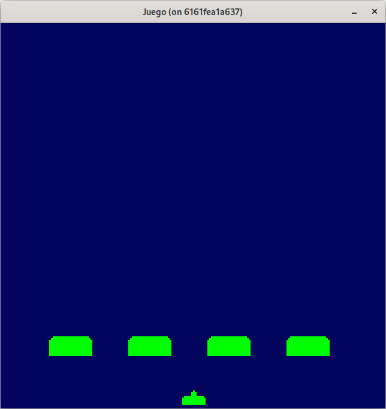

Puede consultar el código de este paso en la rama [step-04-bunkers_1](https://github.com/programatta/space-invaders/tree/step-04-bunkers_1)

## Daños a los bunkers por disparos del cañon.
Para determinar los daños por los proyectiles lanzados por el cañón en los bunkers, vamos a definir una funcionalidad que nos indique si dos objetos han colisionado. En este proyecto, las colisiones se basan en rectángulos y sin ser **"pixel perfect"**.

### La colisión AABB.
La colisión **AABB**, denominada así por sus siglas en ingés **Axis-Aligned Bounding Box**, es un método muy común y simple para detectar si dos objetos se están tocando o solapando. Se basa en comparar los rectángulos que rodean a los objetos.

La idea es que dos objetos colisionan si sus áreas rectangulares se solapan horizontal y verticalmente al mismo tiempo.

#### ¿Cómo se calcula?
El sistema **AABB** compara las coordenadas y tamaños de los dos objetos. Se considera que hay colisión si:
~~~
sx0 < tx0+tw && sx0+sw > tx0 && sy0 < ty0+th && sy0+sh > ty0
~~~

Donde:
* *sx0*, *sy0*: posición del objeto fuente (por ejemplo, el proyectil).
* *sw*, *sh*: ancho y alto del objeto fuente.
* *tx0*, *ty0*: posición del objeto objetivo (por ejemplo, el bunker).
* *tw*, *th*: ancho y alto del objeto objetivo.

Las imágenes muestran el proceso de cálculo:

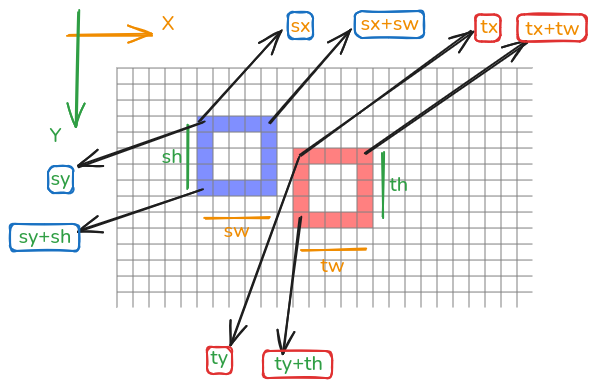

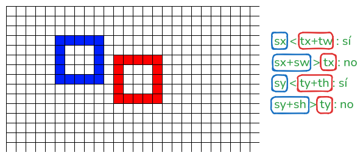

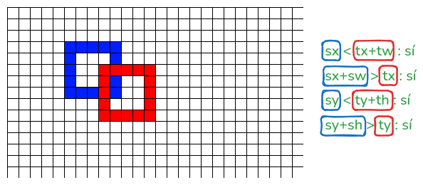

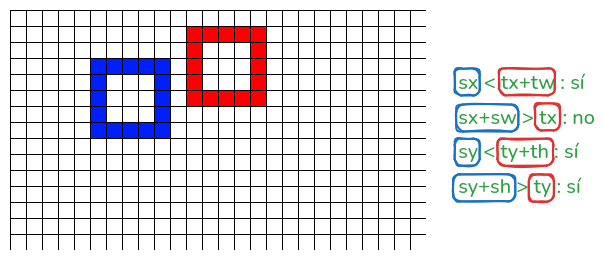

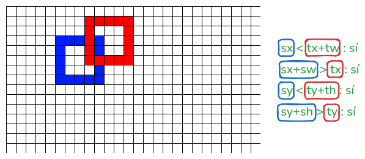

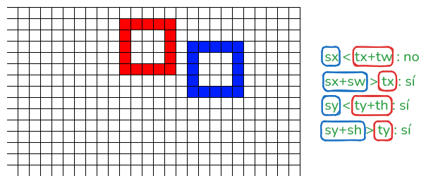

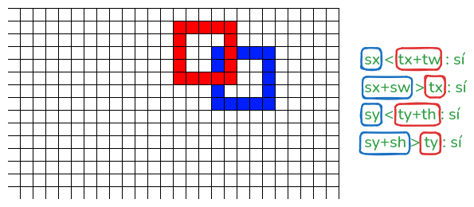

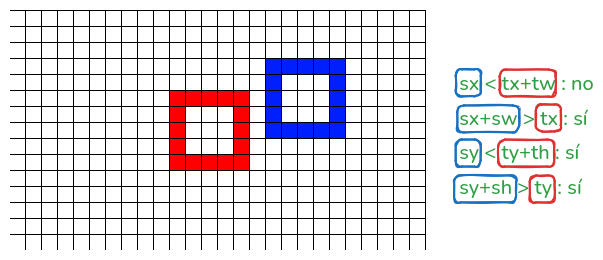

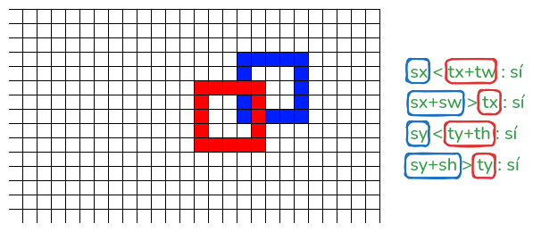

Para comparar los objetos que colisionan, vamos a definir una interfaz **Collider** para no depender del tipo de objeto, y que implemente métodos necesarios, como **Rect** que nos indique las dimensiones del sprite, y **OnCollide** que en caso de colision, los objetos que colisionan hagan algo en consecuencia. 

En en este paso, el proyectil debería marcarse como eliminable.

~~~go
type Collider interface {
  Rect() (float32, float32, float32, float32)
  OnCollide()
}
...
func (g *Game) checkCollision(sourceObj, targetObj Collider) bool {
  sx0, sy0, sw, sh := sourceObj.Rect()
  tx0, ty0, tw, th := targetObj.Rect()

  hasCollision := sx0 < tx0+tw && sx0+sw > tx0 && sy0 < ty0+th && sh+sy0 > ty0

  return hasCollision
}
~~~

#### Implementación de Collider en la entidad Bullet.
Aquí el método **Rect** devolverá el rectángulo de colisión del **bullet** y el método **OnCollide** marcará el **bullet** como eliminable:
~~~go
// Implementación de la interface Collider.
func (b *Bullet) Rect() (float32, float32, float32, float32) {
  width := float32(b.sprite.Image.Bounds().Dx())
  height := float32(b.sprite.Image.Bounds().Dy())
  return b.posX, b.posY, width, height
}

func (b *Bullet) OnCollide() {
  b.remove = true
}
~~~

#### Implementación de Collider en la entidad Bunker.
Aquí el método **Rect** devolverá el rectángulo de colisión del **bunker** y el método **OnCollide** por el momento queda sin uso.
~~~go
// Implementación de la interface Collider.
func (b *Bunker) Rect() (float32, float32, float32, float32) {
  width := float32(b.sprite.Image.Bounds().Dx())
  height := float32(b.sprite.Image.Bounds().Dy())
  return b.posX, b.posY, width, height
}

func (b *Bunker) OnCollide() {}
~~~

### Daño en el bunker.
Para determinar el daño en el bunker, eliminamos del array de datos la porción del proyectil, es decir, quitaremos los "1" y pondremos "0" para posteriormente crear de nuevo el sprite. Esto podemos verlo en la secuencia de imágenes desde que se aproxima el proyectil hasta que deja el hueco en el bunker.

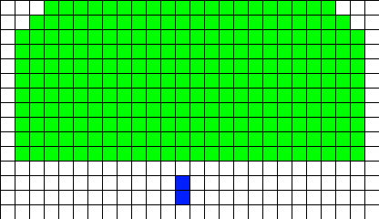

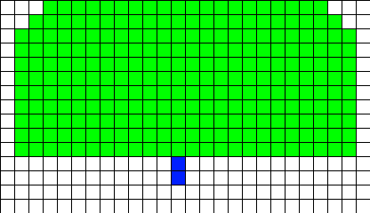

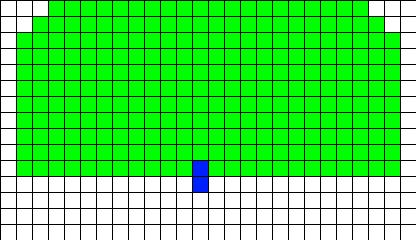

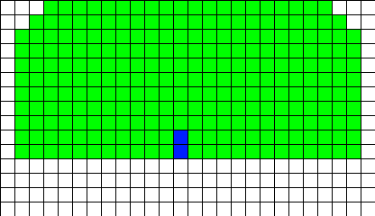

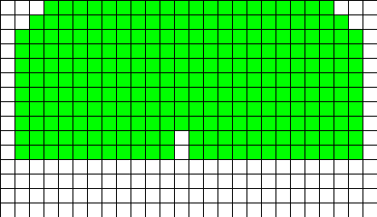

Para realizar esta funcionalidad, necesitamos de los datos con los que se construye el sprite, para poderlos modificar y recrear así su imagen.

Vamos a crear una pequeña entidad que llamaremos **Sprite**, que tendrá la imagen creada y sus datos, y para usarla refactorizaremos las entidades que ya tenemos.

~~~go
package internal

import (
  "github.com/hajimehoshi/ebiten/v2"
)

type Sprite struct {
  Image *ebiten.Image
  Data  [][]int
}
~~~

#### game.go
Aplicamos los cambios para usar **Sprite** además de la verificación de colisiones por parte del **bullet** con los **bunkers**:

~~~go
func NewGame() *Game {
  spriteImgCannon := SpriteFromArray(spriteDataCannon, 1, color.RGBA{0, 255, 0, 255})
  spriteCannon := Sprite{spriteImgCannon, spriteDataCannon}

  spriteImgBunker := SpriteFromArray(spriteDataBunker, 1, color.RGBA{0, 255, 0, 255})
  spriteBunker := Sprite{spriteImgBunker, spriteDataBunker}

  game := &Game{}
  game.cannon = NewCannon(float32(0), float32(DesignHeight-10), spriteCannon, game)

  bunker1 := NewBunker(float32(27), float32(DesignHeight-40), spriteBunker)

  space := float32(bunker1.sprite.Image.Bounds().Dx())
  bunker2 := NewBunker(27+space+20, float32(DesignHeight-40), spriteBunker)
  bunker3 := NewBunker(27+2*(space+20), float32(DesignHeight-40), spriteBunker)
  bunker4 := NewBunker(27+3*(space+20), float32(DesignHeight-40), spriteBunker)
  game.bunkers = []*Bunker{bunker1, bunker2, bunker3, bunker4}

  return game
}

func (g *Game) Update() error {
  ...
  //Colisiones.
  for _, bullet := range g.bullets {
    for _, bunker := range g.bunkers {
      if g.checkCollision(bullet, bunker) {
        if bunker.DoDamage(bullet.posX, bullet.posY) {
          bullet.OnCollide()
        }
      }
    }
  }
  return nil  
}

func (g *Game) OnCreateCannonBullet(posX, posY float32) {
  spriteImageBullet := SpriteFromArray(spriteDataBullet, 1, color.RGBA{0, 255, 0, 255})
  spriteBullet := Sprite{spriteImageBullet, spriteDataBullet}
  bullet := NewBullet(posX, posY, spriteBullet)
  g.bullets = append(g.bullets, bullet)
}

func (g *Game) checkCollision(sourceObj, targetObj Collider) bool {
  sx0, sy0, sw, sh := sourceObj.Rect()
  tx0, ty0, tw, th := targetObj.Rect()

  hasCollision := sx0 < tx0+tw && sx0+sw > tx0 && sy0 < ty0+th && sh+sy0 > ty0

  return hasCollision
}
~~~

#### bunker.go
Se muestra el proceso de daño en el bunker en el método **DoDamage**, donde se transforman las coordenadas físicas del **bullet** con relación a la posición física del **bunker** para determinar una posición lógica que es usada para trabajar en el array de datos 2D del sprite y poder actualizarlo en consecuencia.

Si la actualización y creación del nuevo sprite se lleva a cabo, retornará **true**, para que el juego actúe en consecuencia. Si devuelve **false**, está pasando el **bullet** por un daño ya establecido.

~~~go
func (b *Bunker) DoDamage(damageX, damageY float32) bool {
  damage := false
  logX := int((damageX - b.posX))
  logY := int((damageY - b.posY))

  if 0 <= logY && logY < b.sprite.Image.Bounds().Dy() {
    if b.sprite.Data[logY][logX] != 0 {
      b.sprite.Data[logY][logX] = 0
      if logY-1 >= 0 {
        b.sprite.Data[logY-1][logX] = 0
      }
      b.sprite.Image = SpriteFromArray(b.sprite.Data, 1, color.RGBA{0, 255, 0, 255})
      damage = true
    }
  }
  return damage
}
~~~

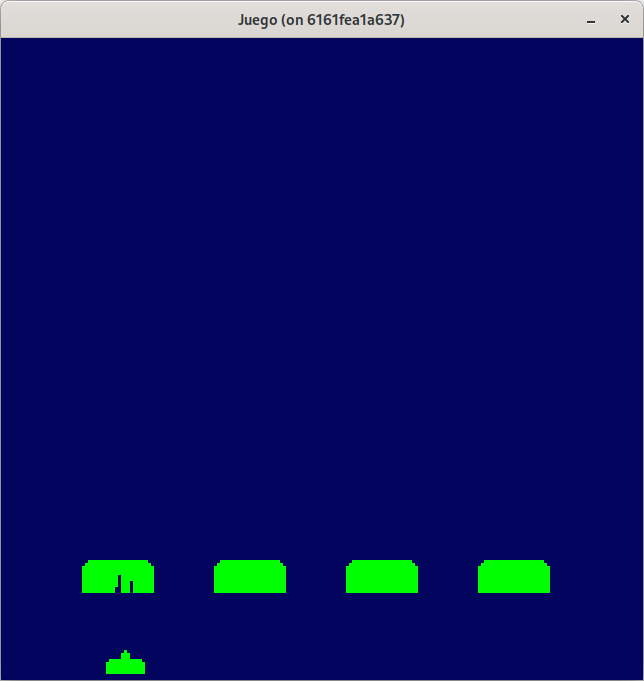

Puede consultar el código de este paso en la rama [step-04-bunkers_2](https://github.com/programatta/space-invaders/tree/step-04-bunkers_2)

## Error en el daño a los bunkers por disparos del cañon.
Vemos que el daño al bunker por parte de los proyectiles (bullets) se realiza correctamente. Sin embargo, si disparamos a un segundo bunker, observamos que no solo se daña ese nuevo bunker, sino que hereda los mismos daños del primero.

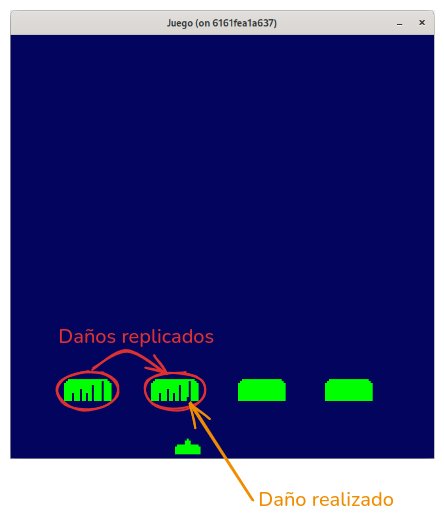

Esto ocurre porque al crear los cuatro bunkers, estamos compartiendo entre ellos el mismo array de datos 2D. Aunque se copie el array externo, los arrays internos (las filas) siguen siendo referencias a los mismos datos, lo que provoca este comportamiento no deseado.

En Go, para evitar esto es necesario realizar una copia profunda (deep copy) del array bidimensional. No basta con hacer `slices.Clone()` o usar `append([][]int(nil), arrayDatos2d...)`) directamente, ya que estas operaciones solo copian el primer nivel.

### Solucion: copia profunda del array 2D.
Para evitar compartir datos entre bunkers, clonamos cada fila del array:

~~~go
	spriteDataBunker := make([][]int, len(sprite.Data))
	for i := range sprite.Data {
		spriteDataBunker[i] = make([]int, len(sprite.Data[i]))
		copy(spriteDataBunker[i], sprite.Data[i])
	}

	sprite.Data = spriteDataBunker
~~~

Esto asegura que cada bunker tiene su propia copia independiente del array de datos, y los daños no se propagan entre ellos.

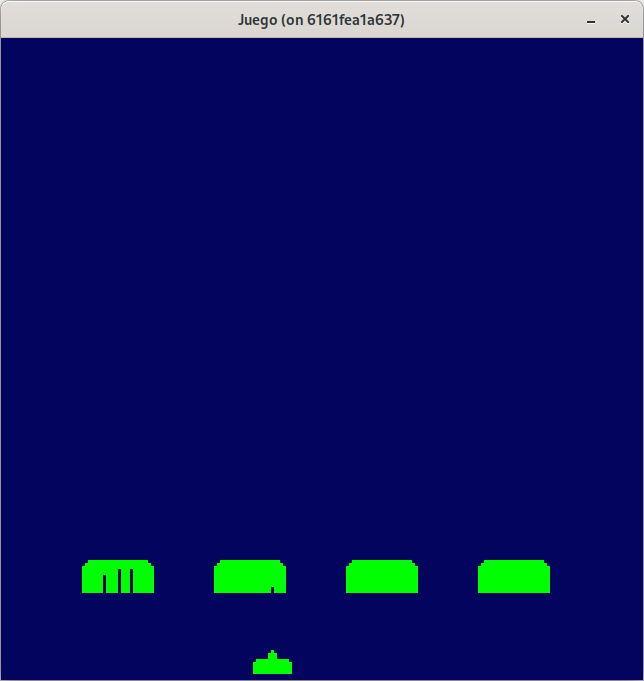

Puede consultar el código de este paso en la rama [step-04-bunkers_3](https://github.com/programatta/space-invaders/tree/step-04-bunkers_3)
