# Paso 5. Enemigos.

## Tipos de enemigos.
En el juego tenemos 4 tipos de enemigos, 3 que disparan proyectiles, que serían los aliens (*octopus*, *crab* y *squid*) y la nave (*ufo*).

Vamos a crear por lo tanto nuevos sprites, donde los aliens tienen una pequeña secuencia de movimiento (realmente son 2 sprites por alien), por lo que tendremos 7 sprites nuevos.
Vamos a diseñar una nueva funcionalidad para crear todos los sprites, y así dejar la clase **Game** libre de los mapas de datos de los sprites.

La llamaremos **SpriteCreator** y se encargará de crear los sprites y mantenerlos en un mapa de **Sprite**.

Cada alien va a tener un color diferente, por lo que añadiremos esa información a **Sprite**:

~~~go
package internal

import (
	"github.com/hajimehoshi/ebiten/v2"
)

type Sprite struct {
  Image *ebiten.Image
  Color color.Color
  Data  [][]int
}
~~~

### sprite_creator.go
Creamos la entidad **SpriteCreator**, que como hemos indicado, tendrá un mapa de **Sprite**, su función de inicialización y un método para poder solicitar el sprite. Además de métodos privados que permitirán construir los sprites y añadirlos al mapa.

Vamos a mover los arrays de datos de los sprites ya existentes en **game.go** a esta entidad y refactorizamos para su uso, y posteriormente ya añadimos los sprites de los aliens y el de la nave.

~~~go
package internal

import "image/color"

type SpriteCreator struct {
  sprites map[string]Sprite
}

func NewSpriteCreator() *SpriteCreator {
  spriteCreator := &SpriteCreator{}

  spriteCreator.sprites = make(map[string]Sprite)

  spriteCreator.createCannonSprite()
  spriteCreator.createBunkerSprite()
  spriteCreator.createBulletSprite()

  return spriteCreator
}

func (sc *SpriteCreator) SpriteByName(name string) (Sprite, error) {
  return sc.sprites[name], nil
}

func (sc *SpriteCreator) createCannonSprite() {
  var spriteDataCannon = [][]int{
    {0, 0, 0, 0, 0, 0, 1, 0, 0, 0, 0, 0, 0},
    {0, 0, 0, 0, 0, 1, 1, 1, 0, 0, 0, 0, 0},
    {0, 0, 0, 0, 0, 1, 1, 1, 0, 0, 0, 0, 0},
    {0, 1, 1, 1, 1, 1, 1, 1, 1, 1, 1, 1, 0},
    {1, 1, 1, 1, 1, 1, 1, 1, 1, 1, 1, 1, 1},
    {1, 1, 1, 1, 1, 1, 1, 1, 1, 1, 1, 1, 1},
    {1, 1, 1, 1, 1, 1, 1, 1, 1, 1, 1, 1, 1},
    {1, 1, 1, 1, 1, 1, 1, 1, 1, 1, 1, 1, 1},
  }
  sprite := SpriteFromArray(spriteDataCannon, 1, color.RGBA{0, 255, 255, 255})
  sc.sprites["cannon"] = Sprite{Image: sprite, Color: color.RGBA{0, 255, 255, 255}, Data: spriteDataCannon}
}

func (sc *SpriteCreator) createBunkerSprite() {
  var spriteDataBunker = [][]int{
    {0, 0, 1, 1, 1, 1, 1, 1, 1, 1, 1, 1, 1, 1, 1, 1, 1, 1, 1, 1, 1, 1, 0, 0},
    {0, 1, 1, 1, 1, 1, 1, 1, 1, 1, 1, 1, 1, 1, 1, 1, 1, 1, 1, 1, 1, 1, 1, 0},
    {1, 1, 1, 1, 1, 1, 1, 1, 1, 1, 1, 1, 1, 1, 1, 1, 1, 1, 1, 1, 1, 1, 1, 1},
    {1, 1, 1, 1, 1, 1, 1, 1, 1, 1, 1, 1, 1, 1, 1, 1, 1, 1, 1, 1, 1, 1, 1, 1},
    {1, 1, 1, 1, 1, 1, 1, 1, 1, 1, 1, 1, 1, 1, 1, 1, 1, 1, 1, 1, 1, 1, 1, 1},
    {1, 1, 1, 1, 1, 1, 1, 1, 1, 1, 1, 1, 1, 1, 1, 1, 1, 1, 1, 1, 1, 1, 1, 1},
    {1, 1, 1, 1, 1, 1, 1, 1, 1, 1, 1, 1, 1, 1, 1, 1, 1, 1, 1, 1, 1, 1, 1, 1},
    {1, 1, 1, 1, 1, 1, 1, 1, 1, 1, 1, 1, 1, 1, 1, 1, 1, 1, 1, 1, 1, 1, 1, 1},
    {1, 1, 1, 1, 1, 1, 1, 1, 1, 1, 1, 1, 1, 1, 1, 1, 1, 1, 1, 1, 1, 1, 1, 1},
    {1, 1, 1, 1, 1, 1, 1, 1, 1, 1, 1, 1, 1, 1, 1, 1, 1, 1, 1, 1, 1, 1, 1, 1},
    {1, 1, 1, 1, 1, 1, 1, 1, 1, 1, 1, 1, 1, 1, 1, 1, 1, 1, 1, 1, 1, 1, 1, 1},
  }
  sprite := SpriteFromArray(spriteDataBunker, 1, color.RGBA{0, 255, 0, 255})
  sc.sprites["bunker"] = Sprite{Image: sprite, Color: color.RGBA{0, 255, 0, 255}, Data: spriteDataBunker}
}

func (sc *SpriteCreator) createBulletSprite() {
  var spriteDataBullet = [][]int{
    {1},
    {1},
  }
  sprite := SpriteFromArray(spriteDataBullet, 1, color.RGBA{255, 255, 255, 255})
  sc.sprites["bullet"] = Sprite{Image: sprite, Color: color.RGBA{255, 255, 255, 255}, Data: spriteDataBullet}
}
~~~

Se ha realizado un pequeño cambio en los colores de los sprites de **cannon** y **bullet**. Para el cañon, se va a pintar de un color azul clarito, y para el proyectil, se deja en blanco, para posteriormente poder tintarlo de otro color según sea la entidad que hace el disparo (cañon, el proyectil será de su color, y lo mismo ocurrirá con los disparios de los aliens, ya que cada uno tendrá un color).

### main.go
Hacemos uso de la nueva entidad **SpriteCreator** y aplicamos algunos cambios:
* Eliminamos los arrays de creación de sprites.
* **Game** va a tener una instancia de **SpriteCreator**, para poder acceder a sprite **bullet** sin tener que volverlo a construir en cada disparo del cañón y nos servirá para los disparos de los aliens.

~~~go
type Game struct {
  spriteCreator *SpriteCreator
  cannon        *Cannon
  bullets       []*Bullet
  bunkers       []*Bunker
}

func NewGame() *Game {
  spriteCreator := NewSpriteCreator()

  game := &Game{}
  game.spriteCreator = spriteCreator

  spriteCannon, _ := spriteCreator.SpriteByName("cannon")
  game.cannon = NewCannon(float32(0), float32(DesignHeight-10), spriteCannon, game)

  spriteBunker, _ := spriteCreator.SpriteByName("bunker")
  bunker1 := NewBunker(float32(27), float32(DesignHeight-40), spriteBunker)

  space := float32(bunker1.sprite.Image.Bounds().Dx())
  bunker2 := NewBunker(27+space+20, float32(DesignHeight-40), spriteBunker)
  bunker3 := NewBunker(27+2*(space+20), float32(DesignHeight-40), spriteBunker)
  bunker4 := NewBunker(27+3*(space+20), float32(DesignHeight-40), spriteBunker)
  game.bunkers = []*Bunker{bunker1, bunker2, bunker3, bunker4}

  return game
}
...
func (g *Game) OnCreateCannonBullet(posX, posY float32) {
  spriteBullet, _ := g.spriteCreator.SpriteByName("bullet")
  bullet := NewBullet(posX, posY, spriteBullet)
  g.bullets = append(g.bullets, bullet)
}
~~~

Puede consultar el código de este paso en la rama [step-05-enemigos_1](https://github.com/programatta/space-invaders/tree/step-05-enemigos_1)

## Pintando a los enemigos.
Añadimos los sprites de los enemigos en la entidad **SpriteCreator**, para luego hacer uso de ellos en **Game**:

~~~go
func NewSpriteCreator() *SpriteCreator {
  spriteCreator := &SpriteCreator{}

  spriteCreator.sprites = make(map[string]Sprite)
  spriteCreator.createCrabSprites()
  spriteCreator.createOctopusSprites()
  spriteCreator.createSquidSprites()
  spriteCreator.createUfoSprite()
  spriteCreator.createCannonSprite()
  spriteCreator.createBunkerSprite()
  spriteCreator.createBulletSprite()

  return spriteCreator
}
...
func (sc *SpriteCreator) createCrabSprites() {
  var spriteDataCrab1 = [][]int{
    {0, 0, 1, 0, 0, 0, 0, 0, 1, 0, 0},
    {0, 0, 0, 1, 0, 0, 0, 1, 0, 0, 0},
    {0, 0, 1, 1, 1, 1, 1, 1, 1, 0, 0},
    {0, 1, 1, 0, 1, 1, 1, 0, 1, 1, 0},
    {1, 1, 1, 1, 1, 1, 1, 1, 1, 1, 1},
    {1, 0, 1, 1, 1, 1, 1, 1, 1, 0, 1},
    {1, 0, 1, 0, 0, 0, 0, 0, 1, 0, 1},
    {0, 0, 0, 1, 1, 0, 1, 1, 0, 0, 0},
  }

  var spriteDataCrab2 = [][]int{
    {0, 0, 1, 0, 0, 0, 0, 0, 1, 0, 0},
    {1, 0, 0, 1, 0, 0, 0, 1, 0, 0, 1},
    {1, 0, 1, 1, 1, 1, 1, 1, 1, 0, 1},
    {1, 1, 1, 0, 1, 1, 1, 0, 1, 1, 1},
    {1, 1, 1, 1, 1, 1, 1, 1, 1, 1, 1},
    {0, 1, 1, 1, 1, 1, 1, 1, 1, 1, 0},
    {0, 0, 1, 0, 0, 0, 0, 0, 1, 0, 0},
    {0, 1, 0, 0, 0, 0, 0, 0, 0, 1, 0},
  }

  sprite1 := SpriteFromArray(spriteDataCrab1, 1, color.RGBA{0, 255, 0, 255})
  sprite2 := SpriteFromArray(spriteDataCrab2, 1, color.RGBA{0, 255, 0, 255})
  sc.sprites["crab1"] = Sprite{Image: sprite1, Color: color.RGBA{0, 255, 0, 255}, Data: spriteDataCrab1}
  sc.sprites["crab2"] = Sprite{Image: sprite2, Color: color.RGBA{0, 255, 0, 255}, Data: spriteDataCrab2}
}

func (sc *SpriteCreator) createOctopusSprites() {
  var spriteDataOctopus1 = [][]int{
    {0, 0, 0, 0, 1, 1, 1, 1, 0, 0, 0, 0},
    {0, 1, 1, 1, 1, 1, 1, 1, 1, 1, 1, 0},
    {1, 1, 1, 1, 1, 1, 1, 1, 1, 1, 1, 1},
    {1, 1, 1, 0, 0, 1, 1, 0, 0, 1, 1, 1},
    {1, 1, 1, 1, 1, 1, 1, 1, 1, 1, 1, 1},
    {0, 0, 1, 1, 1, 0, 0, 1, 1, 1, 0, 0},
    {0, 1, 1, 0, 0, 1, 1, 0, 0, 1, 1, 0},
    {0, 0, 1, 1, 0, 0, 0, 0, 1, 1, 0, 0},
  }

  var spriteDataOctopus2 = [][]int{
    {0, 0, 0, 0, 1, 1, 1, 1, 0, 0, 0, 0},
    {0, 1, 1, 1, 1, 1, 1, 1, 1, 1, 1, 0},
    {1, 1, 1, 1, 1, 1, 1, 1, 1, 1, 1, 1},
    {1, 1, 1, 0, 0, 1, 1, 0, 0, 1, 1, 1},
    {1, 1, 1, 1, 1, 1, 1, 1, 1, 1, 1, 1},
    {0, 0, 0, 1, 1, 0, 0, 1, 1, 0, 0, 0},
    {0, 0, 1, 1, 0, 1, 1, 0, 1, 1, 0, 0},
    {1, 1, 0, 0, 0, 0, 0, 0, 0, 0, 1, 1},
  }
  sprite1 := SpriteFromArray(spriteDataOctopus1, 1, color.RGBA{255, 255, 0, 255})
  sprite2 := SpriteFromArray(spriteDataOctopus2, 1, color.RGBA{255, 255, 0, 255})
  sc.sprites["octopus1"] = Sprite{Image: sprite1, Color: color.RGBA{255, 255, 0, 255}, Data: spriteDataOctopus1}
  sc.sprites["octopus2"] = Sprite{Image: sprite2, Color: color.RGBA{255, 255, 0, 255}, Data: spriteDataOctopus2}
}

func (sc *SpriteCreator) createSquidSprites() {
  var spriteDataSquid1 = [][]int{
    {0, 0, 0, 1, 1, 0, 0, 0},
    {0, 0, 1, 1, 1, 1, 0, 0},
    {0, 1, 1, 1, 1, 1, 1, 0},
    {1, 1, 0, 1, 1, 0, 1, 1},
    {1, 1, 1, 1, 1, 1, 1, 1},
    {0, 0, 1, 0, 0, 1, 0, 0},
    {0, 1, 0, 1, 1, 0, 1, 0},
    {1, 0, 1, 0, 0, 1, 0, 1},
  }

  var spriteDataSquid2 = [][]int{
    {0, 0, 0, 1, 1, 0, 0, 0},
    {0, 0, 1, 1, 1, 1, 0, 0},
    {0, 1, 1, 1, 1, 1, 1, 0},
    {1, 1, 0, 1, 1, 0, 1, 1},
    {1, 1, 1, 1, 1, 1, 1, 1},
    {0, 1, 0, 1, 1, 0, 1, 0},
    {1, 0, 0, 0, 0, 0, 0, 1},
    {0, 1, 0, 0, 0, 0, 1, 0},
  }

  sprite1 := SpriteFromArray(spriteDataSquid1, 1, color.RGBA{255, 0, 255, 255})
  sprite2 := SpriteFromArray(spriteDataSquid2, 1, color.RGBA{255, 0, 255, 255})
  sc.sprites["squid1"] = Sprite{Image: sprite1, Color: color.RGBA{255, 0, 255, 255}, Data: spriteDataSquid1}
  sc.sprites["squid2"] = Sprite{Image: sprite2, Color: color.RGBA{255, 0, 255, 255}, Data: spriteDataSquid2}
}

func (sc *SpriteCreator) createUfoSprite() {
  var spriteDataUFO = [][]int{
    {0, 0, 0, 0, 0, 1, 1, 1, 1, 1, 1, 0, 0, 0, 0, 0},
    {0, 0, 0, 1, 1, 1, 1, 1, 1, 1, 1, 1, 1, 0, 0, 0},
    {0, 0, 1, 1, 1, 1, 1, 1, 1, 1, 1, 1, 1, 1, 0, 0},
    {0, 1, 1, 0, 1, 1, 0, 1, 1, 0, 1, 1, 0, 1, 1, 0},
    {1, 1, 1, 1, 1, 1, 1, 1, 1, 1, 1, 1, 1, 1, 1, 1},
    {0, 0, 1, 1, 1, 0, 0, 1, 1, 0, 0, 1, 1, 1, 0, 0},
    {0, 0, 0, 1, 0, 0, 0, 0, 0, 0, 0, 0, 1, 0, 0, 0},
  }
  sprite := SpriteFromArray(spriteDataUFO, 1, color.RGBA{255, 0, 0, 255})
  sc.sprites["ufo"] = Sprite{Image: sprite, Color: color.RGBA{255, 0, 0, 255}, Data: spriteDataUFO}
}
~~~

Para los tipos de alien que tenemos, vamos a crear una entidad **Alien** y para la nave, creamos una entidad **Ufo**.

### alien.go
La entidad **Alien** va a manejar la posición en pantalla y el sprite correspondiente a la animación. Tendrá su función constructora que recogerá la posición y los sprites de la animación a usar.

~~~go
type Alien struct {
  sprites []Sprite
  posX    float32
  posY    float32
}

func NewAlien(posX, posY float32, sprite1, sprite2 Sprite) *Alien {
  sprites := []Sprite{sprite1, sprite2}
  return &Alien{sprites: sprites, posX: posX, posY: posY}
}
~~~

Definimos también metodos **Update** y **Draw**, para su actualización y pintado en pantalla respectivamente:

~~~go
func (a *Alien) Update() {
}

func (a *Alien) Draw(screen *ebiten.Image) {
  opAlien := &ebiten.DrawImageOptions{}
  opAlien.GeoM.Translate(float64(a.posX), float64(a.posY))

  screen.DrawImage(a.sprites[0].Image, opAlien)
}
~~~

### ufo.go
Esta entidad va a manejar la posición de la nave con un único sprite:

~~~go
type Ufo struct {
  sprite Sprite
  posX   float32
  posY   float32
}

func NewUfo(posX, posY float32, sprite Sprite) *Ufo {
  return &Ufo{sprite: sprite, posX: posX, posY: posY}
}
~~~

Definimos también metodos **Update** y **Draw**, para su actualización y pintado en pantalla respectivamente:

~~~go
func (u *Ufo) Update() {}

func (u *Ufo) Draw(screen *ebiten.Image) {
  opUfo := &ebiten.DrawImageOptions{}
  opUfo.GeoM.Translate(float64(u.posX), float64(u.posY))
  screen.DrawImage(u.sprite.Image, opUfo)
}
~~~

### game.go
Para hacer uso de los enemigos y de la nave, vamos a agrupar a los enemigos usando un slice de tipo **Alien**, ya que nos permitirá ir actualizando  el slice a medida que se vayan destruyendo aliens.

~~~go
type Game struct {
  spriteCreator *SpriteCreator
  cannon        *Cannon
  bullets       []*Bullet
  bunkers       []*Bunker
  ufo           *Ufo
  enemies       []*Alien
}

func NewGame() *Game {
  ...
  ufoSprite, _ := spriteCreator.SpriteByName("ufo")
  ufo := NewUfo(100, 5, ufoSprite)
  game.ufo = ufo

  enemies := createEnemies(spriteCreator)
  game.enemies = enemies
  
  return game
}

func (g *Game) Draw(screen *ebiten.Image) {
  screen.Fill(color.RGBA{0x03, 0x04, 0x5e, 0xFF})

  g.ufo.Draw(screen)

  for _, enemy := range g.enemies {
    enemy.Draw(screen)
  }
  ...
}
~~~

La distribución de los aliens es de la siguiente forma:
- una fila de 11 aliens tipo *squids*.
- dos filas de 11 aliens tipo *crabs*.
- dos filas de 11 aliens tipo *octopus*.

~~~go
func createEnemies(spriteCreator *SpriteCreator) []*Alien {
  enemies := []*Alien{}

  squids := createSquids(11, 1, 11, 35, spriteCreator)
  enemies = append(enemies, squids...)

  crabs := createCrabs(11, 2, 10, 50, spriteCreator)
  enemies = append(enemies, crabs...)

  octopuses := createOctopuses(11, 2, 9, 80, spriteCreator)
  enemies = append(enemies, octopuses...)

  return enemies
}

func createCrabs(count, rows uint8, initX, initY float32, spriteCreator *SpriteCreator) []*Alien {
  sprite1, _ := spriteCreator.SpriteByName("crab1")
  sprite2, _ := spriteCreator.SpriteByName("crab2")
  crabs := []*Alien{}

  posX := initX
  posY := initY
  for i := range count * rows {
    crab := NewAlien(posX, posY, sprite1, sprite2)
    crabs = append(crabs, crab)
    posX += float32(sprite1.Image.Bounds().Dx())
    if i > 0 && (i+1)%count == 0 {
      posX = initX
      posY += float32(sprite1.Image.Bounds().Dy())
    }
  }
  return crabs
}

func createOctopuses(count, rows uint8, initX, initY float32, spriteCreator *SpriteCreator) []*Alien {
  sprite1, _ := spriteCreator.SpriteByName("octopus1")
  sprite2, _ := spriteCreator.SpriteByName("octopus2")
  octopuses := []*Alien{}

  posX := initX
  posY := initY
  for i := range count * rows {
    octopus := NewAlien(posX, posY, sprite1, sprite2)
    octopuses = append(octopuses, octopus)
    posX += float32(sprite1.Image.Bounds().Dx())
    if i > 0 && (i+1)%count == 0 {
      posX = initX
      posY += float32(sprite1.Image.Bounds().Dy())
    }
  }
  return octopuses
}

func createSquids(count, rows uint8, initX, initY float32, spriteCreator *SpriteCreator) []*Alien {
  sprite1, _ := spriteCreator.SpriteByName("squid1")
  sprite2, _ := spriteCreator.SpriteByName("squid2")
  squids := []*Alien{}

  posX := initX
  posY := initY
  for i := range count * rows {
    squid := NewAlien(posX, posY, sprite1, sprite2)
    squids = append(squids, squid)
    posX += float32(sprite1.Image.Bounds().Dx())
    if i > 0 && (i+1)%count == 0 {
      posX = initX
      posY += float32(sprite1.Image.Bounds().Dy())
    }
  }
  return squids
}
~~~

Con lo que tenemos la siguiente salida:

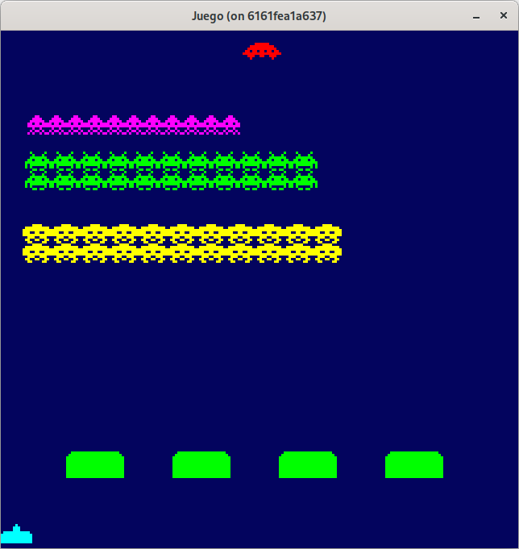

Tenemos tres métodos muy similares, que a futuro nos llevará a refactorizarlos, pero de momento, nos permiten establecer los sprites a usar. En imagen, se ve una primera aproximación de su posicionamiento, pero debemos tener en cuenta el desplazamiento de cada sprite para que se presente una mejor formación.

* Para los aliens *squid*, le añadimos una separación entre ellos de **9** pixeles en X.
* Para los aliens *crab*, le añadimos una separación entre ellos de **6** pixeles en X.
* Para los aliens *octopus*, le añadimos una separación entre ellos de **5** pixeles en X.

~~~go
func createCrabs(count, rows uint8, initX, initY float32, spriteCreator *SpriteCreator) []*Alien {
  sprite1, _ := spriteCreator.SpriteByName("crab1")
  sprite2, _ := spriteCreator.SpriteByName("crab2")
  crabs := []*Alien{}

  posX := initX
  posY := initY
  for i := range count * rows {
    crab := NewAlien(posX, posY, sprite1, sprite2)
    crabs = append(crabs, crab)
    posX += float32(sprite1.Image.Bounds().Dx() + 6)
    if i > 0 && (i+1)%count == 0 {
      posX = initX
      posY += float32(sprite1.Image.Bounds().Dy())
    }
  }
  return crabs
}

func createOctopuses(count, rows uint8, initX, initY float32, spriteCreator *SpriteCreator) []*Alien {
  sprite1, _ := spriteCreator.SpriteByName("octopus1")
  sprite2, _ := spriteCreator.SpriteByName("octopus2")
  octopuses := []*Alien{}

  posX := initX
  posY := initY
  for i := range count * rows {
    octopus := NewAlien(posX, posY, sprite1, sprite2)
    octopuses = append(octopuses, octopus)
    posX += float32(sprite1.Image.Bounds().Dx() + 5)
    if i > 0 && (i+1)%count == 0 {
      posX = initX
      posY += float32(sprite1.Image.Bounds().Dy())
    }
  }
  return octopuses
}

func createSquids(count, rows uint8, initX, initY float32, spriteCreator *SpriteCreator) []*Alien {
  sprite1, _ := spriteCreator.SpriteByName("squid1")
  sprite2, _ := spriteCreator.SpriteByName("squid2")
  squids := []*Alien{}

  posX := initX
  posY := initY
  for i := range count * rows {
    squid := NewAlien(posX, posY, sprite1, sprite2)
    squids = append(squids, squid)
    posX += float32(sprite1.Image.Bounds().Dx() + 9)
    if i > 0 && (i+1)%count == 0 {
      posX = initX
      posY += float32(sprite1.Image.Bounds().Dy())
    }
  }
  return squids
}

~~~

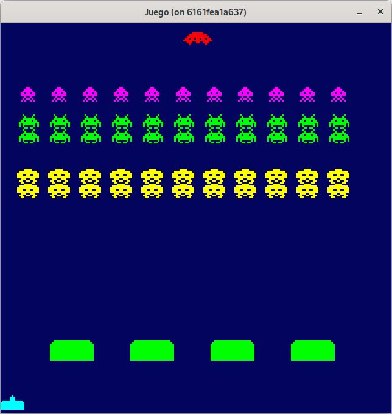

Para los aliens con dos filas (*crab* y *octopus*), vamos a asignar una una separación entre ellos de **5** pixeles en Y:

~~~go
func createCrabs(count, rows uint8, initX, initY float32, spriteCreator *SpriteCreator) []*Alien {
  sprite1, _ := spriteCreator.SpriteByName("crab1")
  sprite2, _ := spriteCreator.SpriteByName("crab2")
  crabs := []*Alien{}

  posX := initX
  posY := initY
  for i := range count * rows {
    crab := NewAlien(posX, posY, sprite1, sprite2)
    crabs = append(crabs, crab)
    posX += float32(sprite1.Image.Bounds().Dx() + 6)
    if i > 0 && (i+1)%count == 0 {
      posX = initX
      posY += float32(sprite1.Image.Bounds().Dy() + 5)
    }
  }
  return crabs
}

func createOctopuses(count, rows uint8, initX, initY float32, spriteCreator *SpriteCreator) []*Alien {
  sprite1, _ := spriteCreator.SpriteByName("octopus1")
  sprite2, _ := spriteCreator.SpriteByName("octopus2")
  octopuses := []*Alien{}

  posX := initX
  posY := initY
  for i := range count * rows {
    octopus := NewAlien(posX, posY, sprite1, sprite2)
    octopuses = append(octopuses, octopus)
    posX += float32(sprite1.Image.Bounds().Dx() + 5)
    if i > 0 && (i+1)%count == 0 {
      posX = initX
      posY += float32(sprite1.Image.Bounds().Dy() +5)
    }
  }
  return octopuses
}
~~~

Con estos pequeños cambios, ya tenemos a los aliens en una perfecta formación.

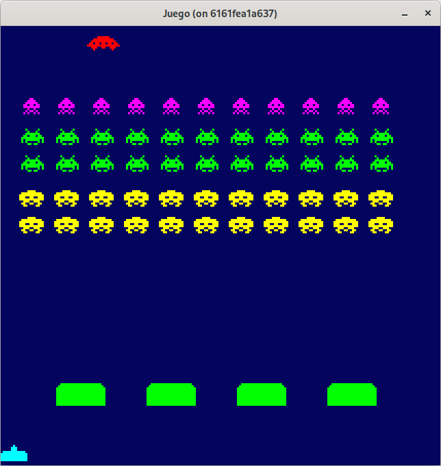

Puede consultar el código de este paso en la rama [step-05-enemigos_2](https://github.com/programatta/space-invaders/tree/step-05-enemigos_2)

## Actualizando enemigos.
### Ufo.
Comenzamos con la actualización de la entidad **Ufo** que es la más sencilla.
Aquí moveremos la nave de izquierda a derecha y cuando supere el límite izquierdo, ubicaremos su posición en una X negativa para que demore un poco en salir, de esta forma tenemos una operativa continua de aparecer la nave.

~~~go
func (u *Ufo) Update() {
  u.posX++
  if u.posX >= float32(DesignWidth) {
    u.posX = -100
  }
}
~~~

En la entidad **Game**, en el método de creación y en **Update** añadimos lo siguiente:

~~~go
func NewGame() *Game {
  ...
  ufo := NewUfo(-20, 5, ufoSprite)
  ...
}

func (g *Game) Update() error {
  ...
  g.cannon.Update()
  for _, bullet := range g.bullets {
    bullet.Update()
  }

  g.ufo.Update()
  ...
}
~~~

### Alien.
Como hemos indicado antes, la entidad **Alien** va a gestionar una serie de sprites (en este caso 2) para realizar la animación. 

Para determinar que sprite es el que tiene que usar, crearemos la propiedad **currentSprite**.

Para determinar la duración de la animación, usaremos el valor del *delta time* (**dt**) y un acumulador de tiempo (de la misma forma que hicimos con el cañon a la hora de hacer disparos) para pasar al siguiente sprite y establecer el acumulador de tiempo a 0. 

Para realizar la operación de pasar al siguiente sprite, usaremos el valor de **currentSprite** le sumamos 1 y calculamos el módulo (o resto) con el número de elementos del array. De esta forma siempre tendremos el valor acotado entre 0 y el máximo índice del slice.

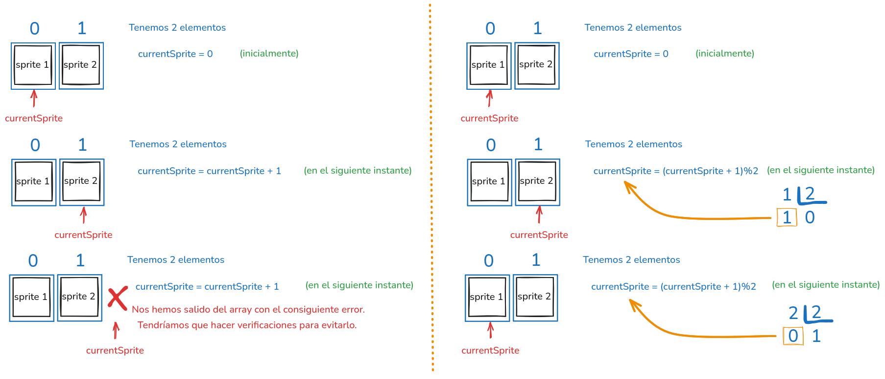

~~~go
type Alien struct {
  sprites       []Sprite
  currentSprite uint
  posX          float32
  posY          float32
  time float32
}

func NewAlien(posX, posY float32, sprite1, sprite2 Sprite) *Alien {
  sprites := []Sprite{sprite1, sprite2}
  return &Alien{sprites: sprites, posX: posX, posY: posY, currentSprite: 0, time: 0}
}

func (a *Alien) Update() {
  a.time += dt
  if a.time >= 0.35 {
    a.currentSprite = (a.currentSprite + 1) % 2
    a.time = 0
  }
}

func (a *Alien) Draw(screen *ebiten.Image) {
  spriteOptions := &ebiten.DrawImageOptions{}
  spriteOptions.GeoM.Translate(float64(a.posX), float64(a.posY))

  screen.DrawImage(a.sprites[a.currentSprite].Image, spriteOptions)
}
~~~

De esta forma tenemos ya la animación de nuestros enemigos.

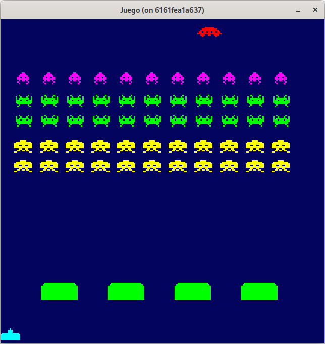

Puede consultar el código de este paso en la rama [step-05-enemigos_3](https://github.com/programatta/space-invaders/tree/step-05-enemigos_3)

Los aliens se van a ir desplazando de izquierda a derecha en formación. Cuando un alien llegué a los extremos (tanto izquierdo como derecho), la formación bajará 5 pixeles y cambiará de dirección.

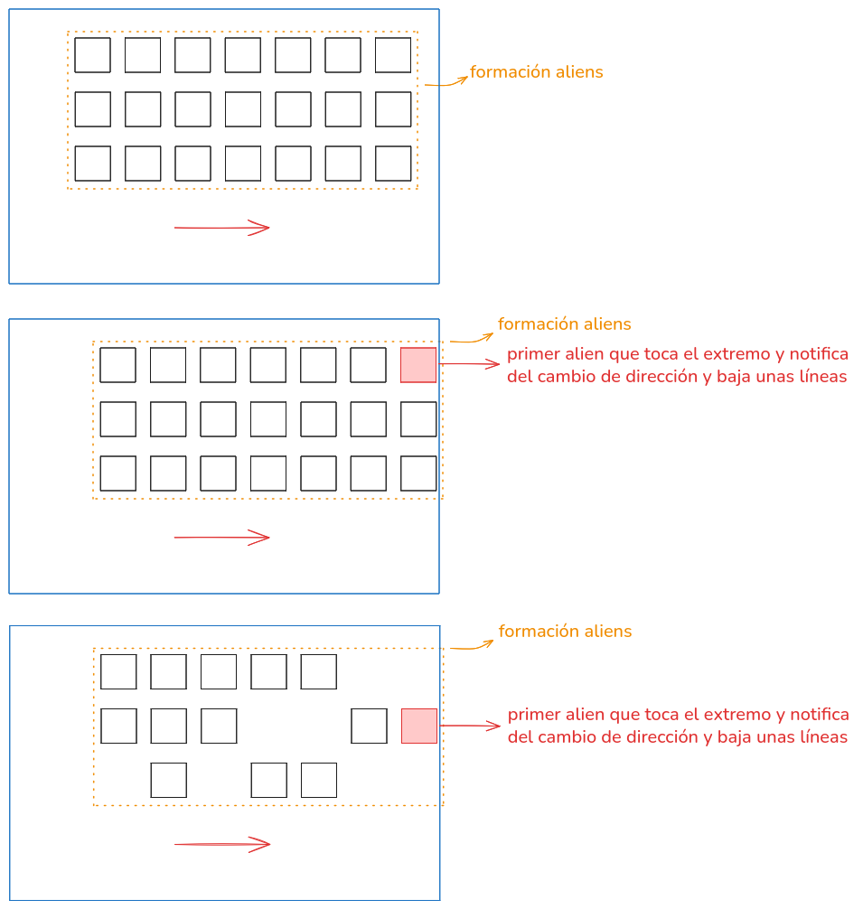

Para realizar el cambio de dirección, se lo notificaremos al juego para que este se lo haga saber al resto de enemigos. Para ello usaremos la interfaz que definimos para crear el proyectil del cañon, añadiendo un nuevo método a implementar por **Game** llamado **OnChangeDirection** que el alien indicará cual será la nueva dirección.

~~~go
type Alien struct {
  sprites       []Sprite
  currentSprite uint
  posX          float32
  posY          float32
  currentDirX   float32
  time          float32
  notifier      Notifier
}

func NewAlien(posX, posY float32, sprite1, sprite2 Sprite, notifier Notifier) *Alien {
  sprites := []Sprite{sprite1, sprite2}
  return &Alien{sprites: sprites, posX: posX, posY: posY, currentSprite: 0, time: 0, notifier: notifier}
}

func (a *Alien) Update() {
  a.time += dt
  if a.time >= 0.35 {
    a.posX += speed * dt * a.currentDirX
    a.currentSprite = (a.currentSprite + 1) % 2
    a.time = 0
  }

  if a.posX+float32(a.sprites[a.currentSprite].Image.Bounds().Dx()) >= float32(DesignWidth) {
    a.notifier.OnChangeDirection(-1)
    a.posX = float32(DesignWidth) - float32(a.sprites[a.currentSprite].Image.Bounds().Dx())
  } else if a.posX <= 0 {
    a.notifier.OnChangeDirection(1)
    a.posX = 0
  }
}

const speed float32 = 200
~~~

Este cambio nos lleva a realizar unos pequeños cambios para pasar el notificador (game) a la entidad **Alien** en **Game**.

~~~go
type Notifier interface {
  OnChangeDirection(newDirection float32)
  OnCreateCannonBullet(posX, posY float32)
}

type Game struct {
  ...
  newDirection      float32
}

func NewGame() *Game {
  ...
  enemies := createEnemies(spriteCreator, game)
  game.enemies = enemies
  game.newDirection = 1
  return game 
}

func (g *Game) OnChangeDirection(newDirection float32) {
  g.newDirection = newDirection
}

func createEnemies(spriteCreator *SpriteCreator, notifier Notifier) []*Alien {
  enemies := []*Alien{}

  squids := createSquids(11, 1, 11, 35, spriteCreator, notifier)
  enemies = append(enemies, squids...)

  crabs := createCrabs(11, 2, 10, 50, spriteCreator, notifier)
  enemies = append(enemies, crabs...)

  octopuses := createOctopuses(11, 2, 9, 80, spriteCreator, notifier)
  enemies = append(enemies, octopuses...)

  return enemies
}

func createCrabs(count, rows uint8, initX, initY float32, spriteCreator *SpriteCreator, notifier Notifier) []*Alien {
  ...
  for i := range count * rows {
    crab := NewAlien(posX, posY, sprite1, sprite2, notifier)
    crabs = append(crabs, crab)
    ...
  }
  return crabs
}

func createOctopuses(count, rows uint8, initX, initY float32, spriteCreator *SpriteCreator, notifier Notifier) []*Alien {
  ...
  for i := range count * rows {
    octopus := NewAlien(posX, posY, sprite1, sprite2, notifier)
    octopuses = append(octopuses, octopus)
    ...
  }
  return octopuses
}

func createSquids(count, rows uint8, initX, initY float32, spriteCreator *SpriteCreator, notifier Notifier) []*Alien {
  ...
  for i := range count * rows {
    squid := NewAlien(posX, posY, sprite1, sprite2, notifier)
    squids = append(squids, squid)
    ...
  }
  return squids
}
~~~

**Game** a su vez, notificará la nueva dirección al los enemigos, para cambiar de dirección y descender **5** pixels en Y, llamando al método de **Alien**: **ChangeDirection**.

~~~go
type Game struct {
  ...
  enemiesCurrentDir float32
  newDirection      float32
}

func NewGame() *Game {
  ...
  game.enemiesCurrentDir = 1
  game.newDirection = 1
  return game
}

func (g *Game) Update() error {
  ...
  g.ufo.Update()
  for _, enemy := range g.enemies {
    enemy.ChangeDirection(g.enemiesCurrentDir)
    enemy.Update()
  }
  ...
  if g.newDirection != g.enemiesCurrentDir {
    g.enemiesCurrentDir = g.newDirection
  }

  return nil
}
~~~

En la entidad **Alien** añadimos el método **ChangeDirection** para realizar el cambio de dirección, de izquierda a derecha y de derecha a izquierda e ir bajando:

~~~go
type Alien struct {
  ...
  currentDirX   float32
  lastDirX      float32
  ...
}

func (a *Alien) ChangeDirection(currentDir float32) {
  a.currentDirX = currentDir
}

func (a *Alien) Update() {
  if a.lastDirX != a.currentDirX {
    if a.lastDirX != 0 {
      a.posY += 5
    }
    a.lastDirX = a.currentDirX
  }
  ...
}
~~~

Con esta funcionalidad añadida, ya disponemos del movimiento y desplazamiento hacia abajo de los enemigos.

Puede consultar el código de este paso en la rama [step-05-enemigos_4](https://github.com/programatta/space-invaders/tree/step-05-enemigos_4)

## Colisión del proyectil del cañon con los enemigos.
Para establecer la funcionalidad de colisión entre la entidad **Bullet** con las entidades **Ufo** y **Alien**, debemos  implementar en estas últimas la interface **Collider**.

Al igual que con el **Bullet**, el método **OnCollide** de **Ufo** y de **Alien** debe marcar el objeto como borrable y **Game** los irá eliminando del slice **enemies** de la misma manera que se eliminan los objetos **Bullet**.

### ufo.go
~~~go
type Ufo struct {
  ...
  remove bool
}

func (u *Ufo) Update() {
  if !u.remove {
    u.posX++
    if u.posX >= float32(DesignWidth) {
      u.posX = -100
    }
  }
}

func (u *Ufo) Draw(screen *ebiten.Image) {
  if !u.remove {
    opUfo := &ebiten.DrawImageOptions{}
    opUfo.GeoM.Translate(float64(u.posX), float64(u.posY))
    screen.DrawImage(u.sprite.Image, opUfo)
  }
}

// Implementación de la interface Collider.
func (u *Ufo) Rect() (float32, float32, float32, float32) {
  width := float32(u.sprite.Image.Bounds().Dx())
  height := float32(u.sprite.Image.Bounds().Dy())
  return u.posX, u.posY, width, height
}

func (u *Ufo) OnCollide() {
  u.remove = true
}
...
~~~

### alien.go
~~~go
type Alien struct {
  ...
  remove        bool
}

func (a *Alien) CanRemove() bool {
  return a.remove
}

// Implementación de la interface Collider.
func (a *Alien) Rect() (float32, float32, float32, float32) {
  width := float32(a.sprites[a.currentSprite].Image.Bounds().Dx())
  height := float32(a.sprites[a.currentSprite].Image.Bounds().Dy())
  return a.posX, a.posY, width, height
}

func (a *Alien) OnCollide() {
  a.remove = true
}
...
~~~

### game.go
~~~go
func (g *Game) Update() error {
  ...
  //Colisiones.
  for _, bullet := range g.bullets {
    for _, bunker := range g.bunkers {
      if g.checkCollision(bullet, bunker) {
        if bunker.DoDamage(bullet.posX, bullet.posY) {
          bullet.OnCollide()
        }
      }
    }

    for _, enemy := range g.enemies {
      if g.checkCollision(bullet, enemy) {
        bullet.OnCollide()
        enemy.OnCollide()
      }
    }

    if g.checkCollision(bullet, g.ufo) {
      bullet.OnCollide()
      g.ufo.OnCollide()
    }
  }

  if len(g.bullets) > 0 {
    g.bullets = slices.DeleteFunc(g.bullets, func(bullet *Bullet) bool {
      return bullet.CanRemove()
    })
  }
  if len(g.enemies) > 0 {
    g.enemies = slices.DeleteFunc(g.enemies, func(alien *Alien) bool {
      return alien.CanRemove()
    })
  }
  ...
}
~~~

Con esta funcionalidad ya eliminamos **Ufo** y **Alien** del slice **enemies**.

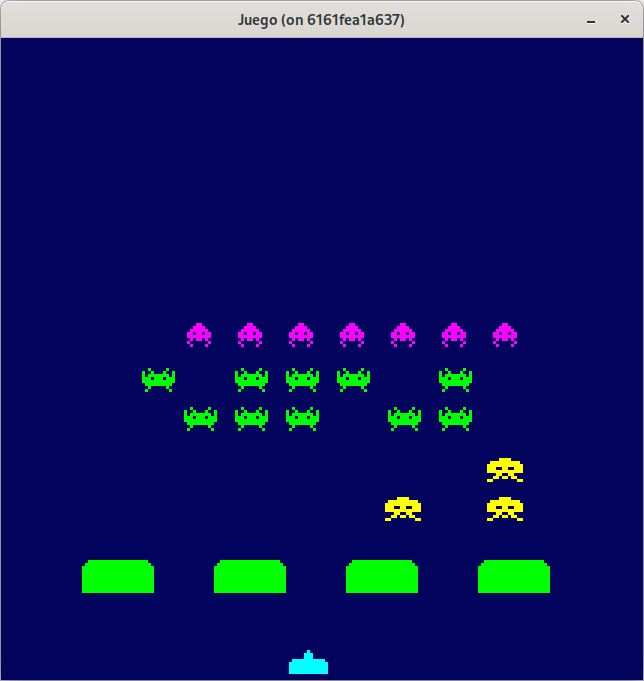

Puede consultar el código de este paso en la rama [step-05-enemigos_5](https://github.com/programatta/space-invaders/tree/step-05-enemigos_5)

## Sprites de explosiones visuales.
Cuando un proyectil colisione con **Ufo**, **Alien** o **Cannon** vamos a añadir una explosión. Para **Ufo** y **Alien** es un sprite simple, pero para el **Cannon** va a ser una animación, que tendrá dos sprites.

Añadimos los sprites a **SpriteCreator**:

~~~go
func NewSpriteCreator() *SpriteCreator {
  ...
  spriteCreator.createAlienExplosion()
  spriteCreator.createUfoExplosion()
  spriteCreator.createCannonExplosions()

  return spriteCreator
}
...
func (sc *SpriteCreator) createAlienExplosion() {
  var spriteDataExplosionAlien = [][]int{
    {0, 0, 0, 1, 0, 0, 0, 1, 0, 0, 0},
    {0, 1, 0, 0, 1, 0, 1, 0, 0, 1, 0},
    {0, 0, 1, 0, 0, 0, 0, 0, 1, 0, 0},
    {0, 0, 0, 1, 0, 0, 0, 1, 0, 0, 0},
    {1, 1, 0, 0, 0, 0, 0, 0, 0, 1, 1},
    {0, 0, 0, 1, 0, 0, 0, 1, 0, 0, 0},
    {0, 0, 1, 0, 0, 0, 0, 0, 1, 0, 0},
    {0, 1, 0, 0, 1, 0, 1, 0, 0, 1, 0},
    {0, 0, 0, 1, 0, 0, 0, 1, 0, 0, 0},
  }
  sprite := SpriteFromArray(spriteDataExplosionAlien, 1, color.RGBA{255, 255, 255, 255})
  sc.sprites["alienExplosion"] = Sprite{Image: sprite, Color: color.RGBA{255, 255, 255, 255}}
}

func (sc *SpriteCreator) createUfoExplosion() {
  var spriteDataExplosionUFO = [][]int{
    {0, 0, 1, 0, 0, 0, 0, 0, 0, 0, 1, 0, 0, 0, 0, 1},
    {0, 0, 0, 1, 0, 1, 0, 1, 0, 0, 0, 0, 1, 0, 1, 0},
    {1, 0, 1, 0, 0, 0, 1, 1, 0, 1, 1, 0, 0, 0, 0, 0},
    {0, 0, 0, 0, 1, 1, 0, 1, 1, 0, 1, 1, 1, 0, 1, 0},
    {0, 0, 1, 0, 1, 0, 1, 1, 1, 0, 1, 0, 1, 0, 0, 1},
    {1, 0, 0, 0, 0, 0, 1, 0, 1, 0, 0, 1, 0, 0, 0, 0},
    {0, 0, 1, 0, 0, 1, 0, 0, 0, 1, 0, 0, 0, 1, 0, 0},
  }
  sprite := SpriteFromArray(spriteDataExplosionUFO, 1, color.RGBA{255, 0, 0, 255})
  sc.sprites["ufoExplosion"] = Sprite{Image: sprite, Color: color.RGBA{255, 0, 0, 255}}
}

func (sc *SpriteCreator) createCannonExplosions() {
  var spriteDataExplosionCannon1 = [][]int{
    {0, 0, 0, 1, 0, 0, 0, 0, 0, 1, 0, 0, 0},
    {1, 0, 0, 0, 0, 1, 0, 0, 0, 0, 0, 1, 0},
    {0, 0, 0, 1, 0, 0, 0, 1, 1, 0, 0, 0, 1},
    {1, 0, 0, 0, 0, 0, 0, 0, 0, 0, 1, 0, 0},
    {0, 1, 0, 0, 1, 1, 0, 1, 1, 0, 0, 1, 0},
    {0, 0, 1, 0, 0, 1, 1, 0, 0, 0, 1, 0, 1},
    {0, 0, 0, 1, 1, 1, 1, 1, 1, 0, 0, 0, 0},
    {0, 0, 1, 1, 0, 1, 1, 1, 1, 0, 0, 1, 0},
  }

  var spriteDataExplosionCannon2 = [][]int{
    {0, 0, 0, 0, 1, 0, 0, 0, 0, 0, 0, 0, 0},
    {0, 0, 0, 0, 0, 0, 0, 0, 0, 0, 1, 0, 0},
    {0, 0, 0, 0, 1, 0, 0, 1, 0, 1, 0, 0, 0},
    {0, 0, 1, 0, 1, 0, 0, 0, 0, 0, 0, 0, 1},
    {0, 0, 0, 0, 0, 1, 1, 1, 1, 0, 0, 0, 0},
    {1, 0, 0, 1, 0, 1, 1, 0, 0, 1, 0, 0, 0},
    {0, 0, 1, 1, 1, 1, 1, 0, 0, 0, 1, 0, 0},
    {0, 1, 1, 1, 1, 1, 1, 1, 0, 0, 1, 0, 1},
  }
  sprite1 := SpriteFromArray(spriteDataExplosionCannon1, 1, color.RGBA{0, 255, 255, 255})
  sprite2 := SpriteFromArray(spriteDataExplosionCannon2, 1, color.RGBA{0, 255, 255, 255})
  sc.sprites["cannonExplosion1"] = Sprite{Image: sprite1, Color: color.RGBA{0, 255, 255, 255}}
  sc.sprites["cannonExplosion2"] = Sprite{Image: sprite2, Color: color.RGBA{0, 255, 255, 255}}
}
~~~

Indicar que el sprite de la explosión del alien, es de color blanca, para poder tintarlo luego al color correspondiente de cada alien eliminado.

Vamos a crear una entidad de explosión para cada uno de ellos (**ExplosionUfo**, **ExplosionAlien** y **ExplosionCannon**), y para gestionar las explosiones creadas, crearemos un slice de tipo **Explosioner** que será una interfaz que implementará cada una de las nuevas entidades de explosión.

### explosion_ufo.go
Con la funcionalidad actual, una vez que la nave es destruida, ya no vuelve a aparecer. Esta entidad, además de mostrar la explosión durante un tiempo en pantalla, se va a encargar de restablecer el funcionamiento de la nave para que vuelva a ser presentada en pantalla. 

Para ello, deberá notificar al juego que restaure la nave, y para eso, usaremos la interfaz **Notifier** añadiendo un nuevo método que implementará **Game** llamado **OnResetUfo**.

~~~go
type ExplosionUfo struct {
  sprite   Sprite
  posX     float32
  posY     float32
  notifier Notifier
  time     float32
  remove   bool
}

func NewExplosionUfo(posX, posY float32, sprite Sprite, notifier Notifier) *ExplosionUfo {
  return &ExplosionUfo{sprite: sprite, posX: posX, posY: posY, notifier: notifier}
}

// Implementación de la interface Explosioner
func (eu *ExplosionUfo) CanRemove() bool {
  return eu.remove
}

func (eu *ExplosionUfo) Update() {
  eu.time += dt
  if eu.time >= 0.35 {
    eu.time = 0
    eu.remove = true
    eu.notifier.OnResetUfo()
  }
}

func (eu *ExplosionUfo) Draw(screen *ebiten.Image) {
  opExplosionUfo := &ebiten.DrawImageOptions{}
  opExplosionUfo.GeoM.Translate(float64(eu.posX), float64(eu.posY))
  screen.DrawImage(eu.sprite.Image, opExplosionUfo)
}
~~~

### ufo.go
Vamos a añadir dos métodos, uno para obtener la posición en la que se encuentra la nave, cuando recibe el impacto del proyectil, para poder pintar en esa posición la explosión, y otro para hacer el reseteo del estado y que se pueda seguir mostrando la nave.

~~~go
func (u *Ufo) Position() (float32, float32) {
  return u.posX, u.posY
}

func (u *Ufo) Reset() {
  u.posX = -100
  u.remove = false
}
~~~

### explosion_alien.go
Esta entidad, además de mostrar la explosión durante un tiempo en pantalla, se va a encargar de tintar el sprite de explosion con el color del alien eliminado. En la función constructora, recibimos el color `color.Color` y obtenemos sus componentes con el método `RGBA()`.
Para realizar el tintado, usaremos la estructura `ColorScale` de `ebiten.DrawImageOptions` para establecer el nuevo color con el método `Scale()`.

~~~go
type ExplosionAlien struct {
  sprite     Sprite
  posX       float32
  posY       float32
  colorRed   float32
  colorGreen float32
  colorBlue  float32
  colorAlpha float32
  time       float32
  remove     bool
}

func NewExplosion(posX, posY float32, sprite Sprite, color color.Color) *ExplosionAlien {
  red, green, blue, alpha := color.RGBA()
  colorRed := float32(red)
  colorGreen := float32(green)
  colorBlue := float32(blue)
  colorAlpha := float32(alpha)

  return &ExplosionAlien{sprite: sprite, posX: posX, posY: posY, colorRed: colorRed, colorGreen: colorGreen, colorBlue: colorBlue, colorAlpha: colorAlpha}
}

func (ea *ExplosionAlien) CanRemove() bool {
  return ea.remove
}

func (ea *ExplosionAlien) Update() {
  ea.time += dt
  if ea.time >= 0.35 {
    ea.time = 0
    ea.remove = true
  }
}

func (ea *ExplosionAlien) Draw(screen *ebiten.Image) {
  opExplosionAlien := &ebiten.DrawImageOptions{}
  opExplosionAlien.GeoM.Translate(float64(ea.posX), float64(ea.posY))
  opExplosionAlien.ColorScale.Scale(ea.colorRed, ea.colorGreen, ea.colorBlue, ea.colorAlpha)
  screen.DrawImage(ea.sprite.Image, opExplosionAlien)
}
~~~

### alien.go
Añadimos dos métodos para devolver la posición y el color del alien eliminado para ubicar y tintar la explosión.

~~~go
func (a *Alien) Position() (float32, float32) {
  return a.posX, a.posY
}

func (a *Alien) Color() color.Color {
  return a.sprites[a.currentSprite].Color
}
~~~

### game.go
Como se ha indicado, se añade el método **OnResetUfo** a la interfaz **Notifier** para reestablecer el uso de la nave, al igual que se crean las interfaces para gestionar las distintas explosiones (de momento del **Ufo** y de **Alien**). 

Cuando ocurra una colisión de un proyectil con **Ufo** o **Alien** se creará una explosión, que se añade al slice **explosions**.

Si **explosions** tiene datos, se actualiza cada explosión, hasta que esta sea marcada como borrable. Las explosiones borrables, se eliminan del slice.

~~~go
type Notifier interface {
 ...
 OnResetUfo()
}

type Manageer interface {
  Update()
  Draw(screen *ebiten.Image)
}

type Eraser interface {
  CanRemove() bool
}

type Explosioner interface {
  Manageer
  Eraser
}

type Game struct {
 ...
  explosions        []Explosioner
}

func (g *Game) Update() error {
  ...
  for _, explosion := range g.explosions {
    explosion.Update()
  }
  //Colisiones.
  for _, bullet := range g.bullets {
    for _, bunker := range g.bunkers {
      if g.checkCollision(bullet, bunker) {
        if bunker.DoDamage(bullet.posX, bullet.posY) {
          bullet.OnCollide()
        }
      }
    }
    for _, enemy := range g.enemies {
      if g.checkCollision(bullet, enemy) {
        bullet.OnCollide()
        enemy.OnCollide()

        alienExplosionSprite, _ := g.spriteCreator.SpriteByName("alienExplosion")
        enemyX, enemyY := enemy.Position()
        explosion := NewExplosion(enemyX, enemyY, alienExplosionSprite, enemy.Color())
        g.explosions = append(g.explosions, explosion)
      }
    }
    if g.checkCollision(bullet, g.ufo) {
      bullet.OnCollide()
      g.ufo.OnCollide()

      ufoExplosionSprite, _ := g.spriteCreator.SpriteByName("ufoExplosion")
      ufoX, ufoY := g.ufo.Position()
      explosionUfo := NewExplosionUfo(ufoX, ufoY, ufoExplosionSprite, g)
      g.explosions = append(g.explosions, explosionUfo)
    }
  }
  ...
  if len(g.explosions) > 0 {
    g.explosions = slices.DeleteFunc(g.explosions, func(explosion Explosioner) bool {
      return explosion.CanRemove()
    })
  }
  ...
}

func (g *Game) Draw(screen *ebiten.Image) {
  ...
  for _, explosion := range g.explosions {
    explosion.Draw(screen)
  }
  ...
}
...
func (g *Game) OnResetUfo() {
  g.ufo.Reset()
}
~~~

Con esta funcionalidad al eliminar tanto **Ufo** como **Alien** se muestra su correspondiente explosión.

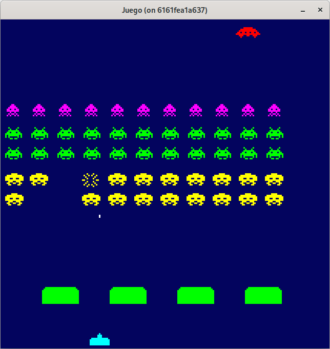

Puede consultar el código de este paso en la rama [step-05-enemigos_6](https://github.com/programatta/space-invaders/tree/step-05-enemigos_6)

## Disparo de alien.
Para realizar el proceso de disparo de los aliens, vamos a seleccionar de forma aleatoria uno de los que tengamos en el slice de enemigos, y cada poco tiempo hacemos que dispare. Usaremos un acumulador de tiempo, y cuando haga la acción de disparo se reseta ese tiempo.

Esto nos permite  controlar el disparo, y que sea mas jugable.

La entidad **Alien** tendrá un método **Fire**, que ubicará la posición del proyectil y que solicitará a **Game** que lo cree, de forma similar a como lo hace el cañon, llamando a **OnCreateAlienBullet**.

Los proyectiles, hasta ahora sólo van de abajo hacia arriba. Ahora con la capacidad de los enemigos de disparar, debemos de indicar a la hora de crear la instanica **bullet** la dirección a la que se va a mover y el color. 

Esto nos lleva a una pequeña refactorización de la entidad **Bullet** y pequeños cambios en **Game** y **Cannon**:

### bullet.go
~~~go
type Bullet struct {
  ...
  dirY       float32
  colorRed   float32
  colorGreen float32
  colorBlue  float32
  colorAlpha float32
}

func NewBullet(posX, posY float32, sprite Sprite, color color.Color, dirY float32) *Bullet {
  red, green, blue, alpha := color.RGBA()
  colorRed := float32(red)
  colorGreen := float32(green)
  colorBlue := float32(blue)
  colorAlpha := float32(alpha)
  return &Bullet{
    sprite:     sprite,
    posX:       posX,
    posY:       posY,
    dirY:       dirY,
    colorRed:   colorRed,
    colorGreen: colorGreen,
    colorBlue:  colorBlue,
    colorAlpha: colorAlpha,
  }
}

func (b *Bullet) Update() {
  b.posY += b.dirY

  if b.posY-float32(b.sprite.Image.Bounds().Dy()) < 0 || b.posY > float32(DesignHeight) {
    b.remove = true
  }
}

func (b *Bullet) Draw(screen *ebiten.Image){
  opBullet := &ebiten.DrawImageOptions{}
  opBullet.GeoM.Translate(float64(b.posX), float64(b.posY))
  opBullet.ColorScale.Scale(b.colorRed, b.colorGreen, b.colorBlue, b.colorAlpha)
  screen.DrawImage(b.sprite.Image, opBullet)
}
~~~

### Cannon.go
Al realizar el disparo, llamamos a **OnCreateCannonBullet** pasandole el color del cañon, así el proyectil también tiene el color de este.

~~~go
func (c *Cannon) ProcessKeyEvents() {
  ...
  if c.canFired && ebiten.IsKeyPressed(ebiten.KeySpace) {
    c.canFired = false
    c.notify.OnCreateCannonBullet(c.posX+6, c.posY, c.sprite.Color)
  }
}
~~~

### game.go
~~~go
type Notifier interface {
 ...
 OnCreateCannonBullet(posX, posY float32, color color.Color)
 OnCreateAlienBullet(posX, posY float32, color color.Color)
}

type Game struct {
  ...
  alienFireTime     float32
}

func (g *Game) Update() error {
  ...
  g.alienFireTime += dt
  if g.alienFireTime > 0.400 {
    if len(g.enemies) > 0 {
      pos := rand.Intn(len(g.enemies))
      g.enemies[pos].Fire()
    }
    g.alienFireTime = 0
  }
...
}

func (g *Game) OnCreateCannonBullet(posX, posY float32, color color.Color) {
  spriteBullet, _ := g.spriteCreator.SpriteByName("bullet")
  bullet := NewBullet(posX, posY, spriteBullet, color, -1)
  g.bullets = append(g.bullets, bullet)
}

func (g *Game) OnCreateAlienBullet(posX, posY float32, color color.Color) {
  bulletSprite, _ := g.spriteCreator.SpriteByName("bullet")
  bullet := NewBullet(posX, posY, bulletSprite, color, 1)
  g.bullets = append(g.bullets, bullet)
}
...
~~~

### alien.go
La función de disparo va a centrar el proyectil según el sprite correspondiente a cada alien, además va a tomar de forma aleatoria un desplazamiento del proyectil, un pixel a la derecha, en el mismo centro o un pixel a la izquierda.

Finalmente llama al método **OnCreateAlienBullet** de **Game** para que cree el proyectil en la posición y color indicados.

~~~go
func (a *Alien) Fire() {
  difX := 0
  dado := rand.IntN(3)
  if dado == 0 {
    difX = -1
  }
  if dado == 2 {
    difX = 1
  }

  bulletX := a.posX + float32(a.sprites[a.currentSprite].Image.Bounds().Dx()/2+difX)
  bulletY := a.posY + float32(a.sprites[a.currentSprite].Image.Bounds().Dy())
  a.notifier.OnCreateAlienBullet(bulletX, bulletY, a.sprites[a.currentSprite].Color)
}
~~~

Con esta funcionalidad, los aliens tienen capacidad de disparo, pero se destruyen entre ellos, y no destruyen al cañon. 

Puede consultar el código de este paso en la rama [step-05-enemigos_7](https://github.com/programatta/space-invaders/tree/step-05-enemigos_7)

Vamos a ver a continuación las colisiones de los proyectiles lanzados por los aliens.

## Colisión del proyectil con los bunkers.
Las colisiones con los bunkers de los proyectiles de los aliens hacen menos daño que el proyectil lanzado por el cañon.

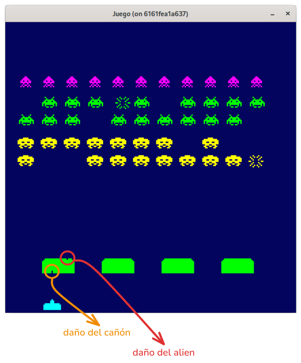

Para solucionar este problema, pasamos la dirección del proyectil para que elimine la parte del proyectil que impacta con el bunker.

~~~go
func (b *Bunker) DoDamage(damageX, damageY float32, dir int) bool {
  damage := false
  logX := int((damageX - b.posX))
  logY := int((damageY - b.posY))

  if 0 <= logY && logY < b.sprite.Image.Bounds().Dy() {
    if b.sprite.Data[logY][logX] != 0 {
      b.sprite.Data[logY][logX] = 0
      if dir > 0 {
        if logY+1 < b.sprite.Image.Bounds().Dy()-1 {
          b.sprite.Data[logY+1][logX] = 0
        }
      } else {
        if logY-1 >= 0 {
          b.sprite.Data[logY-1][logX] = 0
        }
      }
      b.sprite.Image = SpriteFromArray(b.sprite.Data, 1, color.RGBA{0, 255, 0, 255})
      damage = true
    }
  }
  return damage
}
~~~

## Colisión del proyectil con el cañón.
Para establecer la colision entre **Bullet** y **Cannon**, **Cannon** debe implementar la interfaz **Collider**.

Una vez se produzca la colision, el cañón debe desaparecer para mostrar la animación de la explosion gestionada por **ExplosionCannon**, y una vez finalice, **ExplosionCannon** deberá notificar a **Game** para restaurar **Cannon**.

Para esto usaremos de nuevo la interfaz **Notifier** e implementará el método **OnResetCannon**. 

### cannon.go
El cañón al recibir la llamada por colision en **OnCollide**, desactiva el cañón a través de la variable booleana **active**, y que se reestablecerá cuando **Game** llame al método **Reset**.

~~~go
type Cannon struct {
  ...
  active bool
}

func NewCannon(posX, posY float32, sprite Sprite, notify Notifier) *Cannon {
  return &Cannon{
    sprite:   sprite,
    posX:     posX,
    posY:     posY,
    notify:   notify,
    canFired: true,
    active:   true,
  }
}

func (c *Cannon) ProcessKeyEvents() {
  c.dirX = 0
  if c.active {
    if ebiten.IsKeyPressed(ebiten.KeyArrowRight) {
      c.dirX = 1
    } else if ebiten.IsKeyPressed(ebiten.KeyArrowLeft) {
      c.dirX = -1
    }

    if c.canFired && ebiten.IsKeyPressed(ebiten.KeySpace) {
      c.canFired = false
      c.notify.OnCreateCannonBullet(c.posX+6, c.posY, c.sprite.Color)
    }
  }
}

func (c *Cannon) Update() error {
  if c.active {
    if !c.canFired {
      c.time += dt
      if c.time >= 0.35 {
        c.canFired = true
        c.time = 0
      }
    }

    c.posX += c.dirX
    if c.posX <= 0 {
      c.posX = 0
    } else if c.posX+float32(c.sprite.Image.Bounds().Dx()) >= float32(DesignWidth) {
      c.posX = float32(DesignWidth) - float32(c.sprite.Image.Bounds().Dx())
    }
  }
  return nil
}

func (c *Cannon) Draw(screen *ebiten.Image) {
  if c.active {
    opCannon := &ebiten.DrawImageOptions{}
    opCannon.GeoM.Translate(float64(c.posX), float64(c.posY))
    screen.DrawImage(c.sprite.Image, opCannon)
  }
}

// Implementación de la interface Collider.
func (c *Cannon) Rect() (float32, float32, float32, float32) {
  width := float32(c.sprite.Image.Bounds().Dx())
  height := float32(c.sprite.Image.Bounds().Dy())
  return c.posX, c.posY, width, height
}

func (c *Cannon) OnCollide() {
  c.active = false
}

func (c *Cannon) Reset() {
  c.active = true
}
~~~

### explosion_cannon.go
~~~go
type ExplosionCannon struct {
  sprites       []Sprite
  currentSprite uint8
  posX          float32
  posY          float32
  time          float32
  repeatCount   uint8
  remove        bool
}

func NewExplosionCannon(posX, posY float32, sprite1, sprite2 Sprite) *ExplosionCannon {
  sprites := []Sprite{sprite1, sprite2}
  return &ExplosionCannon{sprites: sprites, currentSprite: 0, posX: posX, posY: posY, time: 0, repeatCount: 8, remove: false}
}

func (ec *ExplosionCannon) CanRemove() bool {
  return ec.remove
}

func (ec *ExplosionCannon) Update() {
  if ec.repeatCount > 0 {
    ec.time += dt
    if ec.time >= 0.35 {
      ec.currentSprite = (ec.currentSprite + 1) % 2
      ec.time = 0
      ec.repeatCount--
    }

    if ec.repeatCount == 0 {
      ec.remove = true
    }
  }
}

func (ec *ExplosionCannon) Draw(screen *ebiten.Image) {
  opExplosionCannon := &ebiten.DrawImageOptions{}
  opExplosionCannon.GeoM.Translate(float64(ec.posX), float64(ec.posY))
  screen.DrawImage(ec.sprites[ec.currentSprite].Image, opExplosionCannon)
}
~~~

### game.go
Aplicamos los cambios indicados en **Game**, teniendo en cuenta la dirección del proyectil a la hora de establecer las colisiones, para evitar que los aliens se destruyan entre ellos y cuando colisione el proyectir del alien con el cañón, desactivar el cañon y pintar la animación de la explosion.

~~~go
type Notifier interface {
  ...
  OnResetCannon()
}

func (g *Game) Update() error {
  ...
  //Colisiones.
  for _, bullet := range g.bullets {
    if bullet.dirY < 0 {
      //Bala de cañon
      for _, bunker := range g.bunkers {
        if g.checkCollision(bullet, bunker) {
          if bunker.DoDamage(bullet.posX, bullet.posY, -1) {
            bullet.OnCollide()
          }
        }
      }
      for _, enemy := range g.enemies {
        if g.checkCollision(bullet, enemy) {
          bullet.OnCollide()
          enemy.OnCollide()

          alienExplosionSprite, _ := g.spriteCreator.SpriteByName("alienExplosion")
          enemyX, enemyY := enemy.Position()
          explosion := NewExplosion(enemyX, enemyY, alienExplosionSprite, enemy.Color())
          g.explosions = append(g.explosions, explosion)
        }
      }
      if g.checkCollision(bullet, g.ufo) {
        bullet.OnCollide()
        g.ufo.OnCollide()

        ufoExplosionSprite, _ := g.spriteCreator.SpriteByName("ufoExplosion")
        ufoX, ufoY := g.ufo.Position()
        explosionUfo := NewExplosionUfo(ufoX, ufoY, ufoExplosionSprite, g)
        g.explosions = append(g.explosions, explosionUfo)
      }
    } else {
      //Bala de alien.
      for _, bunker := range g.bunkers {
        if g.checkCollision(bullet, bunker) {
          if bunker.DoDamage(bullet.posX, bullet.posY, 1) {
            bullet.OnCollide()
          }
        }
      }
      if g.checkCollision(bullet, g.cannon) {
        cannonExplosion1Sprite, _ := g.spriteCreator.SpriteByName("cannonExplosion1")
        cannonExplosion2Sprite, _ := g.spriteCreator.SpriteByName("cannonExplosion2")
        explosionCannon := NewExplosionCannon(g.cannon.posX, g.cannon.posY, cannonExplosion1Sprite, cannonExplosion2Sprite, g)
        g.explosions = append(g.explosions, explosionCannon)
        g.cannon.OnCollide()
        bullet.OnCollide()
      }
    }
  }
}

func (g *Game) OnResetCannon() {
  g.cannon.Reset()
}
~~~

Con esta funcionalidad, los aliens pueden destruir al cañón y hacer daños en los bunkers. 

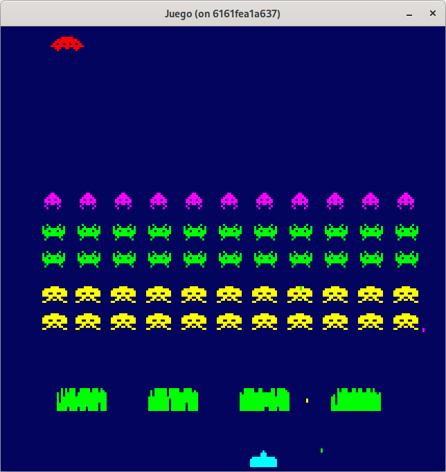

Puede consultar el código de este paso en la rama [step-05-enemigos_8](https://github.com/programatta/space-invaders/tree/step-05-enemigos_8)

## Colisión de un alien con un bunker.
En este caso, cuando un alien colisione con un bunker, vamos a marcar el bunker como borrable.

### game.go
~~~go
func (g *Game) Update() error {
  ...
  //Colisines alien con bunker.
  for _, enemy := range g.enemies {
    for _, bunker := range g.bunkers {
      if g.checkCollision(enemy, bunker) {
        bunker.OnCollide()
        break
      }
    }
  }
  ...
  if len(g.bunkers) > 0 {
    g.bunkers = slices.DeleteFunc(g.bunkers, func(bunker *Bunker) bool {
      return bunker.CanRemove()
    })
  }
  ...
}
~~~

### bunker.go
~~~go
type Bunker struct {
  sprite Sprite
  posX   float32
  posY   float32
  remove bool
}

func NewBunker(posX, posY float32, sprite Sprite) *Bunker {
  spriteDataBunker := make([][]int, len(sprite.Data))
  for i := range sprite.Data {
    spriteDataBunker[i] = make([]int, len(sprite.Data[i]))
    copy(spriteDataBunker[i], sprite.Data[i])
  }

  sprite.Data = spriteDataBunker
  return &Bunker{
    sprite: sprite,
    posX:   posX,
    posY:   posY,
    remove: false,
  }
}

func (b *Bunker) OnCollide() {
  b.remove = true
}

func (b *Bunker) CanRemove() bool {
  return b.remove
}
~~~

Con esta funcionalidad, los aliens pueden destruir los bunkers cuando colisionan con ellos. 

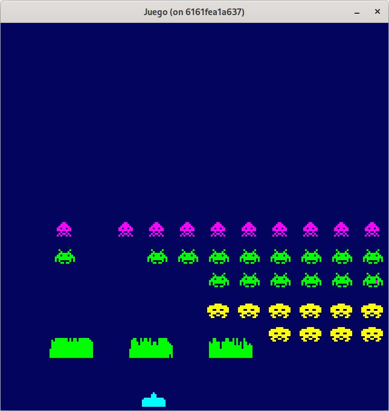

Puede consultar el código de este paso en la rama [step-05-enemigos_9](https://github.com/programatta/space-invaders/tree/step-05-enemigos_9)
