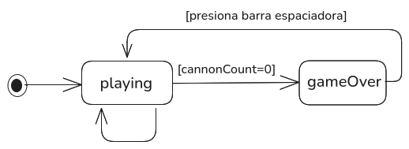
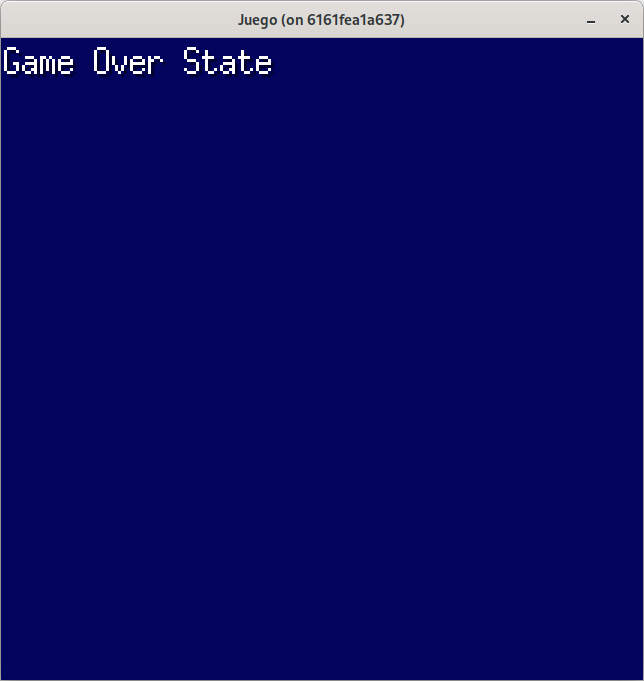

# Paso 6: Casos de victoria y derrota.
Ya disponemos de una versión en la que los aliens disparan y producen daños en los bunkers, y se van desplazando hacia abajo. En caso de colisión con los bunkers, estos son destruidos (desaparecen), el cañón dispara y produce daños en los bunkers y elimina aliens.

De lo que no disponemos es que ocurre si eliminamos a todos los aliens o que ocurre si los aliens destruyen nuestro cañón.

Para ello, vamos a establecer la funcionalidad de victoria y derrota. Una victoria será cuando eliminemos todos los aliens, esto nos va a permitir restablecer el juego. Una derrota será cuando los aliens eliminen un cierto número de veces al cañón (pongamos **3**, que es el valor clásico de estos juegos).

## Victoria.
Para determinar el caso de una victoria, que posteriormente nos va a llevar a un paso de nivel incrementando su dificultad, nos vamos a fijar en la cantidad de elementos que tiene el slice de enemigos. Cuando el slice tenga una longitud de **0**, habremos ganado.

Ya disponemos de una funcionalidad que elimina aliens del **slice** de enemigos al detectarse una colisión con el proyectil del cañon:

~~~go
func (g *Game)Update(){
  ...
  if len(g.enemies) > 0 {
    g.enemies = slices.DeleteFunc(g.enemies, func(alien *Alien) bool {
      return alien.CanRemove()
    })
  }
  ...
}
~~~

En el caso de que ya no dispongamos de enemigos, vamos a restablecer el juego, es decir, que se vuelvan a generar los enemigos y su operativa asociada, se reparen los bunkers, se limpien los slices de proyectiles y explosiones y finalmente situar el cañón a la posición inicial. 

Para realizar esto hacemos unos pequeños cambios en **cannon.go** y **game.go**:

### cannon.go.
Añadimos un campo, que mantendrá la posición original de cuando se creó el cañón, y la llamamos **originalPosX**. Esta propiedad tendrá el valor asignado a **posX** en la función constructora **NewCannon** y restablecerá el valor de **posX** en el método **Reset**.

~~~go
type Cannon struct {
  sprite       Sprite
  posX         float32
  posY         float32
  originalPosX float32
  dirX         float32
  notify       Notifier
  canFired     bool
  time         float32
  active       bool
}

func NewCannon(posX, posY float32, sprite Sprite, notify Notifier) *Cannon {
  return &Cannon{
    sprite:       sprite,
    posX:         posX,
    posY:         posY,
    originalPosX: posX,
    notify:       notify,
    canFired:     true,
    active:       true,
  }
}

func (c *Cannon) Reset() {
  c.active = true
  c.posX = c.originalPosX
}
~~~

### game.go.
Cuando no tengamos enemigos en el slice, establecemos la funcionalidad indicada anteriormente en un método llamado **reset** y restablecemos el estado del cañón ya que hemos modificado el método para ello.

Para realizar esta opretiva, vamos a crear una función para reutilizar la creación del slice de **Bunker** llamada **createBunkers** que será usada en la función constructora **NewGame** como en la nueva función **reset**.

~~~go
func NewGame() *Game {
  spriteCreator := NewSpriteCreator()

  game := &Game{}
  game.spriteCreator = spriteCreator

  spriteCannon, _ := spriteCreator.SpriteByName("cannon")
  game.cannon = NewCannon(float32(0), float32(DesignHeight-10), spriteCannon, game)

  bunkers := createBunkers(spriteCreator)
  game.bunkers = bunkers

  ufoSprite, _ := spriteCreator.SpriteByName("ufo")
  ufo := NewUfo(-20, 5, ufoSprite)
  game.ufo = ufo

  enemies := createEnemies(spriteCreator, game)
  game.enemies = enemies
  game.enemiesCurrentDir = 1
  game.newDirection = 1
  return game
}

func (g *Game) Update() error {
  ...
  if len(g.enemies) > 0 {
    g.enemies = slices.DeleteFunc(g.enemies, func(alien *Alien) bool {
      return alien.CanRemove()
    })
  } else {
    g.reset()
    g.cannon.Reset()
  }
  ...
}

func (g *Game) reset() {
  bunkers := createBunkers(g.spriteCreator)
  enemies := createEnemies(g.spriteCreator, g)

  g.enemies = enemies
  g.bullets = []*Bullet{}
  g.bunkers = bunkers
  g.explosions = []Explosioner{}
  g.enemiesCurrentDir = 1
  g.newDirection = 1
  g.alienFireTime = 0
}

func createBunkers(spriteCreator *SpriteCreator) []*Bunker {
  bunkerSprite, _ := spriteCreator.SpriteByName("bunker")

  var posX float32 = 27
  bunkers := []*Bunker{}
  for range 4 {
    bunker := NewBunker(posX, float32(DesignHeight-40), bunkerSprite)
    bunkers = append(bunkers, bunker)
    posX += float32(bunkerSprite.Image.Bounds().Dx()) + 20
  }
  return bunkers
}
~~~

Con esta funcionalidad, al eliminar todos los enemigos, se restaurará el juego, de momento sin incremento de dificultad, que se verá posteriormente.

Puede consultar el código de este paso en la rama [step-06-victoria_derrota_1](https://github.com/programatta/space-invaders/tree/step-06-victoria_derrota_1)

## Derrota.
Para establecer la derrota, como hemos comentado anteriormente, vamos a establecer un contador de cañones **cannonCount** que lo inicializaremos al valor de **3**, y por cada colisión con un proyectil de un alien, se irá decrementando, hasta llegar a **0**.

En este caso, procedemos a reutilizar la funcionalidad de victoria, pero además estableciendo el valor de **cannonCount** a **3**. Más adelante estableceremos estados de juego.

~~~go
type Game struct {
  spriteCreator     *SpriteCreator
  cannon            *Cannon
  cannonCount       uint8
  bullets           []*Bullet
  bunkers           []*Bunker
  ufo               *Ufo
  enemies           []*Alien
  enemiesCurrentDir float32
  newDirection      float32
  explosions        []Explosioner
  alienFireTime     float32
}

func NewGame() *Game {
  spriteCreator := NewSpriteCreator()

  game := &Game{}
  game.spriteCreator = spriteCreator

  spriteCannon, _ := spriteCreator.SpriteByName("cannon")
  game.cannon = NewCannon(float32(0), float32(DesignHeight-10), spriteCannon, game)

  bunkers := createBunkers(spriteCreator)
  game.bunkers = bunkers

  ufoSprite, _ := spriteCreator.SpriteByName("ufo")
  ufo := NewUfo(-20, 5, ufoSprite)
  game.ufo = ufo

  enemies := createEnemies(spriteCreator, game)
  game.enemies = enemies
  game.enemiesCurrentDir = 1
  game.newDirection = 1
  game.cannonCount = 3
  return game
}

func (g *Game) Update() error {
  ...
  //Colisiones.
  for _, bullet := range g.bullets {
    if bullet.dirY < 0 {
      //Bala de cañon
      ...
    } else {
      //Bala de alien.
      for _, bunker := range g.bunkers {
        if g.checkCollision(bullet, bunker) {
          if bunker.DoDamage(bullet.posX, bullet.posY, 1) {
            bullet.OnCollide()
          }
        }
      }
      if g.checkCollision(bullet, g.cannon) {
        cannonExplosion1Sprite, _ := g.spriteCreator.SpriteByName("cannonExplosion1")
        cannonExplosion2Sprite, _ := g.spriteCreator.SpriteByName("cannonExplosion2")
        explosionCannon := NewExplosionCannon(g.cannon.posX, g.cannon.posY, cannonExplosion1Sprite, cannonExplosion2Sprite, g)
        g.explosions = append(g.explosions, explosionCannon)
        if g.cannonCount > 0 {
          g.cannonCount--
          g.cannon.OnCollide()
        }
        bullet.OnCollide()
      }      
    }
  }
  ...
}
~~~

Con esta funcionalidad, al perder los tres cañones, se restaurará el juego. Como hemos indicado, esto nos da paso a estados, como puede ser **playing** y **gameOver** que veremos a continuación.

Puede consultar el código de este paso en la rama [step-06-victoria_derrota_2](https://github.com/programatta/space-invaders/tree/step-06-victoria_derrota_2)

## Estados _playing_ y _gameOver_.
Actualmente, el juego no distingue entre estado **jugando (playing)** o **juego finalizado (gameOver)**.

En este apartado procedemos a añadir esta funcionalidad.
Creamos dos estados a través de un **enumerado**, para indicar estos valores, para ello, creamos un tipo llamado **playInnerStateId** y los posibles valores: 
* **playing**: que manejará la funcionalidad actual (con algunos cambios)
* **gameOver**: que manejará la nueva funcionalidad de fin de juego

### play_innerstate.go
~~~go
package internal

type playInnerStateId int

const (
  playing playInnerStateId = iota
  gameOver
)
~~~

Para usar este nuevo tipo de dato, nos basamos en la siguiente imagen, que muestra los estados en el que se va a encontrar el juego.

Realizamos una serie de cambios en **Game** para llevar a cabo esta implementación.

### game.go
Vamos a separar la funcionalidad en operaciones de **juegando (playing)** y en operaciones de **juego acabado (gameOver)**:
* _update()_ la dividimos en:
  Para eventos:
  * _processKeyEventPlaying()_ para eventos únicamente para juego.
  * _processKeyEventGameOver()_ para eventos únicamente para game over.
  
  Para lógica:
  * _updatePlaying()_ para actualización de la lógica del juego (lo que tenemos actualmente en Update).

* draw(screen *ebiten.Image) la dividimos en:
  * _drawPlaying(screen)_ para el renderizado del juego (lo que tenemos actualmente en Draw).
  * _drawGameOver(screen)_ para el renderizado del game over.

El cambio de estado lo vamos a realizar en la verificación del número de cañones disponibles. Si es **0** cambiamos a **gameOver**. 

Como aun no hemos cargado ninguna fuente, usamos la función `ebitenutil.DebugPrint(screen *ebiten.Image, str string)` para poder mostrar el estado en el que nos encontramos.  

Una vez en el estado de **gameOver**, al liberar la tecla (una única vez como se explicó anteriormente) barra espaciadora, cambiamos a **playing**.

~~~go
type Game struct {
  spriteCreator     *SpriteCreator
  cannon            *Cannon
  cannonCount       uint8
  bullets           []*Bullet
  bunkers           []*Bunker
  ufo               *Ufo
  enemies           []*Alien
  enemiesCurrentDir float32
  newDirection      float32
  explosions        []Explosioner
  alienFireTime     float32
  innerStateId      playInnerStateId
}

func NewGame() *Game {
  spriteCreator := NewSpriteCreator()

  game := &Game{}
  game.spriteCreator = spriteCreator

  spriteCannon, _ := spriteCreator.SpriteByName("cannon")
  game.cannon = NewCannon(float32(0), float32(DesignHeight-10), spriteCannon, game)

  bunkers := createBunkers(spriteCreator)
  game.bunkers = bunkers

  ufoSprite, _ := spriteCreator.SpriteByName("ufo")
  ufo := NewUfo(-20, 5, ufoSprite)
  game.ufo = ufo

  enemies := createEnemies(spriteCreator, game)
  game.enemies = enemies
  game.enemiesCurrentDir = 1
  game.newDirection = 1
  game.cannonCount = 3
  game.innerStateId = playing
  return game
}

func (g *Game) Update() error {
  switch g.innerStateId {
    case playing:
      g.processKeyEventPlaying()
      g.updatePlaying()
    case gameOver:
      g.processKeyEventGameOver()
  }
  return nil
}

func (g *Game) Draw(screen *ebiten.Image) {
  screen.Fill(color.RGBA{0x03, 0x04, 0x5e, 0xFF})

  switch g.innerStateId {
    case playing:
      g.drawPlaying(screen)
    case gameOver:
      g.drawGameOver(screen)
  }
}

// -----------------------------------------------------------------------------
// Sección de procesamiento de eventos por estado.
// -----------------------------------------------------------------------------

func (g *Game) processKeyEventPlaying() {
  g.cannon.ProcessKeyEvents()
}

func (g *Game) processKeyEventGameOver() {
  if inpututil.IsKeyJustReleased(ebiten.KeySpace) {
    // restablecer el juego.
    g.reset()
    g.cannon.Reset()
    g.cannonCount = 3
    g.innerStateId = playing
  }
}

func (g *Game) OnResetCannon() {
  if g.cannonCount == 0 {
    g.innerStateId = gameOver
  }
  g.cannon.Reset()
}

// -----------------------------------------------------------------------------
// Sección de actualización por estado.
// -----------------------------------------------------------------------------

func (g *Game) updatePlaying() {
  ...
}

// -----------------------------------------------------------------------------
// Sección de dibujo de pantalla por estado.
// -----------------------------------------------------------------------------

func (g *Game) drawPlaying(screen *ebiten.Image) {
  ...
}

func (g *Game) drawGameOver(screen *ebiten.Image) {
  ebitenutil.DebugPrint(screen, "Game Over State")
}
~~~

Con los cambios realizados, ya disponemos de funcionalidad independiente para:
* un control de eventos en **playing** y **gameOver** 
* actualización de la lógica en **playing**
* renderizado de pantalla en **playing** y **gameOver** 

Puede consultar el código de este paso en la rama [step-06-victoria_derrota_3](https://github.com/programatta/space-invaders/tree/step-06-victoria_derrota_3).
