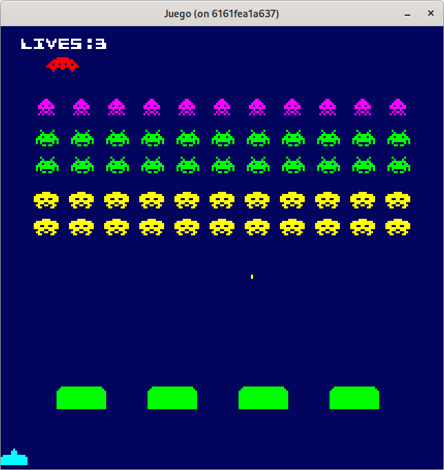
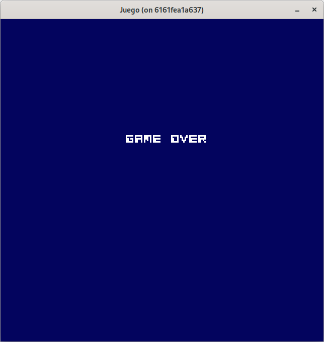
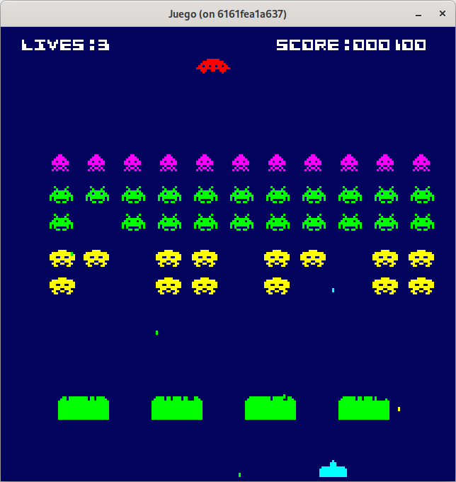
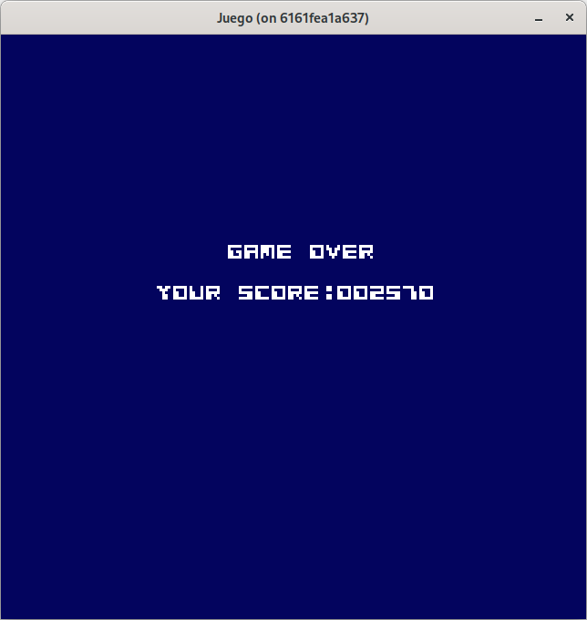

# Paso 7: Uso de assets empotrados - fuentes y sonidos.
En este paso aprenderás:
- Cómo reorganizar el paquete internal en submódulos reutilizables.
- Cómo empotrar y utilizar fuentes para mostrar texto en pantalla.
- Cómo empotrar y reproducir sonidos sincronizados con eventos del juego

Hasta este momento, tenemos el juego con colisiones, explosiones y perdida de cañones. Pero no tenemos información sobre la puntuación y los cañones disponibles.

> 🔔 En este paso vamos a realizar una refactorización del paquete **internal** dándole una nueva estructura de paquetes que nos permitirán futuras expansiones y mantener una coherencia.

Para representar esta información vamos a hacer uso de las fuentes. Y para poder usarlas en el juego vamos a empotrarlas en el propio binario que se genere. De esta forma, evitamos procesos de instalación ya que iría todo incluido en el mismo binario lo que lo hace completamente autosuficiente. 

A tener en cuenta:
 * el proceso de distribución del binario es sencillo, simplemente se descarga por el usuario final.
 * el peso del binario aumenta. Si se van a añadir recursos enormes (imágenes de altísima definición o vídeos) es mejor no realizar esta práctica.

## Golang y recursos empotrados.
> 🔔 Golang y recursos empotrados.
>
> Golang desde la versión 1.16, suministra el uso de la directiva **//go:embed** que permite empotrar ficheros estáticos directamente en el  binario.
> 
> El uso de **//go:embed** no permite rutas que salgan del módulo, es decir no se puede usar **..** para subir de nivel.

Para empotrar un fichero dentro del binario debemos importar **embed** y usamos la directiva o comentario especial **//go:embed** y la ruta a este. A continuación en la linea siguiente la variable que va a contener los datos del fichero.

Se debe de especificar a nivel de fichero, es decir, no puede estar dentro de funciones o métodos. Se trata a nivel global.

~~~go
import _ "embed"

//go:embed ruta/a/fuente
var fontData []byte
~~~

Para poder usar **//go:embed** el fichero que lo utilice tiene que estar en el mismo nivel que el fichero a empotrar o en un nivel superior.

Para aplicar esto, vamos a refactorizar el contenido que tenemos en **internal** para dejar todo bien estructurado y agrupando conceptos y funcionalidad en paquetes.

Podemos presentar la siguiente estructura:
* **assets**: contendrá los assets que vamos a usar. Se puede ir extendiendo en en subcarpetas como por ejemplo, fuentes (para manejar ficheros .ttf) y sonidos (para manejar ficheros wav) junto con los ficheros **go** que se van a encargar de referenciar los assets para empotrarlos en el binario.
* **sprite**: la funcionalidad que tenemos desarrollada en **sprite.go** y **sprite_creator.go**.
* **enemy**: la funcionalidad que tenemos desarrollada en **alien.go** y **ufo.go**.
* **explosion**: la funcionalida que tenemos desarrollada en **explosion_alien.go**,- **explosion_cannon.go** y **explosion_ufo.go**.
* **player**: la funcionalidad que tenemos desarrollada en **cannon.go** y **bunker.go**.

El resto de ficheros van a quedar en **internal** como hasta ahora, como se muestra a continuación:

~~~shell
internal/
├── assets/
│   ├── fonts/
│   │   └── ...
│   └── sounds/
│       └── ...
├── sprite/
│   ├── sprite.go
│   └── sprite_creator.go
├── enemy/
│   ├── alien.go
│   └── ufo.go
├── explosion/
│   ├── explosion_alien.go
│   ├── explosion_cannon.go
│   └── explosion_ufo.go
├── player/
│   ├── cannon.go
│   └── bunker.go
├── bullet.go
├── game.go
├── play_innerstate.go
└── util.go
~~~

Al igual que se hizo cuando se creó el paquete **internal** y se movieron todos los ficheros existentes en ese momento dicho paquete, se tuvo que renombrar el paquete de cada fichero movido a **package internal**. Ahora hay que hacer lo mismo. Por ejemplo, en **sprite.go**, será de **package internal** a **package sprite** y en **sprite_creator.go** exactamente lo mismo.

En esta profunda refactorización, nos vamos a encontrar con problemas de importaciones cíclicas, que se van a producir, al intentar usar componentes superiores (por ejemplo **Notifier**, que se encuentra en **internal/game.go**) por componentes inferiores (por ejemplo **Alien**, que se encuentra en **internal/enemy/alien.go**). Esto ocurre debido a que **Game** hace referencia a **Alien** y **Alien** quiere usar un componente definido en **game.go**. Lo mismo ocurre con la llamada a **SpriteFromArray** de **internal/util.go**.

Para solventar esto, creamos los paquetes **internal/utils** e **internal/common** que van a contener **util.go** y **common.go** respectivamente. En **common.go** vamos colocando los elementos que nos vayan dando referencias cíclicas.

También muchos de los componentes hacen uso de las constantes definidas en **game.go**, lo que lleva a referencias cíclicas, por lo que vamos a sacar las constantes en un fichero de configuración que lo ubicamos en el paquete **internal/config** y el fichero es **config.go**.

~~~go
package config

const Dt float32 = float32(1.0 / 60)

const WindowWidth int = 642
const WindowHeight int = 642
const DesignWidth int = WindowWidth / 3
const DesignHeight int = WindowHeight / 3
~~~

Aquí podemos ver que hemos cambiado **dt** a **Dt**. Esto es porque **dt** al estar en minúscula es privada en el paquete. Ahora, al ser movido al paquete **config**, solo se verá en ese paquete, y no puede ser usada en el resto. Para exponerla, ponemos la primera letra en mayúscula, haciéndola pública al resto de paquetes.

Finalmente con la refactorización realizada, nos queda la estructura del paquete **internal** de la siguiente forma:

~~~shell
internal/
├── assets/
│   ├── fonts/
│   │   └── ...
│   └── sounds/
│       └── ...
├── common/
│   └── common.go
├── config/
│   └── config.go
├── sprite/
│   ├── sprite.go
│   └── sprite_creator.go
├── enemy/
│   ├── alien.go
│   └── ufo.go
├── explosion/
│   ├── explosion_alien.go
│   ├── explosion_cannon.go
│   └── explosion_ufo.go
├── player/
│   ├── cannon.go
│   └── bunker.go
├── utils/
│   └── util.go
├── bullet.go
├── game.go
└── play_innerstate.go
~~~

Ha sido una refactorización bastante grande y con muchos cambios, por favor, consulta el código de este paso en la rama [step-07-uso_assets_empotrados_1](https://github.com/programatta/space-invaders/tree/step-07-uso_assets_empotrados_1).

## Uso de fuentes.
Para hacer uso de las fuentes, vamos a crear en **assets** el paquete **fonts** y en el vamos a colocar el fichero **cosmicalien.ttf** (ver el apartado de recuros para descarga y licencia). También creamos el fichero **fonts.go** que se va a encargar de gestionar el recurso empotrado una vez compilado.

~~~go
package fonts

import _ "embed"

//go:embed cosmicalien.ttf
var FontFiles []byte
~~~

Este fichero simplemente hace referencia a **cosmicalien.ttf** y su contenido lo almacena en **FontFiles** (está en mayúscula para poder ser exportado al resto de paquetes).

En el fichero **utils/util.go** procedemos a la carga de la fuente empotrada:

~~~go
func LoadEmbeddedFont(size float64) *text.GoTextFace {
  faceSource, err := text.NewGoTextFaceSource(bytes.NewReader(fonts.FontFiles))
  if err != nil {
    log.Fatal(err)
  }

  return &text.GoTextFace{
    Source: faceSource,
    Size:   size,
  }
}
~~~

Con esta funcionalidad, procesamos el binario de la la fuente cargada en **FontFiles**, a través de la función `text.NewGoTextFaceSource()` y obtenemos la fuente origen, a la cual le asignamos también el tamaño que deseamos a través de la estructura `text.GoTextFace` que es la que se utilizar para poder representar la fuente en pantalla.

Si nos aparece algún tipo de error en la importación de los paquetes de fuente, desde la consola, refrescamos los paquetes:

~~~shell
go mod tidy
~~~

### game.go
Para hacer uso de la fuente en **Game** añadimos un objeto **text.GoTextFace** y en su función constructora, llamaremos a **utils.LoadEmbeddedFont()**.

Como primiera prueba, vamos a mostrar los cañones que tenemos disponibles, y para ello usamos la función **text.Draw()** y al igual que ocurre con las imágenes, los textos también tienen su estructura de opciones **text.DrawOptions{}**.

~~~go
type Game struct {
  ...
  textFace          *text.GoTextFace
  ...
}

func NewGame() *Game {
  ...
  textFace := utils.LoadEmbeddedFont(8)
  ...
  game := &Game{}
  game.textFace = textFace
  ...
  ufoSprite, _ := spriteCreator.SpriteByName("ufo")
  ufo := enemy.NewUfo(-20, 15, ufoSprite)
  game.ufo = ufo
  ...
}

func (g *Game) drawPlaying(screen *ebiten.Image) {
  uiCannonCountText := fmt.Sprintf("LIVES:%1d", g.cannonCount)
  op := &text.DrawOptions{}
  op.GeoM.Translate(10, 6)
  op.ColorScale.ScaleWithColor(color.White)
  text.Draw(screen, uiCannonCountText, g.textFace, op)
  ...
}
~~~

Con esta funcionalidad podemos mostrar la cantidad de cañones que tenemos disponibles en la parte superior izquierda de la pantalla. Usamos la función `fmt.Sprintf()` para formatear el ńumero (el valor de la propiedad **g.cannonCount**) a un **string**. También desplazamos un poco para abajo la nave para no coincidir con el texto.

Hacemos lo mismo para el estado de **gameOver**, eliminado el texto de depuración que usabamos:

~~~go
func (g *Game) drawGameOver(screen *ebiten.Image) {
  uiGameOverText := "GAME OVER"
  gameOverX := float64(config.DesignWidth/2 - 24)
  gameOverY := float64(config.DesignHeight/2 - 30)

  op := &text.DrawOptions{}
  op.GeoM.Translate(gameOverX, gameOverY)
  op.ColorScale.ScaleWithColor(color.White)
  text.Draw(screen, uiGameOverText, g.textFace, op)
}
~~~

Puede consultar el código de este paso en la rama [step-07-uso_assets_empotrados_2](https://github.com/programatta/space-invaders/tree/step-07-uso_assets_empotrados_2).

## Uso de fuentes: puntuación.
Vamos a añadir otro texto en el estado de juego, y va a ser la puntuación que va obteniendo el jugador por cada alien eliminado, esto quiere decir, que cada tipo de alien tendrá un valor. En el juego tradicional, las puntuaciones eran las siguientes:
* **squid**: 30 puntos
* **crab**: 20 puntos
* **octopus**: 10 puntos
* la **nave**: la marcaba como misterio, por lo que podemos tomar un valor aleatorio cada vez, por ejemplo entre 150 y 350 puntos.

Para esta funcionalidad, vamos a modificar la entidad **Alien** para que acepte la puntuación correspondiente a cada tipo de alien, así como un método para devolver la puntucación **Score()** y lo mismo para **Ufo**. Además añadimos un acumulador de puntos en **Game** llamado **score** que usaremos para ir informamdo de los puntos. En las colisiones tanto de enemigos como de nave obtendremos los puntos.

### game.og

~~~go
type Game struct {
  ...
  score             uint32
  ...
}

func NewGame() *Game {
  ...
  game := &Game{}
  ...
  game.score = 0
  ...
}

func (g *Game) processKeyEventGameOver() {
  if inpututil.IsKeyJustReleased(ebiten.KeySpace) {
    // resetear el juego.
    g.reset()
    g.cannon.Reset()
    g.cannonCount = 3
    g.score = 0
    g.innerStateId = playing
  }
}

func (g *Game) updatePlaying() {
  ...
  //Colisiones.
  for _, bullet := range g.bullets {
    if bullet.dirY < 0 {
      //Bala de cañon
      ...
      for _, enemy := range g.enemies {
        if g.checkCollision(bullet, enemy) {
          bullet.OnCollide()
          enemy.OnCollide()

          alienExplosionSprite, _ := g.spriteCreator.SpriteByName("alienExplosion")
          enemyX, enemyY := enemy.Position()
          explosion := explosion.NewExplosion(enemyX, enemyY, alienExplosionSprite, enemy.Color())
          g.explosions = append(g.explosions, explosion)
          g.score += uint32(enemy.Score())
        }
      }
      if g.checkCollision(bullet, g.ufo) {
        bullet.OnCollide()
        g.ufo.OnCollide()

        ufoExplosionSprite, _ := g.spriteCreator.SpriteByName("ufoExplosion")
        ufoX, ufoY := g.ufo.Position()
        explosionUfo := explosion.NewExplosionUfo(ufoX, ufoY, ufoExplosionSprite, g)
        g.explosions = append(g.explosions, explosionUfo)
        g.score += uint32(g.ufo.Score())
      }
    } else {
      ...
    }
  }
  ...
}

func (g *Game) drawPlaying(screen *ebiten.Image) {
  ...
  uiScoreText := fmt.Sprintf("SCORE:%06d", g.score)
  widthText, _ := text.Measure(uiScoreText, g.textFace, 0)
  op = &text.DrawOptions{}
  op.GeoM.Translate(float64(config.DesignWidth)-widthText-10, 6)
  op.ColorScale.ScaleWithColor(color.White)
  text.Draw(screen, uiScoreText, g.textFace, op)
  ...
}

func (g *Game) drawGameOver(screen *ebiten.Image) {
  uiGameOverText := "GAME OVER"
  widthText, _ := text.Measure(uiGameOverText, g.textFace, 0)
  gameOverX := float64(config.DesignWidth/2) - widthText/2
  gameOverY := float64(config.DesignHeight/2 - 30)

  op := &text.DrawOptions{}
  op.GeoM.Translate(gameOverX, gameOverY)
  op.ColorScale.ScaleWithColor(color.White)
  text.Draw(screen, uiGameOverText, g.textFace, op)

  uiYourScoreText := fmt.Sprintf("YOUR SCORE:%06d", g.score)
  widthText, _ = text.Measure(uiYourScoreText, g.textFace, 0)
  yourScoreX := float64(config.DesignWidth/2) - widthText/2
  yourScoreY := float64(config.DesignHeight/2 - 15)

  op = &text.DrawOptions{}
  op.GeoM.Translate(yourScoreX, yourScoreY)
  op.ColorScale.ScaleWithColor(color.White)
  text.Draw(screen, uiYourScoreText, g.textFace, op)
}

func createCrabs(count, rows uint8, initX, initY float32, spriteCreator *sprite.SpriteCreator, notifier common.Notifier) []*enemy.Alien {
  ...
  for i := range count * rows {
    crab := enemy.NewAlien(posX, posY, sprite1, sprite2, 20, notifier)
    ...
  }
  ...
}

func createOctopuses(count, rows uint8, initX, initY float32, spriteCreator *sprite.SpriteCreator, notifier common.Notifier) []*enemy.Alien {
  ...
  for i := range count * rows {
    octopus := enemy.NewAlien(posX, posY, sprite1, sprite2, 10, notifier)
    ...
  }
  ...
}

func createSquids(count, rows uint8, initX, initY float32, spriteCreator *sprite.SpriteCreator, notifier common.Notifier) []*enemy.Alien {
  ...
  for i := range count * rows {
    squid := enemy.NewAlien(posX, posY, sprite1, sprite2, 30, notifier)
    ...
  }
  ...
}
~~~

Para manejar la longitud del texto y realizar las últimas ubicaciones (centrado en la vista del estado **gameOver**, y puntuación en la vista del estado **playing**), usamos la función `text.Measure()` que devuelve el ancho y el alto en pixeles de la cadena que utilizamos para situar los textos en el centro de la pantalla y en la parte izquierda.

### alien.go

~~~go
type Alien struct {
  ...
  score         uint8
  ...
}

func NewAlien(posX, posY float32, sprite1, sprite2 sprite.Sprite, score uint8, notifier common.Notifier) *Alien {
  sprites := []sprite.Sprite{sprite1, sprite2}
  return &Alien{sprites: sprites, posX: posX, posY: posY, score: score, currentSprite: 0, time: 0, notifier: notifier}
}

func (a *Alien) Score() uint8 {
  return a.score
}
~~~

### ufo.go
Cada vez que se llame a la función **Score()**, del slice de puntos se va a elegir una posición aleatoria. 

~~~go
func (u *Ufo) Score() uint16 {
  scores := []uint16{150, 175, 200, 225, 250, 275, 300, 325, 350}
  pos := rand.IntN(len(scores))
  return scores[pos]
}
~~~

Con esta funcionalidad, podemos ofrecer los puntos obtenidos por cada alien o nave eliminada y en caso de pasar al estado de **gameOver** también mostramos los puntos, que posteriormente son restablecidos a 0 cuando empieza de nuevo el juego.

Puede consultar el código de este paso en la rama [step-07-uso_assets_empotrados_3](https://github.com/programatta/space-invaders/tree/step-07-uso_assets_empotrados_3).

## Uso de sonidos.
Vamos a añadir sonidos al juego, y para ello seguimos los mismos pasos que con la fuente. En la carpeta **assets** creamos otra que llamaremos **sounds** y ahí colocamos los ficheros de sonido **cannonexplosion.wav**, **invaderkiller.wav**, **shoot.wav**, **ufo_highpich.wav** y el fichero **sounds.go** que se va a encargar de empotrar y exponer los sonidos.

~~~go
package sounds

import _ "embed"

//go:embed shoot.wav
var ShootWav []byte

//go:embed invaderkilled.wav
var InvaderKilledWav []byte

//go:embed cannonexplosion.wav
var CannonExplosionWav []byte

//go:embed ufo_highpitch.wav
var UfoHighpitchWav []byte
~~~

Al igual que hicimos con los sprites, creando **SpriteCreator** para dar a **Game** cada uno de los sprites, vamos a crear una entidad **SoundEffects** que se encargará de acceder a los sonidos y permitir a **Game** hacer uso de ellos cuando corresponda a través de los métodos que definamos para la reproducción de los sonidos.

Comenzamos con el disparo del cañon y el resto de sonidos será similar. Creamos la carpeta **internal/sounds** y en ella creamos el archivo **sound_effects.go**. 

~~~go
package sounds

import (
  "bytes"

  "github.com/hajimehoshi/ebiten/v2/audio"
  "github.com/hajimehoshi/ebiten/v2/audio/wav"
  "github.com/programatta/spaceinvaders/internal/assets/sounds"
)

type SoundEffects struct {
  shootPlayer *audio.Player
}

func NewSoundEffects() *SoundEffects {
  soundEffects := &SoundEffects{}

  const sampleRate = 44100
  audioContext := audio.NewContext(sampleRate)

  wavStream, decodeErr := wav.DecodeWithSampleRate(audioContext.SampleRate(), bytes.NewReader(sounds.ShootWav))
  if decodeErr != nil {
    panic(decodeErr)
  }

  player, playerErr := audioContext.NewPlayer(wavStream)
  if playerErr != nil {
    panic(playerErr)
  }

  soundEffects.shootPlayer = player
	
  return soundEffects
}

func (se SoundEffects) PlayShoot() {
  se.shootPlayer.Play()
}
~~~

Si tenemos errores en las importaciones indicando que no encuentra los paquetes, volvemos a refrescar desde la consola con:
~~~shell
go mod tidy
~~~

En la funcionalidad añadida, se crea un contexto que gestiona el audio, configurado con una frecuencia de muestreo de 44100 Hz, adecuada para los archivos **WAV** que estamos utilizando. A continuación, se decodifica el recurso empotrado usando esta frecuencia para obtener un flujo de audio (**stream**), que será suministrado al reproductor de sonido.

Vamos a hacer uso de **SoundEffects** en **Game**, para ello en **Game** creamos una propiedad **soundEffects** y en la función constructora **NewGame()** llamamos a **NewSoundEffects()** parar inicializar **soundEffects**. Cuando realicemos el disparo del cañón, llamaremos a la función **soundEffects.PlayShoot()**.

### game.go
~~~go
type Game struct {
  ...
  soundEffects      *sounds.SoundEffects
  ...
}

func NewGame() *Game {
  ...
  soundEffects := sounds.NewSoundEffects()
  ...
  game := &Game{}
  ...
  game.soundEffects = soundEffects
  ...
}

func (g *Game) OnCreateCannonBullet(posX, posY float32, color color.Color) {
  spriteBullet, _ := g.spriteCreator.SpriteByName("bullet")
  bullet := NewBullet(posX, posY, spriteBullet, color, -1)
  g.bullets = append(g.bullets, bullet)
  g.soundEffects.PlayShoot()
}
~~~

Con esta funcionalidad ya disponemos de sonido para el disparo. Si lo probamos, tenemos el sonido, pero solo se reproduce una vez, si volvemos a disparar ya no suena. Esto es debido a que una vez reproducido el sonido, hay que rebobinarlo como en las antiguas cintas de cassetes para situar el contenido al inicio y volver a reproducir.

Para solucionar este pequeño incoveniente, añadimos en la función **SoundEffects.PlayShoot()** la operativa de "rebobinado" del sonido:

~~~go
func (se SoundEffects) PlayShoot() {
  se.shootPlayer.Rewind()
  se.shootPlayer.Play()
}
~~~

De esta forma, ya disponemos de sonido para cada disparo que realicemos.

Puede consultar el código de este paso en la rama [step-07-uso_assets_empotrados_4](https://github.com/programatta/space-invaders/tree/step-07-uso_assets_empotrados_4).

## Sonidos: Explosion del alien.
Ya tenemos el sonido del disparo, vamos a realizar la funcionalidad de sonido cuando se produce la explosión por colisión de un proyectil con un alien.

Procedemos a realizar los mismos pasos que con el sonido del disparo, en la función constructora **NewSoundEffects** haríamos uso del recurso de sonido para la explosión del alien. En este punto vamos  a realizar una pequeña refactorización para poder reutilizar la carga del sonido, creando una función **loadSound()** que nos devuelva el player para cada sonido que le indiquemos.

### sound_effects.go
~~~go
type SoundEffects struct {
  shootPlayer           *audio.Player
  invaderKilledPlayer   *audio.Player
}

func NewSoundEffects() *SoundEffects {
  soundEffects := &SoundEffects{}

  const sampleRate = 44100
  audioContext := audio.NewContext(sampleRate)

  soundEffects.shootPlayer = loadSound(audioContext, sounds.ShootWav)
  soundEffects.invaderKilledPlayer = loadSound(audioContext, sounds.InvaderKilledWav)
	
  return soundEffects
}

func (se SoundEffects) PlayAlienKilled() {
  se.invaderKilledPlayer.Rewind()
  se.invaderKilledPlayer.Play()
}

func loadSound(audioContext *audio.Context, sourceSound []byte) *audio.Player {
  wavStream, decodeErr := wav.DecodeWithSampleRate(audioContext.SampleRate(), bytes.NewReader(sourceSound))
  if decodeErr != nil {
    panic(decodeErr)
  }

  player, playerErr := audioContext.NewPlayer(wavStream)
  if playerErr != nil {
    panic(playerErr)
  }
  return player
}
~~~

### game.go
~~~go
func (g *Game) updatePlaying() {
  ...
  //Colisiones.
  for _, bullet := range g.bullets {
    if bullet.dirY < 0 {
      //Bala de cañon
      ...
      for _, enemy := range g.enemies {
        if g.checkCollision(bullet, enemy) {
          bullet.OnCollide()
          enemy.OnCollide()

          alienExplosionSprite, _ := g.spriteCreator.SpriteByName("alienExplosion")
          enemyX, enemyY := enemy.Position()
          explosion := explosion.NewExplosion(enemyX, enemyY, alienExplosionSprite, enemy.Color())
          g.explosions = append(g.explosions, explosion)
          g.score += uint32(enemy.Score())
          g.soundEffects.PlayAlienKilled()
        }
      }
      ...
    } else {
      ...
    }
  }
  ...
}
~~~

Con este pequeño cambio añadido, ya disponemos de sonido cuando se producen las explosiones de los aliens.

Puede consultar el código de este paso en la rama [step-07-uso_assets_empotrados_5](https://github.com/programatta/space-invaders/tree/step-07-uso_assets_empotrados_5).

## Sonidos: Explosion del cañón.
Para el sonido del cañón, procedemos exactamente igual que en los casos anteriores. Añadiremos el player y cargaremos el sonido. Pero vamos a añadir una función para restablecer el sonido cada vez que llamemos a **PlayShoot()**, **PlayAlienKilled()** y la nueva **PlayCannonExplosion()**.

### sound_effects.go
~~~go
type SoundEffects struct {
  shootPlayer           *audio.Player
  invaderKilledPlayer   *audio.Player
  cannonExplosionPlayer *audio.Player
}

func NewSoundEffects() *SoundEffects {
  soundEffects := &SoundEffects{}

  const sampleRate = 44100
  audioContext := audio.NewContext(sampleRate)

  soundEffects.shootPlayer = loadSound(audioContext, sounds.ShootWav)
  soundEffects.invaderKilledPlayer = loadSound(audioContext, sounds.InvaderKilledWav)
  soundEffects.cannonExplosionPlayer = loadSound(audioContext, sounds.CannonExplosionWav)

  return soundEffects
}

func (se SoundEffects) PlayShoot() {
  se.resetPlayer(se.shootPlayer)
}

func (se SoundEffects) PlayAlienKilled() {
  se.resetPlayer(se.invaderKilledPlayer)
}

func (se SoundEffects) PlayCannonExplosion() {
  se.resetPlayer(se.cannonExplosionPlayer)
}

func (se SoundEffects) resetPlayer(player *audio.Player) {
  player.Rewind()
  player.Play()
}
~~~

### game.go
~~~go
func (g *Game) updatePlaying() {
  ...
  //Colisiones.
  for _, bullet := range g.bullets {
    if bullet.dirY < 0 {
      ...
    } else {
      //Bala de alien.
      ...
      if g.checkCollision(bullet, g.cannon) {
        cannonExplosion1Sprite, _ := g.spriteCreator.SpriteByName("cannonExplosion1")
        cannonExplosion2Sprite, _ := g.spriteCreator.SpriteByName("cannonExplosion2")
        posX, posY := g.cannon.Position()
        explosionCannon := explosion.NewExplosionCannon(posX, posY, cannonExplosion1Sprite, cannonExplosion2Sprite, g)
        g.explosions = append(g.explosions, explosionCannon)
        if g.cannonCount > 0 {
          g.cannonCount--
          g.cannon.OnCollide()
        }
        bullet.OnCollide()
        g.soundEffects.PlayCannonExplosion()
      }
    }
  }
  ...
~~~

Con este pequeño cambio añadido, ya disponemos de sonido cuando se produce la explosión del cañón.

Puede consultar el código de este paso en la rama [step-07-uso_assets_empotrados_6](https://github.com/programatta/space-invaders/tree/step-07-uso_assets_empotrados_6).

## Sonidos: Aparición de la nave.
Finalmente añadimos el sonido para la nave que aparece en la parte superior de la pantalla. Hacemos el mismo procedimiento que anteriormente, y vamos a activar el sonido cuando la nave aparezca en pantalla.

### sound_effects.go
~~~go
type SoundEffects struct {
  shootPlayer           *audio.Player
  invaderKilledPlayer   *audio.Player
  cannonExplosionPlayer *audio.Player
  ufoPlayer             *audio.Player
}

func NewSoundEffects() *SoundEffects {
  soundEffects := &SoundEffects{}

  const sampleRate = 44100
  audioContext := audio.NewContext(sampleRate)

  soundEffects.shootPlayer = loadSound(audioContext, sounds.ShootWav)
  soundEffects.invaderKilledPlayer = loadSound(audioContext, sounds.InvaderKilledWav)
  soundEffects.cannonExplosionPlayer = loadSound(audioContext, sounds.CannonExplosionWav)
  soundEffects.ufoPlayer = loadSound(audioContext, sounds.UfoHighpitchWav)

  return soundEffects
}

func (se SoundEffects) PlayUfo() {
  se.resetPlayer(se.ufoPlayer)
}
~~~

### game.go
~~~go
func (g *Game) updatePlaying() {
  ...
  g.ufo.Update()
  ufoX, _ := g.ufo.Position()
  if ufoX >= 5 {
    g.soundEffects.PlayUfo()
  } 
  ...
}
~~~

Con esta funcionalidad, al aparecer la nave y alcanzar la posición en **X** mayor o igual a **5** se va a activar el sonido. El problema que se presenta es que se está llamando a la función, con lo que se reinicia el sonido y vuelve a comenzar, haciendo un chisporroteo extraño.

Para evitar esto, vamos a verificar que mientras se esté reproduciendo el sonido no permita reiniciarlo en la función **PlayUfo()**.

~~~go
func (se SoundEffects) PlayUfo() {
  if se.ufoPlayer.IsPlaying() {
    return
  }
  se.resetPlayer(se.ufoPlayer)
}
~~~

Con esta funcionalidad ya disponemos de sonido para los elementos de juego.

Puede consultar el código de este paso en la rama [step-07-uso_assets_empotrados_7](https://github.com/programatta/space-invaders/tree/step-07-uso_assets_empotrados_7).

Con todos estos cambios, hemos conseguido enriquecer la experiencia visual y sonora del juego, al tiempo que mejoramos la organización interna del proyecto, dejándolo listo para escalar.
